# Ana Luíza Rodrigues da Silva

## Package Aionotify
Geração de nova versão upstream para o pacote Aionotify.

Link da issue: <https://salsa.debian.org/debian-brasilia-team/docs/-/issues/240>

###  Aionotify
Aionotifyh é uma biblioteca inotify simples e baseada em asyncio para Python.

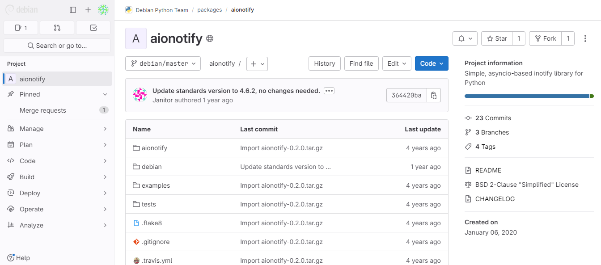

  Imagem 1: Repositório

Link do respositório no salsa: <https://salsa.debian.org/ruby-team/aionotify>

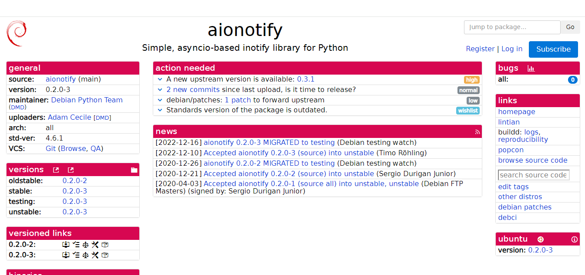

  Imagem 2: Tracker

Link do Tracker: <https://tracker.debian.org/pkg/aionotify>

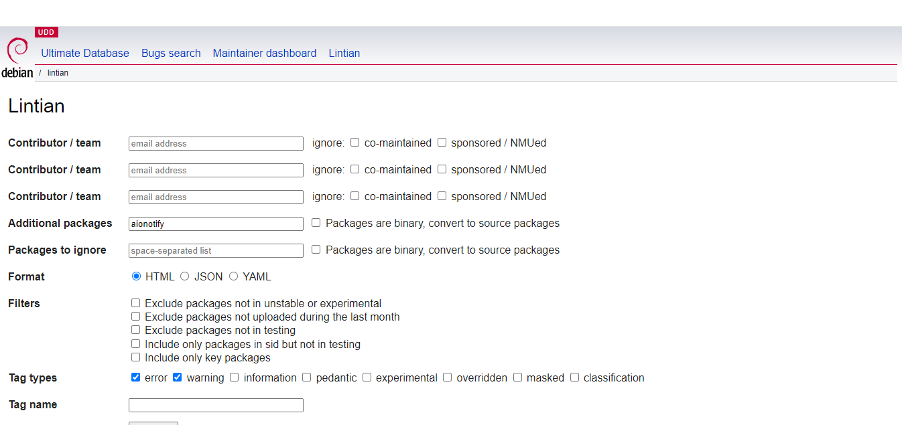

Link do Lintian: <https://udd.debian.org/lintian/?packages=aionotify>

### Empacotamento
Ao gerar o upstream, foi alterado apenas o changelog

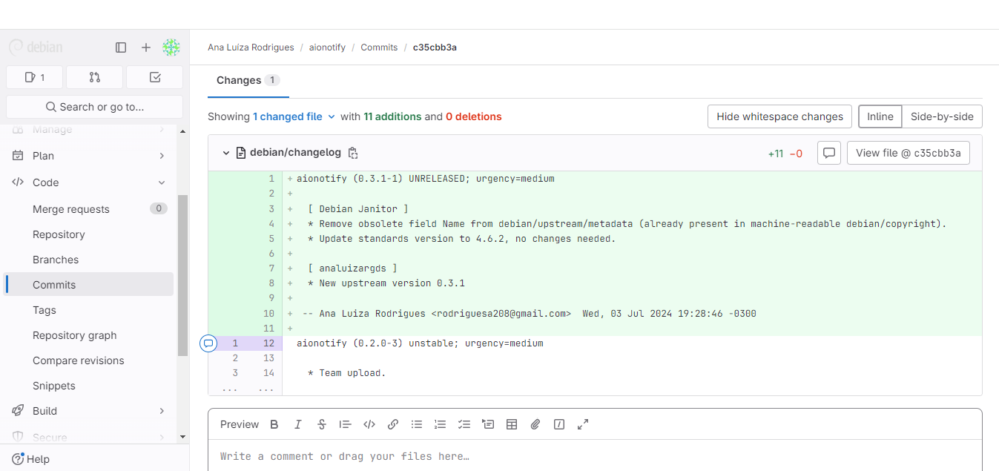

  Imagem 3: Mudanças

Revisor: Ainda não foi revisado. As mudanças serão revisadas na reunião.

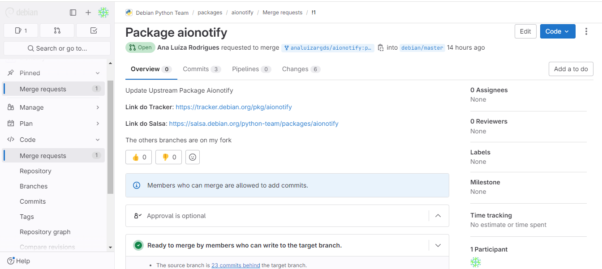

  Imagem 4: Merge Request

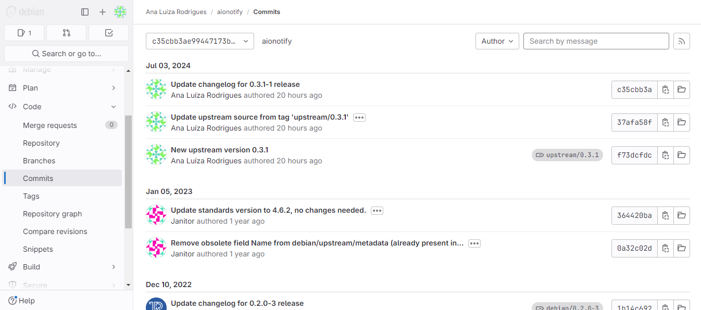

  Imagem 5: Commits

Link do Merge Request: <https://salsa.debian.org/python-team/packages/aionotify/-/merge_requests/1>

## Package jqp
Geração de nova versão upstream para o pacote jqp.

Link da issue: <https://salsa.debian.org/debian-brasilia-team/docs/-/issues/248>

###  jqp
jqp é um Playground TUI para experimentar jq (programa)

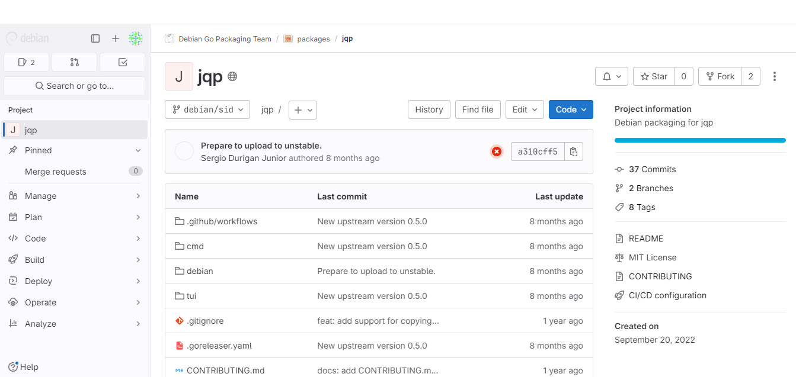

  Imagem 1: Repositório

Link do respositório no salsa: <https://salsa.debian.org/go-team/packages/jqp>

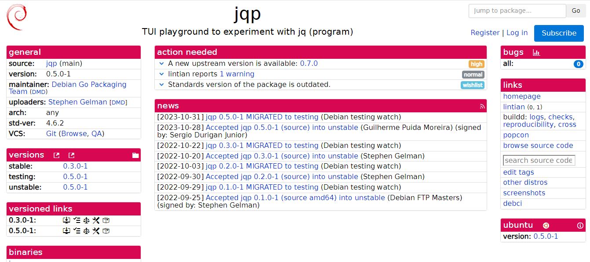

  Imagem 2: Tracker

Link do Tracker: <https://tracker.debian.org/pkg/jqp>

### Empacotamento
Ao gerar o upstream, foi alterado apenas o changelog

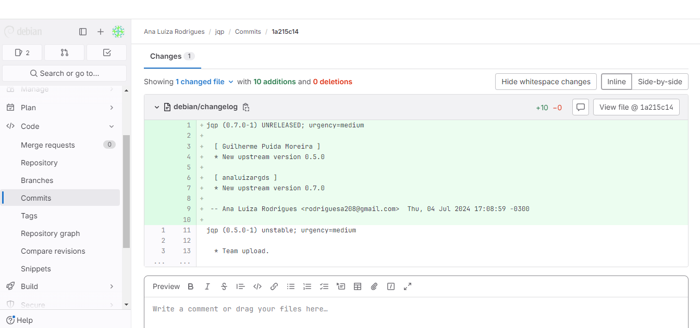

  Imagem 3: Mudanças

Revisor: Ainda não foi revisado. As mudanças serão revisadas na reunião.

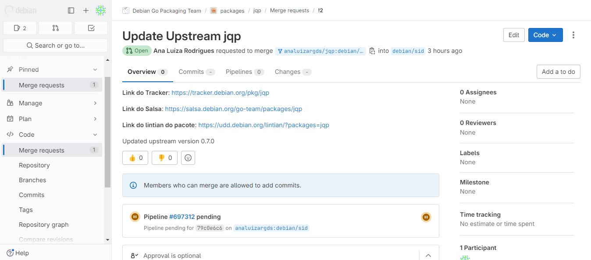

  Imagem 4: Merge Request

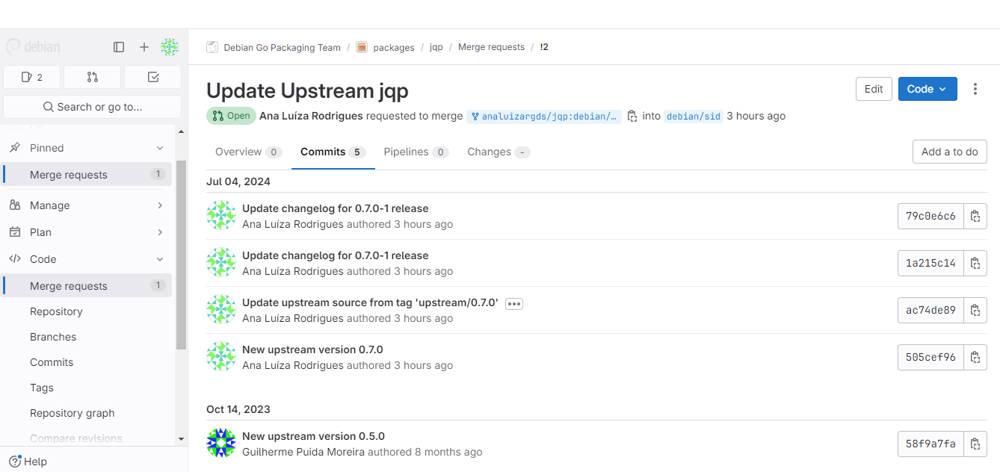

  Imagem 5: Commits

Link do Merge Request: <https://salsa.debian.org/go-team/packages/jqp/-/merge_requests/2>