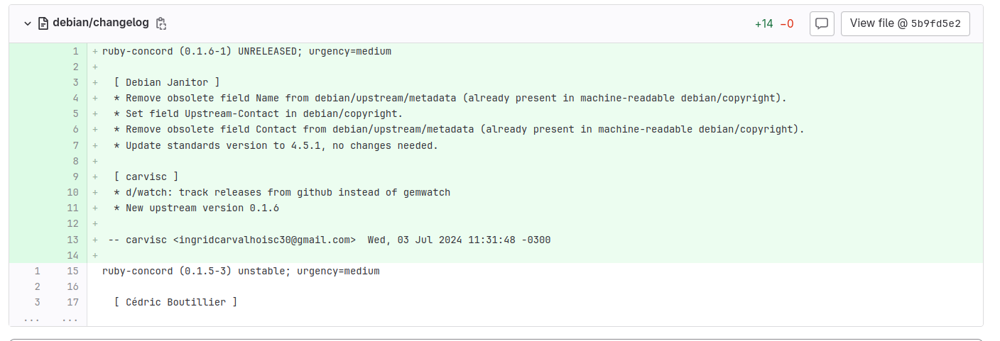
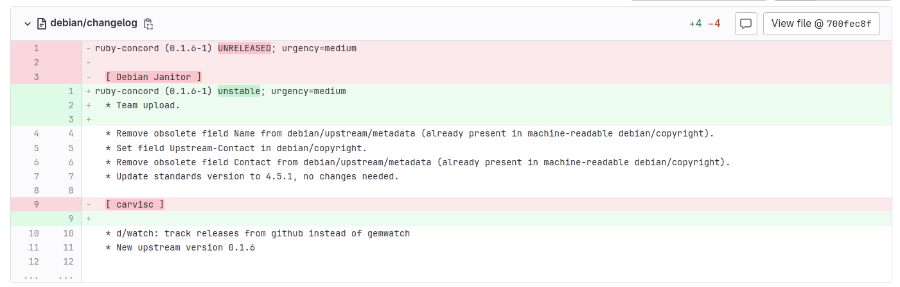
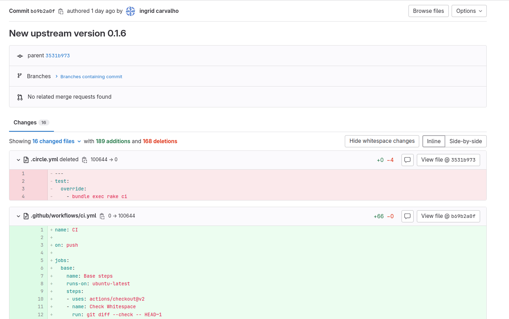
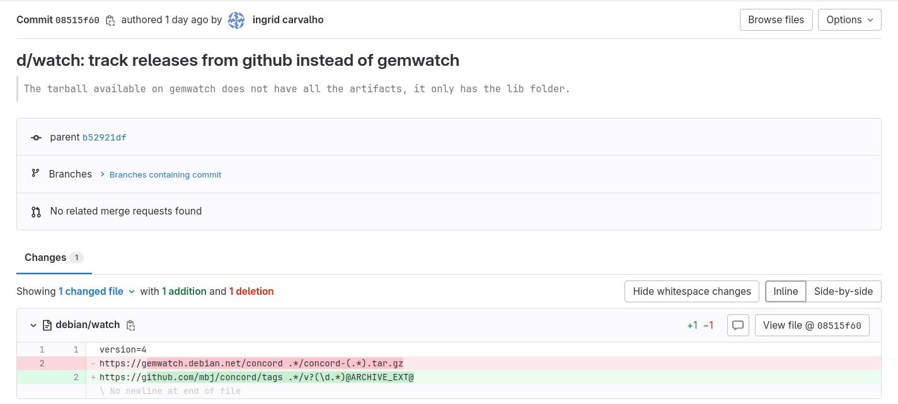
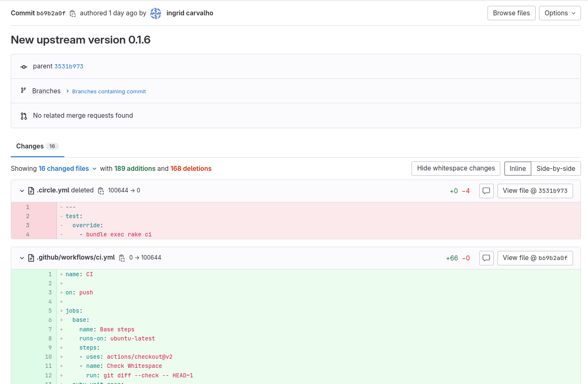
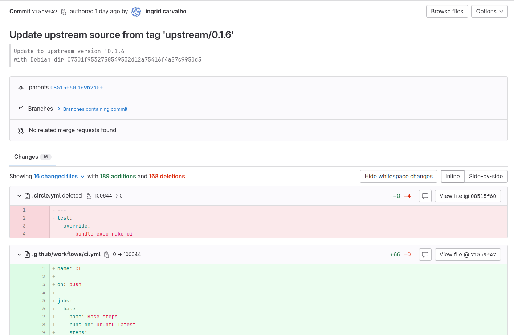
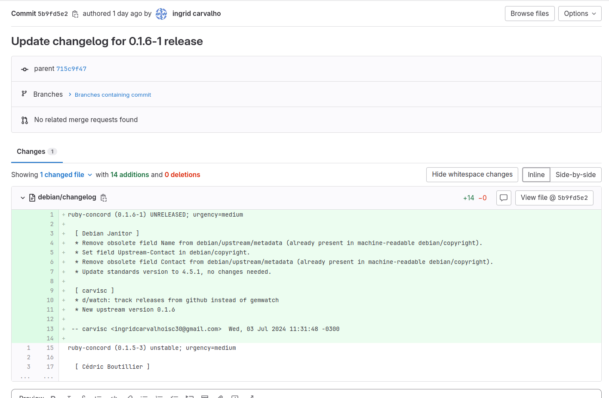
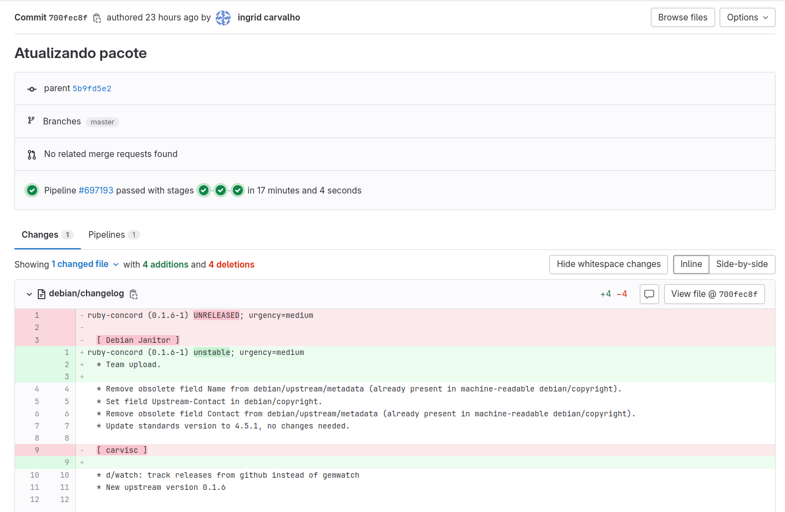

# Ingrid da Silva Carvalho

## Package Ruby-concord
Geração de nova versão do upstream para o pacote Ruby-concord

Link da issue: 

###  Ruby-concord
Ruby-concord é ultilizado para auxiliar na composição de objetos

PRINT DO REPOSITÓRIO DO PACOTE

  Imagem 1: Repositório

Link do respositório no salsa: https://salsa.debian.org/ruby-team/ruby-concord

PRINT DA PÁGINA DO TRACKER

  Imagem 2: Tracker

Link do Tracker: https://tracker.debian.org/pkg/ruby-concord

PRINT DA PÁGINA DO LINTIAN

  Imagem 3: Lintian

Link do Lintian: https://udd.debian.org/lintian/?packages=ruby-concord

### Empacotamento

Foi necessário alterar o link para a homepage e o changelog foi alterado ao gerar o upstream

PRINT DAS ALTERAÇÕES FEITAS

  Imagem 4: Mudanças commit: d/watch: track releases from github instead of gemwatch

  Imagem 5: Mudanças commit: New upstream version 0.1.6

  Imagem 6: Mudanças commit: Update upstream source from tag 'upstream/0.1.6' 

  Imagem 7: Mudanças commit: Update changelog for 0.1.6-1 release
6' 

  Imagem 8: Mudanças commit: Atualizando pacote

