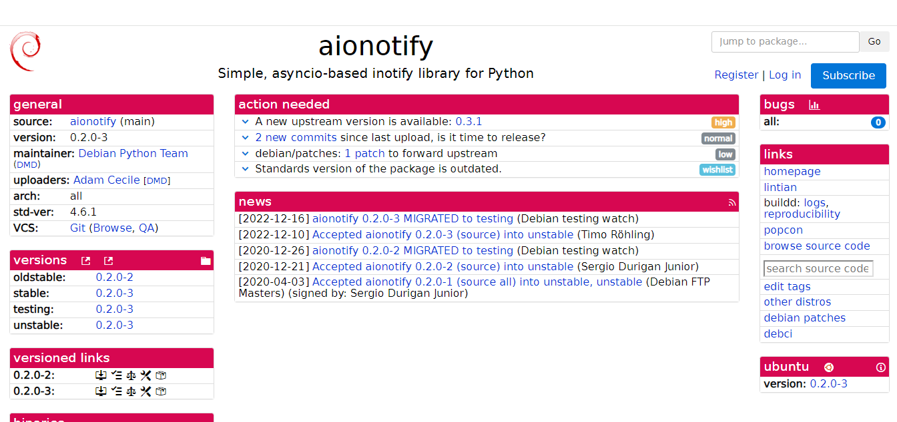

# Ana Luíza Rodrigues

Durante a Sprint 2, foram revisados os dois pacotes que trabalhei na Sprint 1 e pude implementar as correções necessárias. Nas reuniões do Debian Brasília, pude esclarecer dúvidas sobre o processo de empacotamento. Enfrentei um problema com o pacote jqp e, após uma análise detalhada, o revisor recomendou que deixássemos esse pacote de lado para focarmos no pacote aionotify. Após essa decisão, o pacote aionotify foi revisado e consegui implementar as alterações solicitadas.

## Aionotify

### Package aionotify #240

A issue se refere a atualização do upstream do pacote

- Tracker: <https://tracker.debian.org/pkg/aionotify>

- Issue no Salsa: <https://salsa.debian.org/debian-brasilia-team/docs/-/issues/240>

- Link do respositório no salsa: <https://salsa.debian.org/python-team/packages/aionotify>

Figura 1: Página do pacote no Tracker

### Empacotamento

Na revisão do pacote foi necessário fazer alterações no debian/changelog, debian/control e debian/copyright. 

Figura 2: Alterações solicitadas na revisão

### Updates

- Link do Merge Request: <https://salsa.debian.org/python-team/packages/aionotify/-/merge_requests/2>

- Revisor: Guilherme Puida Moreira [@puida](https://salsa.debian.org/puida)

### jqp

Após atualizar o upstream, não foi possível realizar o build devido à necessidade de atualização da biblioteca bubbletea, que por sua vez dependia de algumas bibliotecas ainda não empacotadas. Para contornar essa situação, segui a alternativa sugerida na revisão, que era atualizar o método Sequence. No entanto, após uma avaliação detalhada durante a reunião do Debian Brasília, foi avaliada a complexidade envolvida e, até que a situação da atualização da biblioteca seja resolvida e decisão tomada foi abandonar esse pacote.

- Link da revisão: <https://salsa.debian.org/debian-brasilia-team/docs/-/issues/248#note_504549>

- Revisor: Guilherme Puida Moreira [@puida](https://salsa.debian.org/puida)

### Histórico de versão

|Data|Autora|Versão|
|----|------|------|
| 17/07/2024 | Ana Luíza | Criação do documento| 