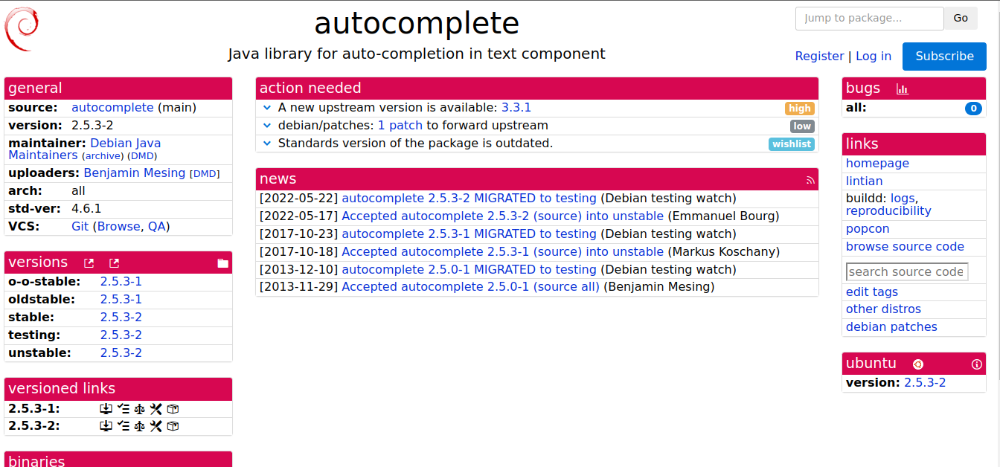
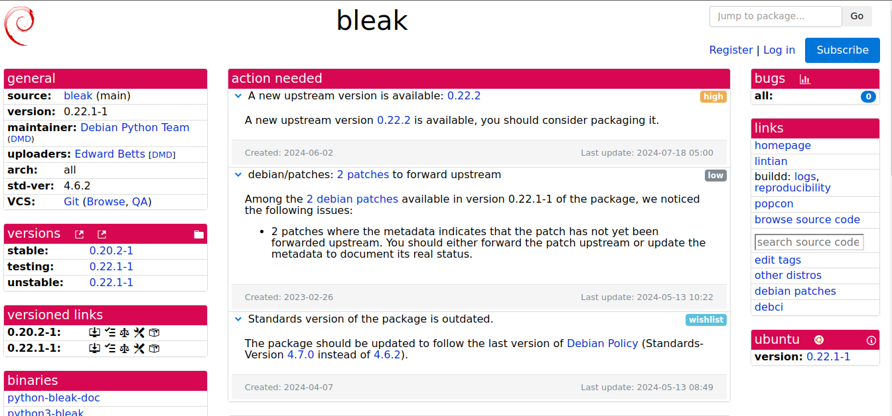

# Henrique Pucci da Silva Pinto

Nessa Sprint 2, que teve uma duração de 9 dias eu fiz a padronização do template de Issues do grupo no Github, e fazendo a atualização e mudanças necessárias em dois pacotes.

## autocomplete

### Package java autocomplete

Ao longo do processo de atualização e construção do pacote autocomplete versão 3.3.1 para Debian, realizei várias etapas essenciais. Primeiramente, garantimos a instalação do Gradle 7.4.2 em /opt/gradle/latest e atualizamos o arquivo debian/control para incluir gradle como uma dependência de construção. Em seguida, modificamos o arquivo debian/rules para configurar corretamente o PATH e assegurar que a versão correta do Gradle fosse utilizada, além de definir as instruções de construção e instalação. Foi enviada essas alterações para o repositório. No entanto, foi encontrado problemas persistentes com a versão do Gradle sendo utilizada durante o processo de construção, apesar das várias tentativas de garantir o uso da versão 7.4.2.

` ` [Link tracker](https://tracker.debian.org/pkg/autocomplete)
` ` [Link issue no Salsa](https://salsa.debian.org/debian-brasilia-team/docs/-/issues/256)

## Bleak

### Package Bleak

Removi patches desnecessários, baixei o tarball original bleak_0.22.2.orig.tar.gz, integrei mudanças no pyproject.toml, criei um novo patch, resolvi conflitos usando quilt e tentei construir o pacote com gbp buildpackage, garantindo que todas as alterações fossem integradas.
` ` [Link tracker](hhttps://tracker.debian.org/pkg/bleak)
` ` [Link issue no Salsa](https://salsa.debian.org/debian-brasilia-team/docs/-/issues/261)

### Empacotamento

Para o empacotamento do bleak, foram removidos patches desnecessários, foi baixado o tarball original bleak_0.22.2.orig.tar.gz, foram integradas mudanças no pyproject.toml, foi criado um novo patch com dpkg-source --commit, foram resolvidos conflitos de patches usando quilt, e foi tentada a construção do pacote com gbp buildpackage

já para o empacotamento do autocomplete foi ajustado o ambiente com o Gradle 7.4.2, modificado o debian/rules para corrigir o PATH, e atualizado o debian/changelog. foi encontrado dificuldades com a versão antiga do Gradle durante a construção do pacote, apesar das tentativas de correção.

### Próximos passos

 para próximos passos, pretendo resolver os problemas que estou encontrando com os pacotes que decidi resolver e continuar com novos pacotes.

### Histórico de versão

| Data       | Autora   | Versão                     |
| ---------- | -------- | --------------------------- |
| 17/07/2024 | Mylena   | Criação do documento      |
| 18/07/2024 | Henrique | adicionando Issues sprint 2 |
