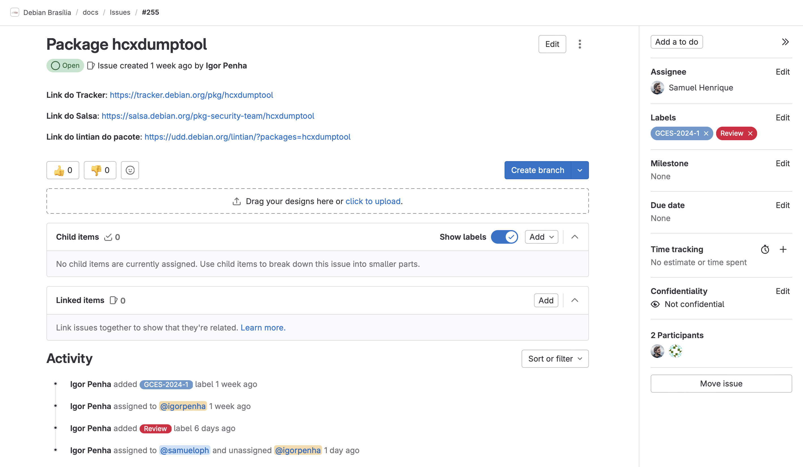
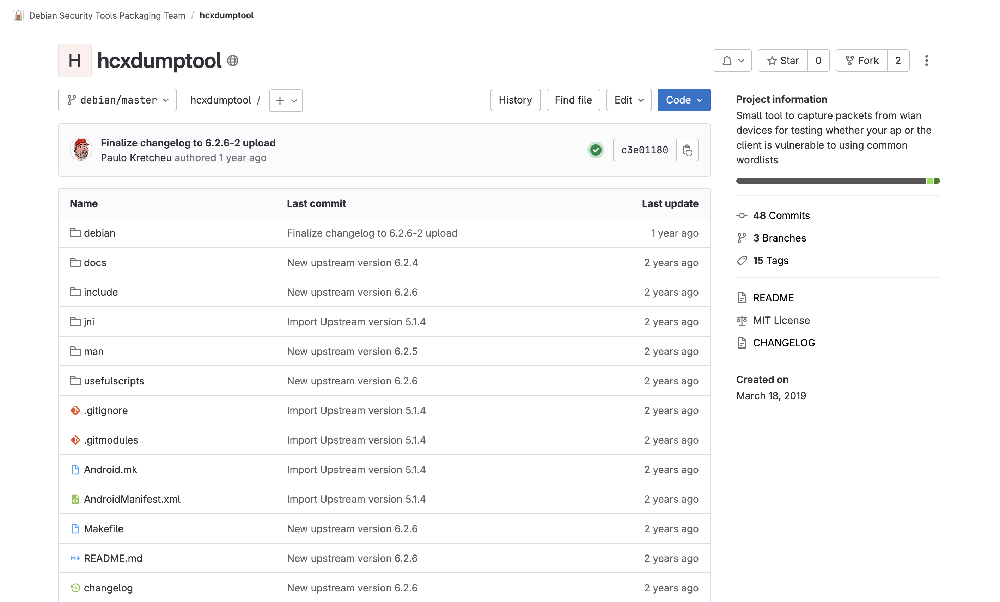
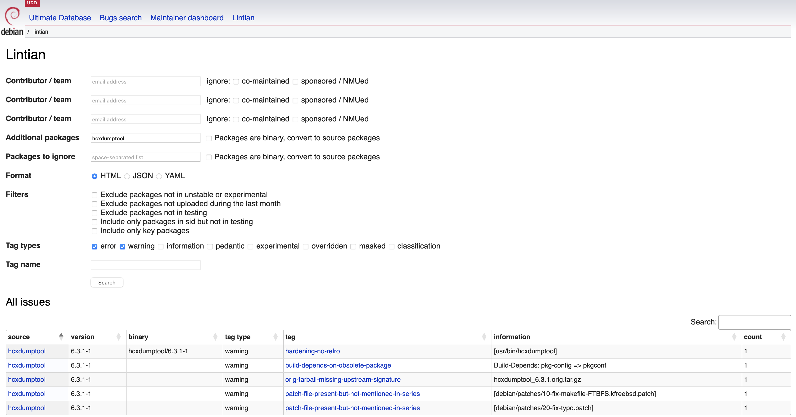
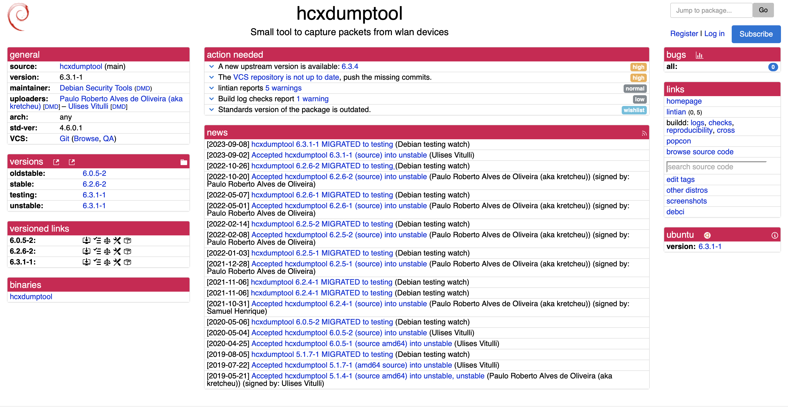
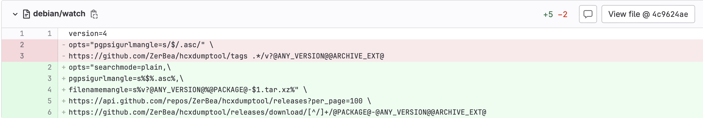
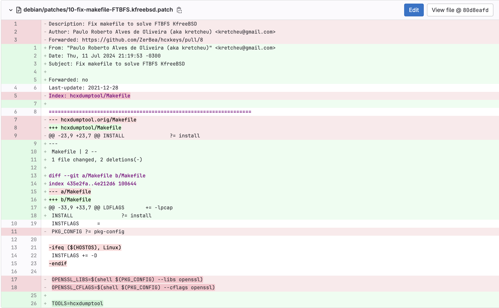
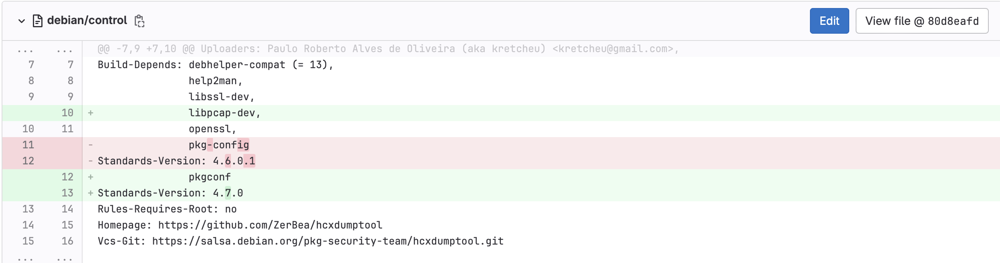
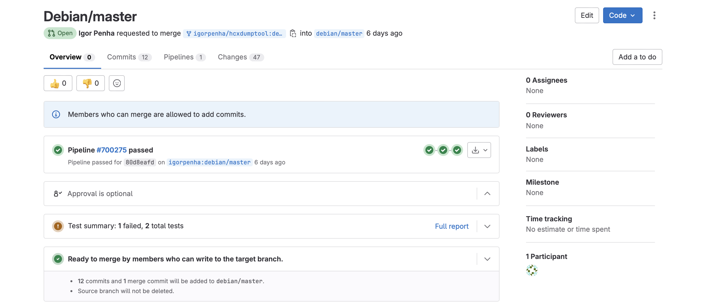

# Igor e Silva Penha

Na Sprint 2, que teve uma duração de 9 dias, realizei a atualização upstream de um pacote, para a realização desse empacotamento foi necessário o estudo sobre alguns arquivos como o debian/watch e debian/control, além de ter estudo e aplicado conhecimentos de gerenciamento de patches.

## Package hcxdumptool
Uma ferramenta para capturar pacotes de dispositivos WLAN e descobrir possíveis pontos fracos dentro das próprias redes WiFi executando ataques de camada 2 contra o protocolo WPA.

[Link issue no Salsa](https://salsa.debian.org/pkg-security-team/hcxdumptool)
  [Link do respositório no salsa](https://salsa.debian.org/pkg-security-team/hcxdumptool)
  [Link do Lintian](https://udd.debian.org/lintian/?packages=hcxdumptool)
  [Link do tracker](https://tracker.debian.org/pkg/hcxdumptool)

 Figura 1: Issue no salsa

 

 Figura 2: Repositório do pacote no salsa

 

 Figura 3: Imagem do Litian

 

 Figura 4: Imagem do tracker

### Empacotamento

O primeiro passo realizado foi alterar o arquivo debian/watch, pois ele não conseguia baixar e ler corretamente o arquivo de assinatura do mantenedor do pacote. Para solucionar isso, o arquivo foi atualizado para o padrão utilizando a API do GitHub. 

Além disso, a expressão regular (regex) foi organizada para funcionar corretamente. Agora, ao invés de buscar a assinatura na aba de tags, a busca é feita pela release.

 Figura 5: Alterações do arquivo debian/watch

 

Em seguida, foram identificados problemas nos patches. Para resolver essa questão, foi necessário excluir o arquivo debian/patches/20-fix-typo.patch e o retirar do arquivo debian/patches/series, pois ele tratava de um problema já resolvido e implementado. 

Ademais, ao analisar o arquivo debian/patches/10-fix-makefile-FTBFS.kfreebsd.patch, foi constatado que o problema informado como resolvido não estava relacionado com a correção mencionada no pull request (PR). Portanto, a seção de "forwarded" foi devidamente atualizada. Com essas alterações, foi realizado o rebase.

 Figura 6: Alterações do arquivo debian/patches/10-fix-makefile-FTBFS.kfreebsd.patch

 

Adicionalmente, o arquivo debian/control foi atualizado para adicionar uma nova dependência, alterar o nome de uma dependência que precisava ser atualizada, e modificar a Standards-Version para a versão mais recente contemplada. Por fim, o arquivo hcxpioff foi removido da manpage, pois ele foi excluído do projeto.

 Figura 7: Alterações do arquivo debian/control

 

O changelog foi atualizado e o Merge Request foi realizado, estando atualmente em revisão.

### Updates

- 12/07/24 - Merge Request criado e enviado para revisão
	 - [Link do Merge Request](https://salsa.debian.org/pkg-security-team/hcxdumptool/-/merge_requests/6)
	 - Revisor: Saumel Henrique [@samueloph](https://salsa.debian.org/samueloph)

 Figura 8: Imagem do merge request

### Histórico de versão

|Data|Autor|Descrição|Versão|
|----|------|------|----|
| 17/07/2024 | Igor Penha | Criação do documento | `1.0` |

