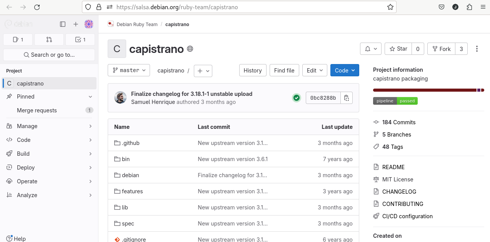
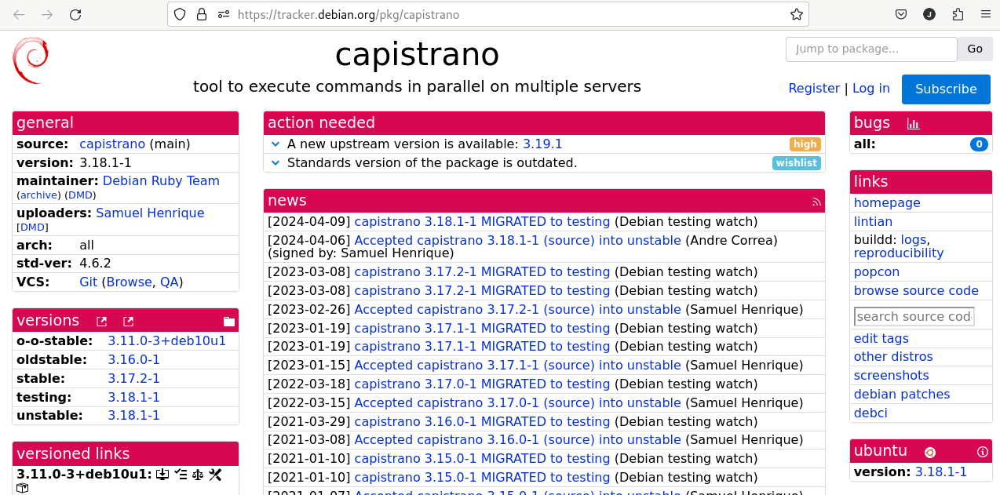
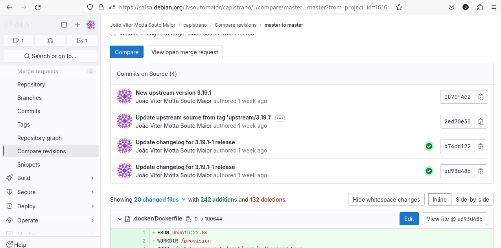

# João Vítor Motta Souto Maior

Breve resumo do que fez:

## Pacote: Capistrano
### Package capistrano

- Atualização do upstream

Link: 
Link issue no Salsa: https://salsa.debian.org/debian-brasilia-team/docs/-/issues/249
Link do respositório no salsa: https://salsa.debian.org/ruby-team/capistrano
Link do Tracker: https://tracker.debian.org/pkg/capistrano

### Empacotamento

### Updates

MR: https://salsa.debian.org/ruby-team/capistrano/-/merge_requests/3