# Leonardo Gonçalves Machado

Contribuição nos pacotes gnome-shell-extension-easyscreencast e ieee-data

## Gnome-shell-extension-easyscreencast
### Package gnome-shell-extension-easyscreencast new upstream version 1.9.0
Criação de uma nova versão upstream do pacote.

Link Tracker: <https://tracker.debian.org/pkg/gnome-shell-extension-easyscreencast>

Link issue no Salsa: <https://salsa.debian.org/debian-brasilia-team/docs/-/issues/250>

Link do respositório no salsa: <https://salsa.debian.org/gnome-team/shell-extensions/gnome-shell-extension-easyscreencast>

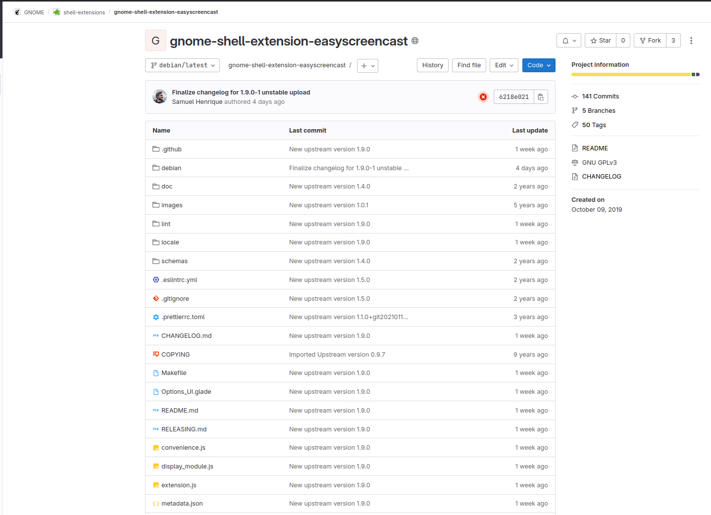

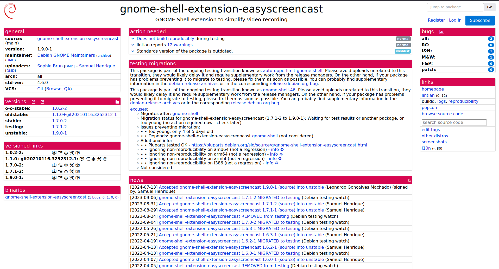

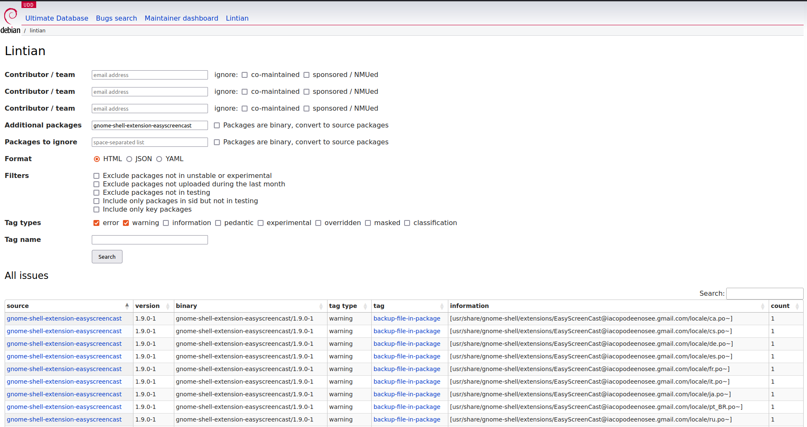

### Empacotamento

Para a nova versão upstream, foram alterdas as versões suportadoas do gnome para apenas da versão 46 em diante. 

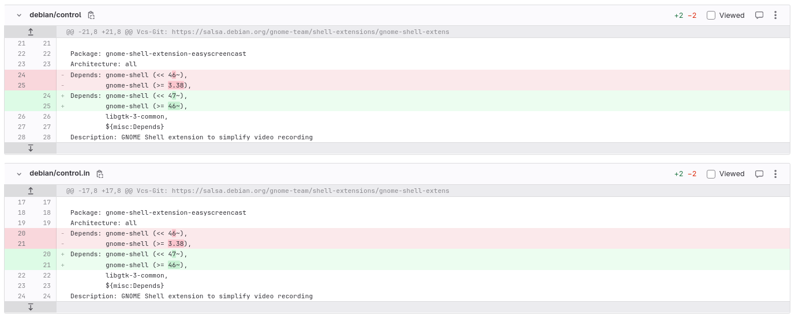

### Updates

- 11/07/27- Merge Request criado e enviado para revisão
	 - Link do Merge Request: <https://salsa.debian.org/gnome-team/shell-extensions/gnome-shell-extension-easyscreencast/-/merge_requests/3#58ef006ab62b83b4bec5d81fe5b32c3b4c2d1cc2>

	 - Revisor: Saumel Henrique [@samueloph](https://salsa.debian.org/samueloph)

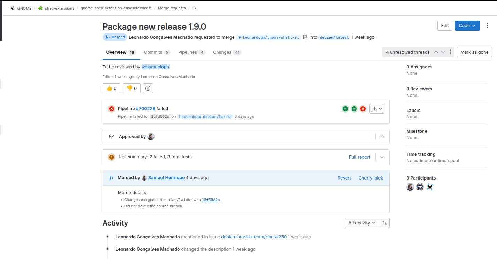

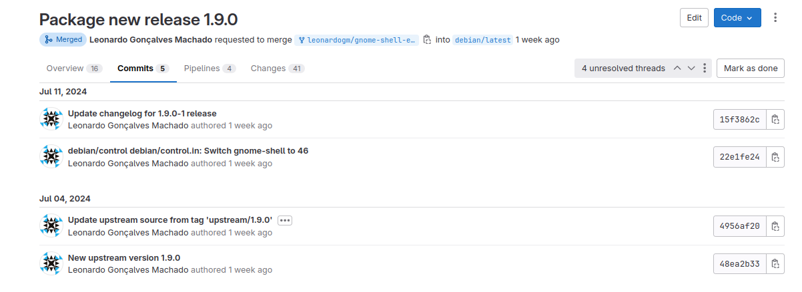
  
  - 14/07/24- Upload feito

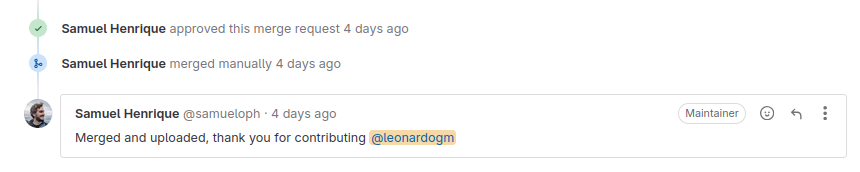

## ieee-data
### Package ieee-data

Criação de uma nova versão upstream do pacote.

Link Tracker: <https://tracker.debian.org/pkg/ieee-data>

Link issue no Salsa: <https://salsa.debian.org/debian-brasilia-team/docs/-/issues/258>

Link do respositório no salsa: <https://salsa.debian.org/debian/ieee-data>

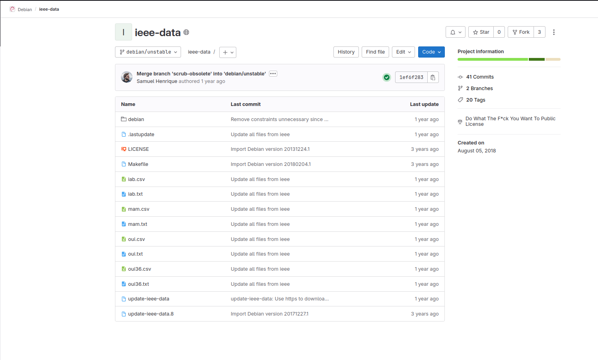

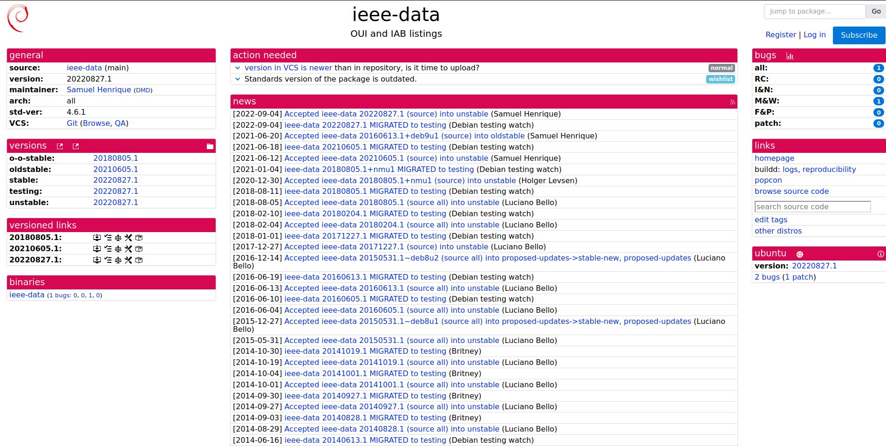

### Empacotamento

Para a nova versão upstream, utilizou-se um método alternativo para a atualização dos pacotes. Foi necessário instalar o pacote no dispotivo e lançar um script de atualização chamado update-ieee-data. 
A instalação foi feita com o comando:

sudo apt install iee-data.deb

E a atualização com o comando:

sudo ./update-iee-data

Após a atualização, substituiu-se os arquivos do repositório local do pacote, pelos arquivos da versão instalada que foi atualizada, que estavam no diretório /var/lib/iee-data do dispositivo. 

### Updates

- 16/07/27- Merge Request criado e enviado para revisão
	 - Link do Merge Request: <https://salsa.debian.org/debian/ieee-data/-/merge_requests/4#9c96da0e9f91d7d8937b69b524702c106258f0d1>

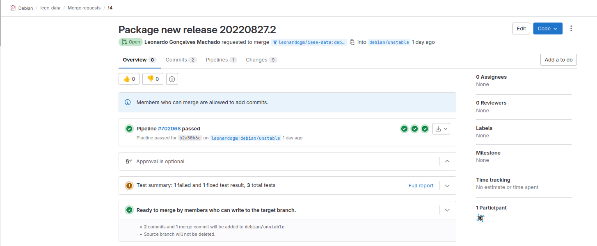

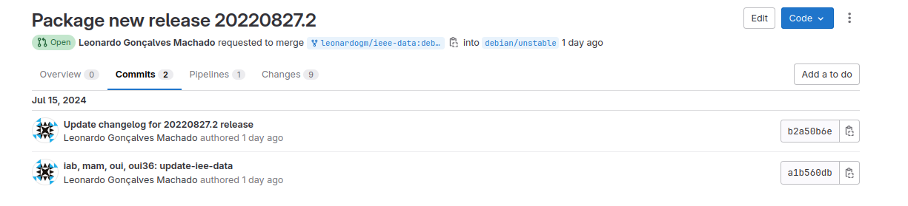