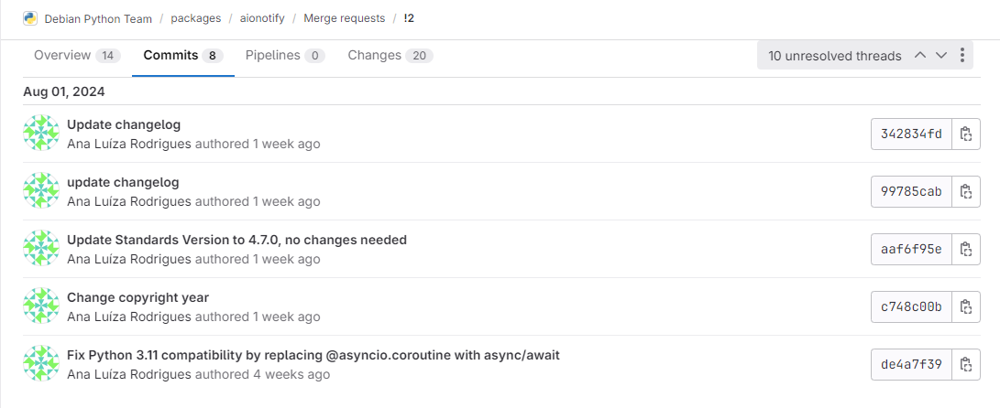
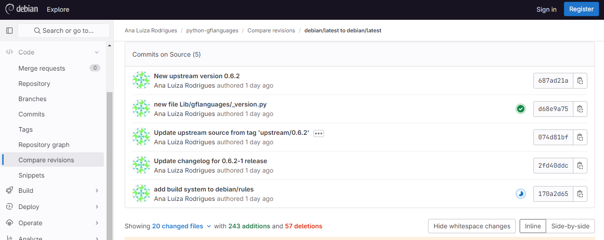

# Ana Luíza Rodrigues

Durante a terceira sprint, refiz os commits do pacote Aionotify para seguir o padrão do Debian e atualizei o upstream do pacote python-gflanguages.

## Aionotify
### Package Aionotify

Após a última revisão do merge request foi pedido mais uma alteração no changelog. Além disso para manter os commit no padrão do Debian foi pedido para que os commit fossem refeitos.

Figura 1: Commits refatorados no pacote aionotify. (Fonte: Ana Luiza)

[Link do Merge Request](https://salsa.debian.org/python-team/packages/aionotify/-/merge_requests/2)

## python-gflanguages

### Pacote python-gflanguages

API para avaliar o suporte a idiomas na coleção Google Fonts

Este módulo python fornece uma API com dados sobre idiomas/regiões/scripts para uso na categorização de suporte de idioma das fontes na coleção Google Fonts.

### Empacotamento

Atualizei a versão upstream para 0.6.2. Após a atualização tive problemas em buildar o pacote. Pedi ajuda no grupo do Debian Brasília para terminar a atualização.

Além disso, estou seguindo a Debian Policy para ver se a versão Standards pode ser atualizada para 4.7.0.

Figura 2: Commits no pacote python-gflanguages. (Fonte: Ana Luiza)

- Tracker: <https://tracker.debian.org/pkg/python-gflanguages>

- Issue no Salsa: <https://salsa.debian.org/debian-brasilia-team/docs/-/issues/277>

- Link do respositório no salsa: <https://salsa.debian.org/python-team/packages/python-gflanguages>

### Updates

 - Ainda não abri o Merge request

### Histórico de versão

|Data|Autora|Versão|
|----|------|------|
| 01/07/2024 | Ana Luíza | Criação do documento | 
