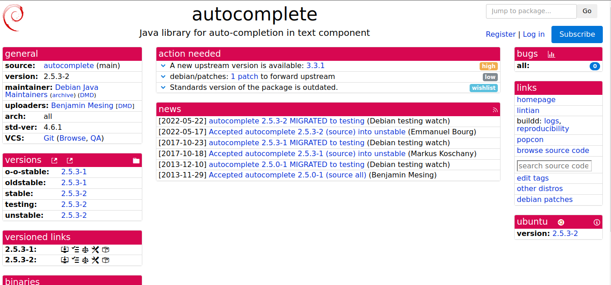

# Henrique Pucci

Durante esta terceira sprint, realizei a atualização do pacote Java auto64fto32f, tendo feito vários ajustes para que o pacote fosse constrído sem erros pós a atualização. Também, continuo atualizando o pacote Java autocomplete.

## Java auto64fto32f
### Package auto64fto32f
O pacote auto64fto32f é uma biblioteca minimalista para Java que tem a função de converter código numérico Java que utiliza tipos de dados em dupla precisão (double) para tipos de dados em precisão simples (float).

Link tracker: <https://tracker.debian.org/pkg/auto64fto32f>
Link issue no Salsa: <https://salsa.debian.org/debian-brasilia-team/docs/-/issues/279>

Link do respositório no salsa: <https://salsa.debian.org/java-team/auto64fto32f>

### Empacotamento

Houve atualização do upstream. Para isso, foi modificado o script do debian/rules para garantir que todos os arquivos gerados fossem corretamente copiados para o diretório de destino. E por fim, resolvi erros de dpkg-source com arquivos binários modificados especificando claramente quais binários deveriam ser incluídos na construção do pacote.

### Updates

 - 28/07/24 - Issue Criada

 - 01/08/24 - Merge Request

 ## Java autocomplete
### Package autocomplete
O pacote autocomplete é uma biblioteca Java destinada a fornecer funcionalidade de auto-completação em componentes de texto.

Link tracker: <https://tracker.debian.org/pkg/autocomplete>
Link issue no Salsa: <https://salsa.debian.org/debian-brasilia-team/docs/-/issues/256>

Link do respositório no salsa: <https://salsa.debian.org/java-team/autocomplete>

### Empacotamento

Houve atualização do upstream. Porém, pacote originalmente usava um arquivo build.xml para a configuração de construção, mas na versão atual, o projeto migrou para o Gradle. Dessa forma, os patches existentes que alteravam as configurações de build no arquivo build.xml se tornaram obsoletos, exigindo a criação de novos patches para os arquivos build.gradle. Isso implica em uma análise detalhada dos scripts de construção Gradle para identificar onde as modificações específicas do Debian devem ser aplicadas, como ajustes no gerenciamento de dependências e especificações de caminhos que se alinhem com os diretórios e padrões do sistema Debian.

### Updates

 - 18/07/24 - Issue Criada

### Histórico de versão

|Data|Autora|Versão|
|----|------|------|
| 01/08/2024 | Henrrique | Adição de informações | 

