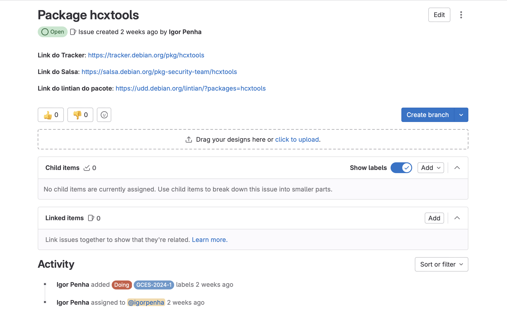
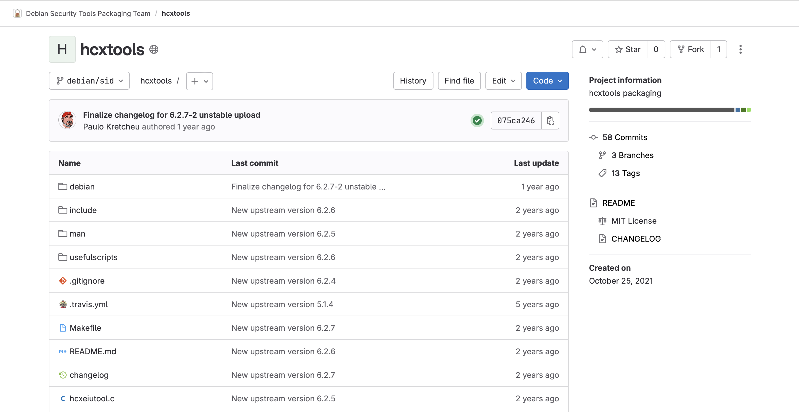
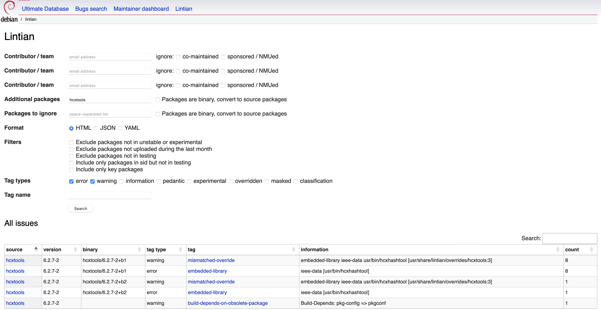
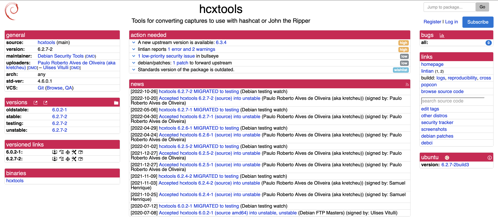
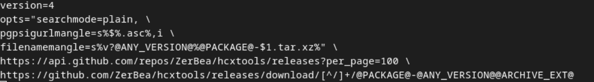
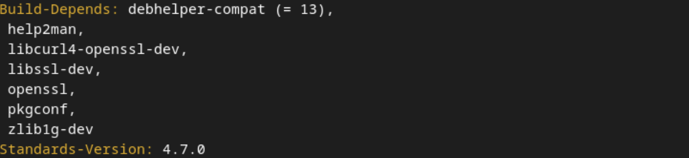

# Igor e Silva Penha

Na Sprint 3, que teve uma duração de 2 semana, realizei a atualização upstream do pacote hcxtools, para a realização desse empacotamento foi necessário aplicar os conhecimentos adquiridos sobre debian/watch e debian/control, além de ter estudado mais afundo sobre patches.

## Package hcxtools
Um conjunto de ferramentas para converter pacotes de arquivos de captura para arquivos hash para uso com Hashcat ou John the Ripper.

[Link issue no Salsa](https://salsa.debian.org/debian-brasilia-team/docs/-/issues/262)
  [Link do respositório no salsa](https://salsa.debian.org/pkg-security-team/hcxtools)
  [Link do Lintian](https://udd.debian.org/lintian/?packages=hcxtools)
  [Link do tracker](https://tracker.debian.org/pkg/hcxtools)

 Figura 1: Issue no salsa

 

 Figura 2: Repositório do pacote no salsa

 

 Figura 3: Imagem do Litian

 

 Figura 4: Imagem do tracker

### Empacotamento

O primeiro passo realizado foi alterar o arquivo debian/watch, pois ele não conseguia baixar e ler corretamente o arquivo de assinatura do mantenedor do pacote. Para solucionar isso, o arquivo foi atualizado para o padrão utilizando a API do GitHub. 

Além disso, a expressão regular (regex) foi organizada para funcionar corretamente. Agora, ao invés de buscar a assinatura na aba de tags, a busca é feita pela release.

 Figura 5: Alterações do arquivo debian/watch

 
Em seguida, foram identificados problemas nos patches. Para resolver essa questão, analisamos dois arquivos hcxpcapngtool.c, o qual o erro ortográfico mensionado estava corrigido e no arquivo hcxpsktool.c o trecho de código mensionado não existia mais, para tanto foi necessário excluir o arquivo debian/patches/01-fix-spell-errors.patch e o retirar do arquivo debian/patches/series, pois ele tratava de um problema já resolvido e implementado. Porém, não havia linkado nenhum pull para ser analisado. 

Adicionalmente, o arquivo debian/control foi atualizado alterando o nome de uma dependência que precisava ser atualizada, e modificar a Standards-Version para a versão mais recente contemplada.

 Figura 6: Alterações do arquivo debian/control

 

O changelog foi atualizado e o sbuild teve status successful.

### Updates

- 01/08/2024 - o merge request está encaminhado necessitando apenas conferir se é necessário encontrar o pull de correções realizadas para poder remover o patch

### Histórico de versão

|Data|Autor|Descrição|Versão|
|----|------|------|----|
| 01/08/2024 | Igor Penha | Criação do documento | `1.0` |

