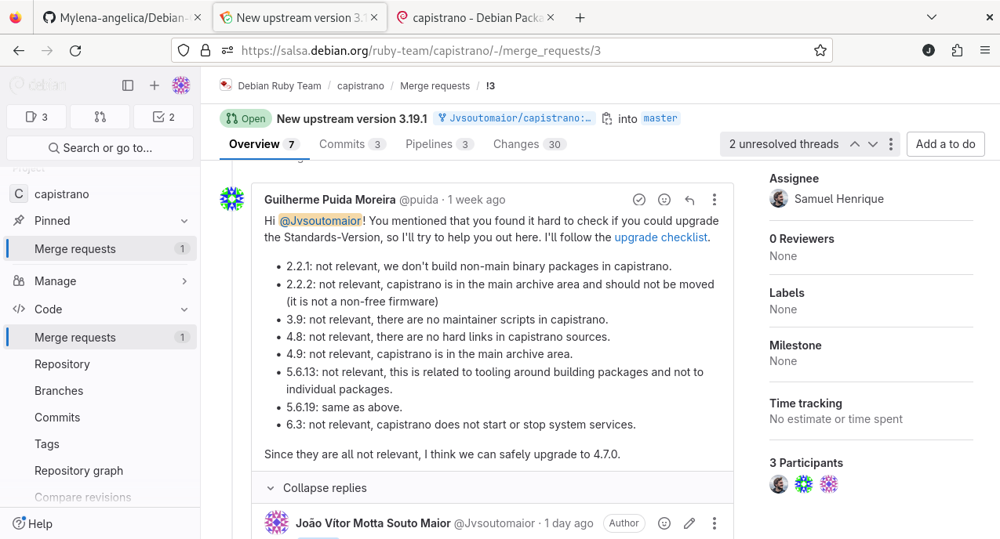
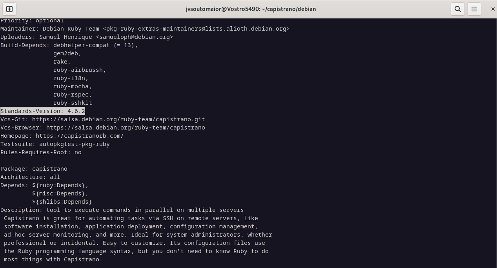
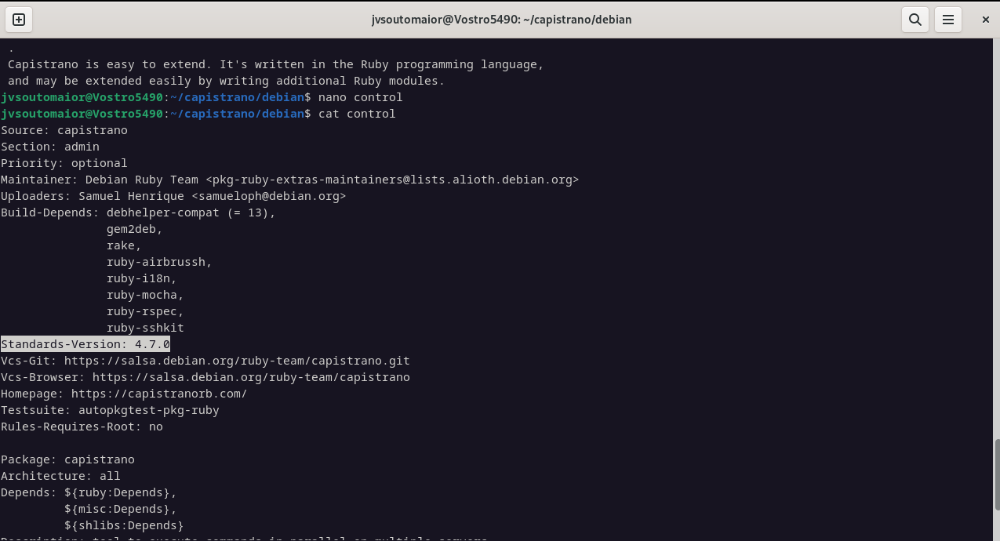
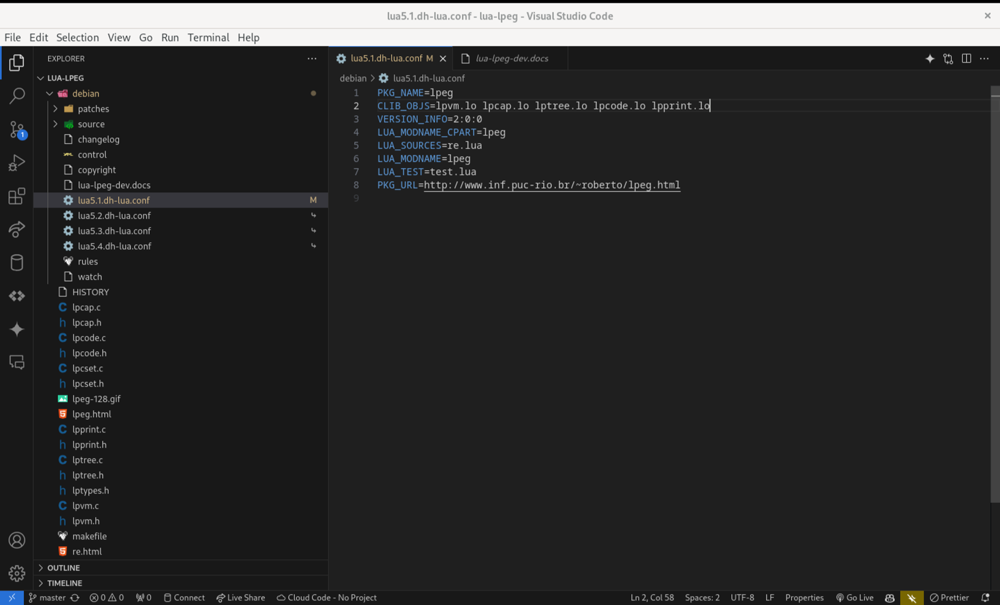
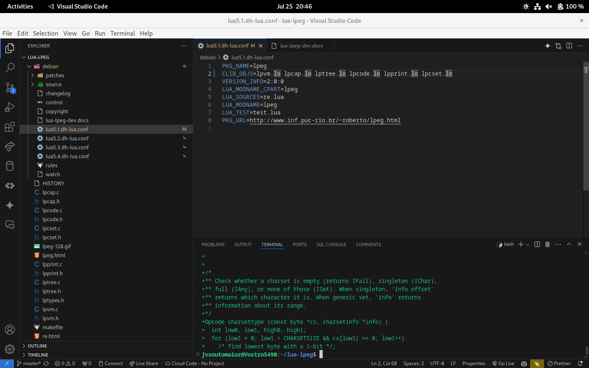
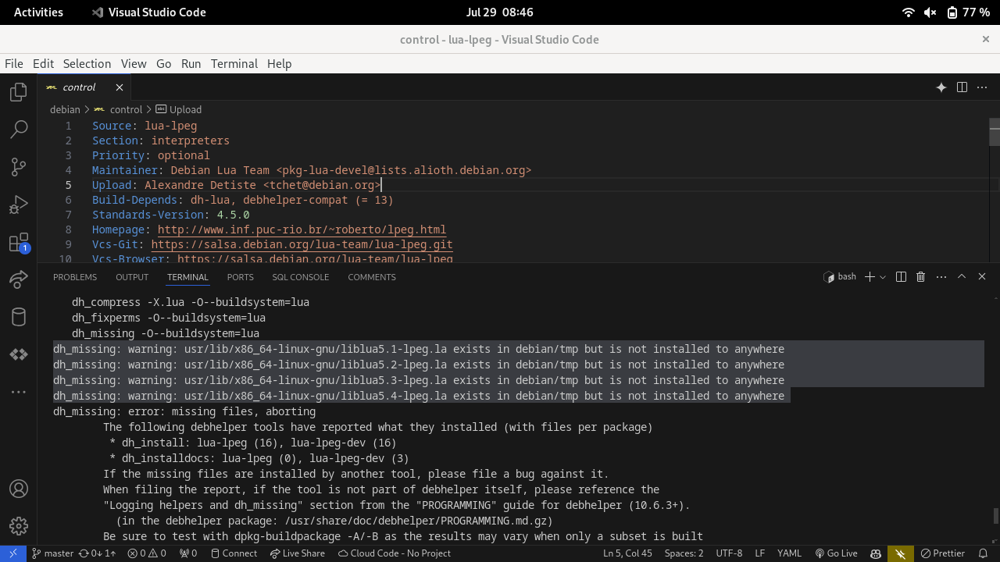

# João Vítor Motta Souto Maior

Breve resumo do que fez:
- Atualização do debian policy do capistrano.
- Resolução de problemas na build do pacote 

## Package capistrano

Link issue no Salsa: https://salsa.debian.org/debian-brasilia-team/docs/-/issues/249
Link do respositório no salsa: https://salsa.debian.org/ruby-team/capistrano
Link do Tracker: https://tracker.debian.org/pkg/capistrano

Atualização do debian policy do capistrano.

### Atualização do Debian Policy

### Updates

MR: https://salsa.debian.org/ruby-team/capistrano/-/merge_requests/3

## Package lua-lpeg

Mais informações sobre o lua-lpeg: https://www.inf.puc-rio.br/~roberto/lpeg/

"LPeg is a pattern-matching library for Lua, based on Parsing Expression Grammars (PEGs)." 
Roberto Ierusalimschy https://www.inf.puc-rio.br/~roberto/lpeg/

Link issue no Salsa: https://salsa.debian.org/debian-brasilia-team/docs/-/issues/269
Link do respositório no salsa: https://salsa.debian.org/lua-team/lua-lpeg
Link do Tracker: https://tracker.debian.org/pkg/lua-lpeg

Atualização do upstream do pacote lua-lpeg.
Resolução de problemas na build do pacote.

Ainda não foi aberto um MR para o pacote lua-lpeg, pois ainda estou resolvendo problemas na build do pacote.

### Problema 1

- problema ao instalar build, verificamos que o problema era na falta de um arquivo .lo nos CLIB_OBJS

### Problema 2

- como debhelper-compat  está na versão 13 , ele é mais exigente para buildar os pacotes por isso o erro, no liblua5.1-lpeg.la, ou seja, temos que investigar se o lpeg.la entra nas instalações ou não, ou apenas nas instalações de dev

- investigação ainda não foi concluída
- ainda não foi aberto um MR para o pacote lua-lpeg, pois ainda estou resolvendo problemas na build do pacote.