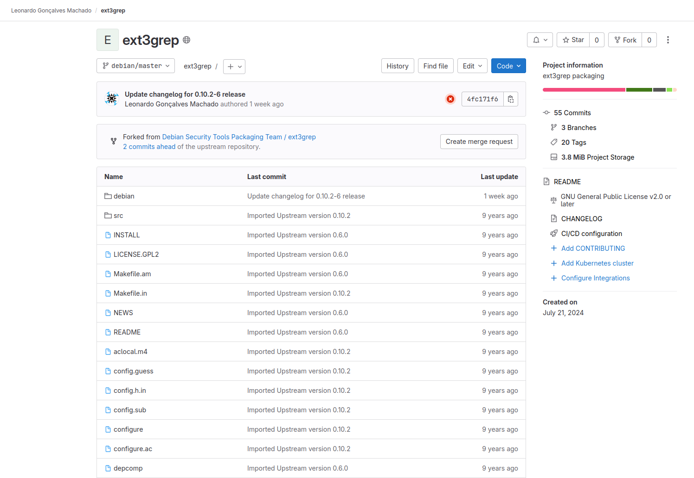
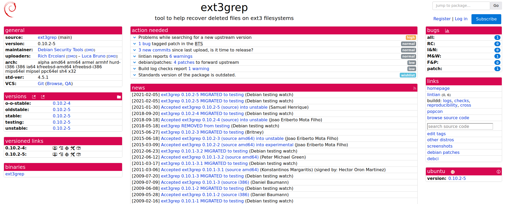
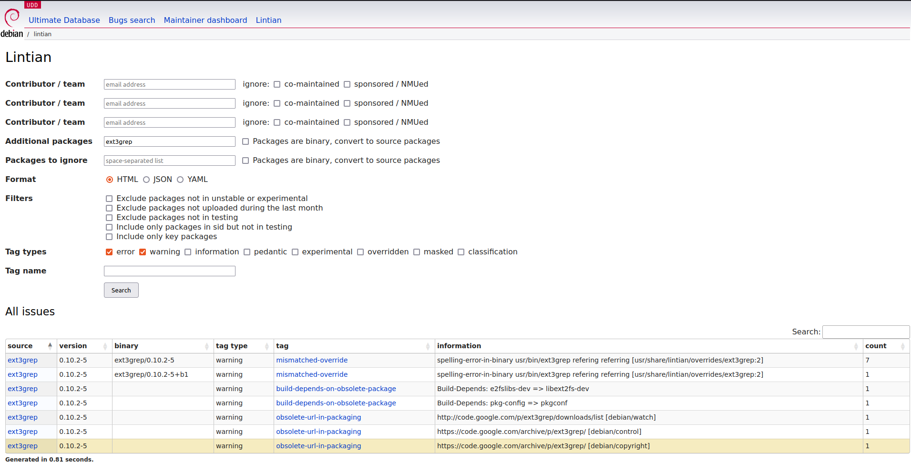
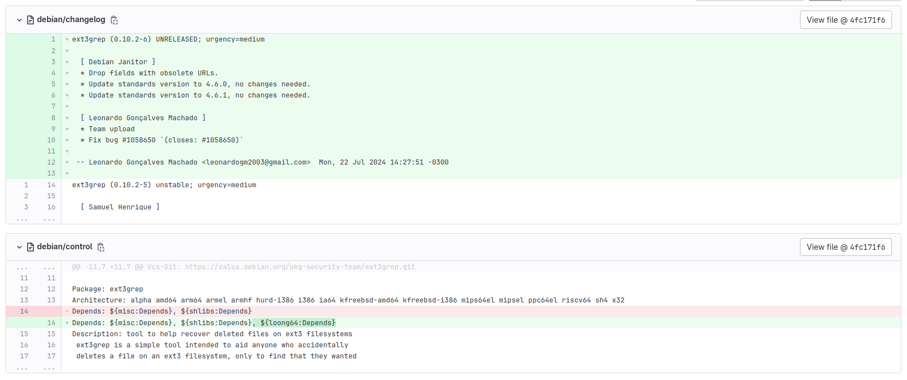
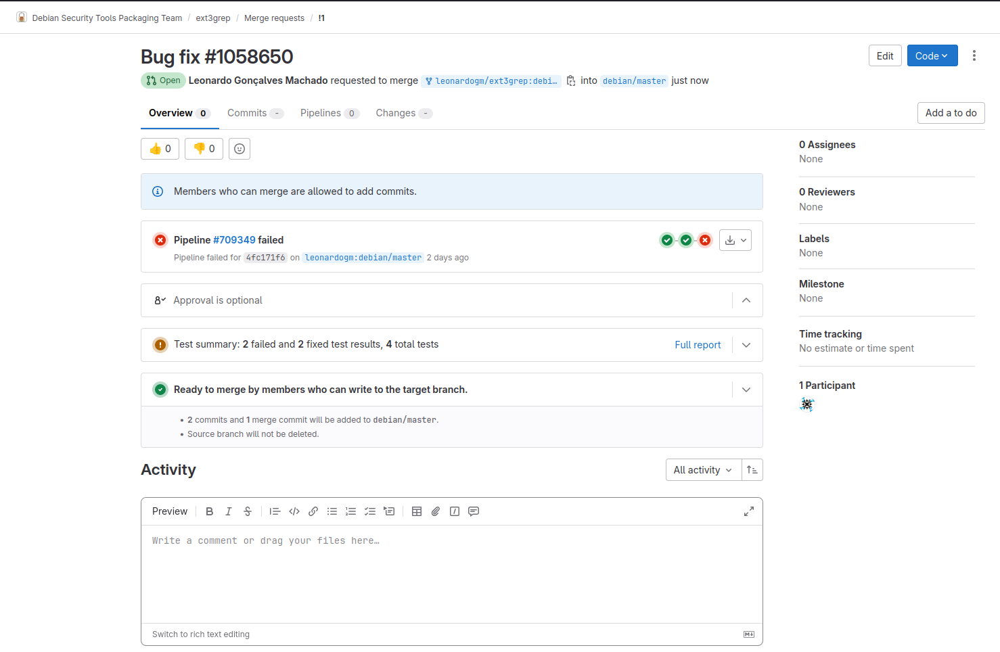
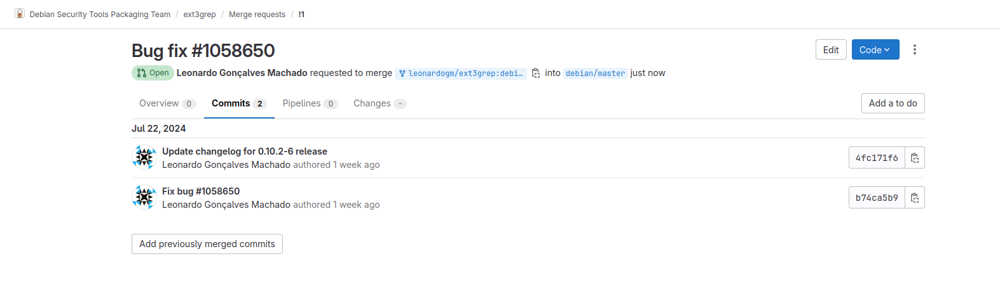

# Leonardo Gonçalves Machado

Correção de bug no pacote ext3grep.

## ext3grep
### Package ext3grep bug fix
Correão de um bug relacionado à dependência com o binário loong64.
Link: <https://tracker.debian.org/pkg/ext3grep>

Link issue no Salsa: <https://salsa.debian.org/debian-brasilia-team/docs/-/issues/264>

Link do respositório no salsa: <https://salsa.debian.org/leonardogm/ext3grep>

Link do Tracker: 

### Empacotamento

O bug corrigido foi relatado no Debian Bug Report #1058650. O relato informava que o binário loong64 não estava na saída do ambiente Loongarch.

A solução proposta foi incluir o loong64 no arquivo debian/control.

Link do Bug Report: <https://bugs.debian.org/cgi-bin/bugreport.cgi?bug=1058650>

### Updates

- 1/08/24- Merge Request criado e enviado para revisão
    - Link do Merge Request: <https://salsa.debian.org/pkg-security-team/ext3grep/-/merge_requests/1>
    
    - Revisor: Samuel Henrique [@samueloph](https://salsa.debian.org/samueloph)
    

