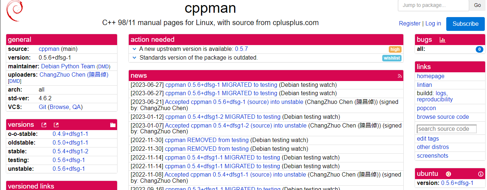
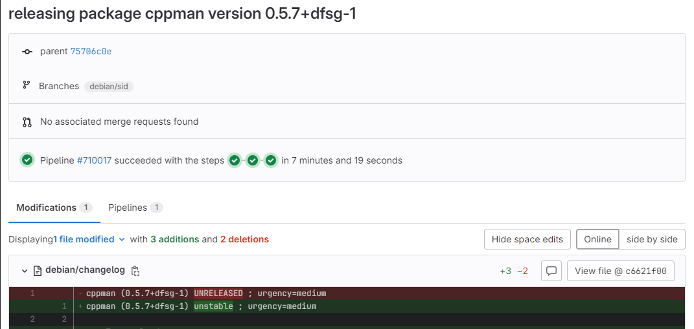

# Luana Ribeiro Soares

Durante a terceira sprint, realizei a atualização do pacote cppman para uma nova versão upstream.

## Package cppman

 O pacote cppman é uma ferramenta que fornece uma interface de linha de comando para acessar páginas de manual (man pages) para a linguagem de programação C++ e suas bibliotecas.

[Link tracker](https://tracker.debian.org/pkg/cppman)

[Link issue no Salsa](https://salsa.debian.org/debian-brasilia-team/docs/-/issues/278)

[Link do respositório no salsa](https://salsa.debian.org/python-team/packages/cppman)

## Merge Request

