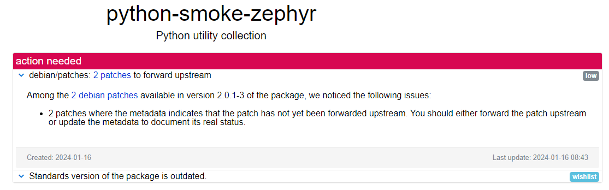
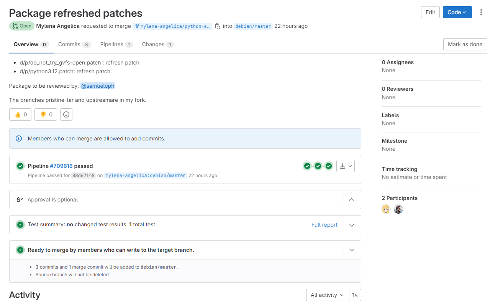

# Mylena Angélica Silva Farias

Durante esta terceira sprint, realizei o refresh dos patches no pacote python-smoke-zephyr e elaborei um tutorial detalhado sobre como atualizar o upstream.

## python-smoke-zephyr
### Package python-smoke-zephyr
O pacote python-smoke-zephyr é uma biblioteca desenvolvida para facilitar o teste automatizado de sistemas e aplicações.

[Link tracker](https://tracker.debian.org/pkg/python-smoke-zephyr)

[Link issue no Salsa](https://salsa.debian.org/debian-brasilia-team/docs/-/issues/272)

[Link do respositório no salsa](https://salsa.debian.org/python-team/packages/python-smoke-zephyr)

### Empacotamento

Como não houve atualização de versão upstream, apenas adicionei os patches à nova versão upstream. Os patches adicionados foram: 
- do_not_try_gvfs-open.patch;
- python3.12.patch.

### Updates

 - 30/07/24- Merge Request criado e enviado para revisão
	 - [Link do Merge Request](https://salsa.debian.org/python-team/packages/python-smoke-zephyr/-/merge_requests/1?commit_id=894ded3a9521cf80c18868cdc2d38e9a2b9dc03f)
	 - Revisor: Samuel 

- 18/08/2024- Revisão feita e ajustes realizados

### Histórico de versão

|Data|Autora|Versão|
|----|------|------|
| 31/07/2024 | Mylena | Adição de informações | 
| 01/08/2024 | Mylena | Revisão  | 
| 18/08/2024 | Mylena | Correções |

