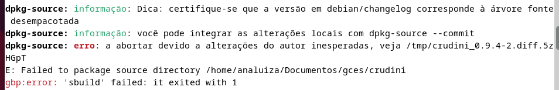
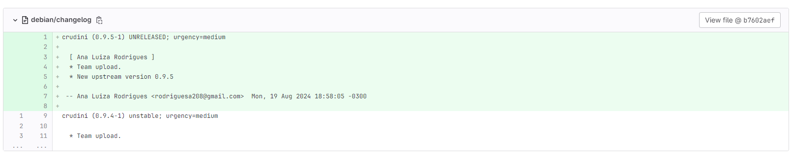

# Ana Luíza Rodrigues

Na sprint 4 atualizei o upstream do pacote crudini.

## Pacote crudini

o **crudini** é um utilitário para manipular arquivos ini

[Link do pacote no Tracker](https://tracker.debian.org/pkg/crudini)

[Link do pacote no Salsa](https://salsa.debian.org/python-team/packages/crudini)

[Link do Fork](https://salsa.debian.org/analuizargds/crudini)

### Empacotamento

Foi realizada uma atualização de upstream. Após a atualização, durante o novo build foi acusado um erro devido a tag da nova versão no commit não corresponder à versão upstream. Conforme imagem abaixo. Geralmente na hora de fazer a atualização a tag muda mas nesse caso teve de ser feita de forma manual

Figura 1: Crudini Erro

Figura 2: Changelog Crudini

O merge request foi criado e está aguardando revisão. 

[Link para o merge](https://salsa.debian.org/python-team/packages/crudini/-/merge_requests/1)

### Histórico de versão

|Data|Autora|Versão|
|----|------|------|
| 20/08/2024 | Ana Luíza | Criação do documento | 