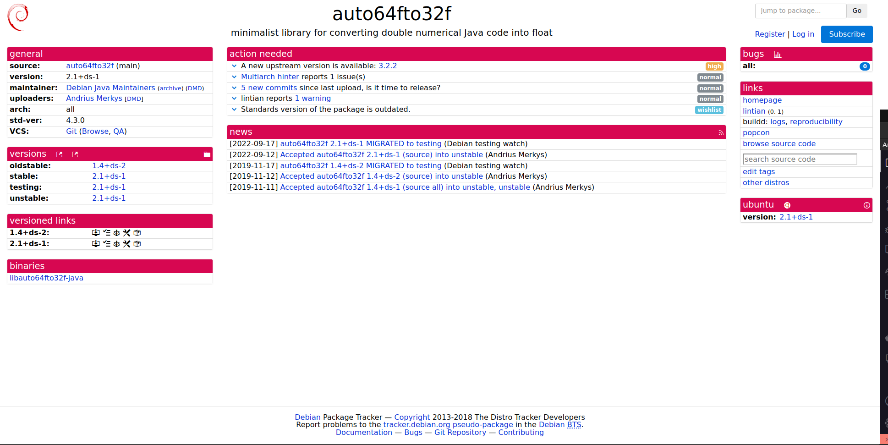

# Henrique Pucci

Durante esta terceira sprint, realizei a atualização do pacote Java auto64fto32f, tendo feito vários ajustes para que o pacote fosse constrído sem erros pós a atualização. Também, continuo atualizando o pacote Java autocomplete.

## Java auto64fto32f

### Package auto64fto32f

O pacote auto64fto32f é uma biblioteca minimalista para Java que tem a função de converter código numérico Java que utiliza tipos de dados em dupla precisão (double) para tipos de dados em precisão simples (float).

Link tracker: [https://tracker.debian.org/pkg/auto64fto32f](https://tracker.debian.org/pkg/auto64fto32f)
Link issue no Salsa: [https://salsa.debian.org/debian-brasilia-team/docs/-/issues/279](https://salsa.debian.org/debian-brasilia-team/docs/-/issues/279)

Link do respositório no salsa: [https://salsa.debian.org/java-team/auto64fto32f](https://salsa.debian.org/java-team/auto64fto32f)

### Updates

- 28/07/24 - Issue Criada
- 14/08/24 - Merge Request

## Google-auth-java

### Package google-auth-java

O pacote google-auth-java é uma biblioteca cliente de autenticação de código aberto para Java, desenvolvida para fornecer autenticação e autorização robustas e seguras para aplicações que chamam APIs do Google.

Link tracker: [https://tracker.debian.org/pkg/google-auth-java](https://tracker.debian.org/pkg/google-auth-java)
Link issue no Salsa: [https://salsa.debian.org/debian-brasilia-team/docs/-/issues/302](https://salsa.debian.org/debian-brasilia-team/docs/-/issues/302)

Link do respositório no salsa: [https://salsa.debian.org/java-team/google-auth-java](https://salsa.debian.org/java-team/google-auth-java)

### Empacotamento

Estive trabalhando na atualização e construção do pacote google-auth-java, enfrentando desafios específicos relacionados à aplicação de patches durante o processo de build. O problema principal ocorreu com o patch use-default-debian-versions.patch, que visa ajustar a versão de autovalue para a versão padrão do Debian no arquivo pom.xml. No entanto, não consegui localizar a configuração específica que o patch tenta modificar, o que indica que essa parte do arquivo pode ter sido alterada ou removida em atualizações recentes do projeto. Esse descompasso entre o patch e o estado atual do arquivo pom.xml tem impedido a aplicação correta do patch e, consequentemente, a construção bem-sucedida do pacote.

### Updates

- 13/08/24 - Issue Criada

### Histórico de versão

| Data       | Autor    | Versão                   |
| ---------- | -------- | ------------------------- |
| 20/08/2024 | Henrique | Adição de informações |
