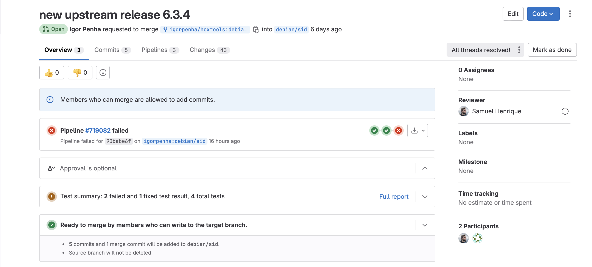

# Igor e Silva Penha

Na Sprint 4, que teve uma duração de 2 semana, realizei o merge request do pacote hcxtool. Em uma conversa durante a reunião foi passado alguns pacotes que estavam atrasados e que precisavam da atualização upstream dos pacotes. Então nessa sprint também foi realizado o merge request dos pacotes: pyenchant, python-pika e python-rosettasciio.

## Package hcxtools

[Link do Merge Request](https://salsa.debian.org/pkg-security-team/hcxtools/-/merge_requests/1)

 Figura 1: Merge request hcxtools

 

## Package pyenchant

PyEnchant é uma biblioteca de verificação ortográfica para Python, baseada na biblioteca Enchant.

[Link issue no Salsa](https://salsa.debian.org/debian-brasilia-team/docs/-/issues/290)
  [Link do respositório no salsa](https://salsa.debian.org/python-team/packages/pyenchant)
  [Link do Lintian](https://udd.debian.org/lintian/?packages=pyenchant)
  [Link do tracker](https://tracker.debian.org/pkg/pyenchant)
  [Link do Merge Request](https://salsa.debian.org/python-team/packages/pyenchant/-/merge_requests/2)

 Figura 2: Merge request pyenchant

 

## Package python-pika

Pika é uma implementação Python do protocolo AMQP 0-9-1 incluindo Extensões do RabbitMQ.

[Link issue no Salsa](https://salsa.debian.org/debian-brasilia-team/docs/-/issues/288)
  [Link do respositório no salsa](https://salsa.debian.org/python-team/packages/python-pika)
  [Link do Lintian](https://udd.debian.org/lintian/?packages=python-pika)
  [Link do tracker](https://tracker.debian.org/pkg/python-pika)
  [Link do Merge Request](https://salsa.debian.org/python-team/packages/python-pika/-/merge_requests/3)

 Figura 3: Merge request python-pika

 

## Package python-rosettasciio

Rosetta Scientific Input Output visa fornecer fácil leitura e capacidades de escrita em Python para uma ampla gama de formatos de dados científicos

[Link issue no Salsa](https://salsa.debian.org/debian-brasilia-team/docs/-/issues/286)
  [Link do respositório no salsa](https://salsa.debian.org/python-team/packages/python-rosettasciio)
  [Link do Lintian](https://udd.debian.org/lintian/?packages=python-rosettasciio)
  [Link do tracker](https://tracker.debian.org/pkg/python-rosettasciio)
  [Link do Merge Request](https://salsa.debian.org/python-team/packages/python-rosettasciio/-/merge_requests/2)

 Figura 4: Merge request Rosetta

 

### Histórico de versão

|Data|Autor|Descrição|Versão|
|----|------|------|----|
| 14/08/2024 | Igor Penha | Criação do documento | `1.0` |

