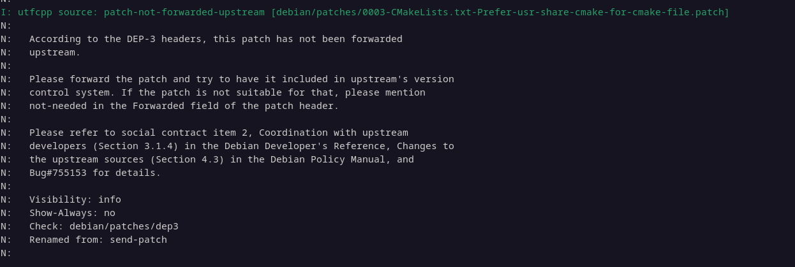
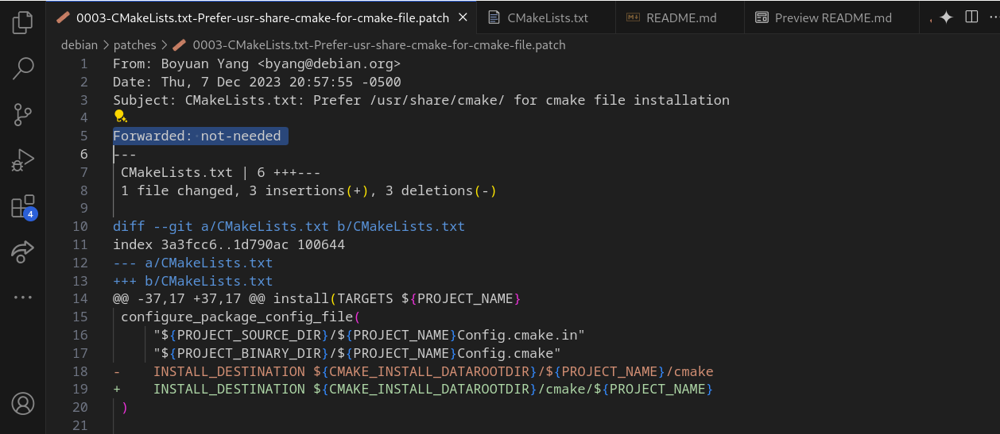
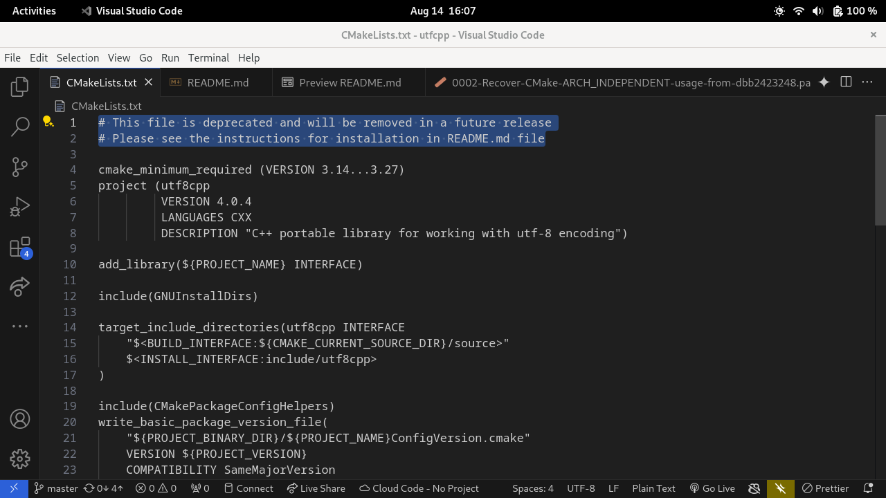

# João Vítor Motta Souto Maior

Breve resumo do que fez:
- Empacotamento e correção de erros no pacote 'utfcpp'

## utfcpp
Issue: [#283](https://salsa.debian.org/debian-brasilia-team/docs/-/issues/283)

[Tracker](https://tracker.debian.org/pkg/utfcpp)

[Repositorio no Salsa](https://salsa.debian.org/debian/utfcpp) 

[lintian do pacote](https://udd.debian.org/lintian/?packages=utfcpp)

[clone do repositorio](https://salsa.debian.org/jvsoutomaior/utfcpp)

### Empacotamento

#### Erro do lintian
Foi feito a build do pacote, porem o lintian acusou alguns erros. Foi feito a correção no patch, porem não foi corrigido todos os erros do lintian.

erro do lintian:

correção do erro:

#### Erro de build

o erro era porque o manentedor do pacote removeu um arquivo e o patch do debian estava tentando aplicar um patch em um arquivo que não existia.

parece que a solução do erro não é apenas remover o patch, parece que o erro é maior.

### Updates

Coloque as datas e o que aconteceu. Pode adicionar imagens
 Ex:
 - 15/07/27- Merge Request criado e enviado para revisão
   - Link do Merge Request: 
   - Revisor: Nome do revisor [@nickname_revisor](link_do_salsa)
PRINT DO OVERVIEW DO MERGE REQUEST
PRINT DA LISTA DE COMMITS DO MERGE REQUEST
 - 15/07/24- Comentários de revisão
 PRINTS  
  - 15/07/24- Upload feito
  -  PRINTS  

# OBS: Caso haja mais pacotes, faça o mesmo processo acima para eles.