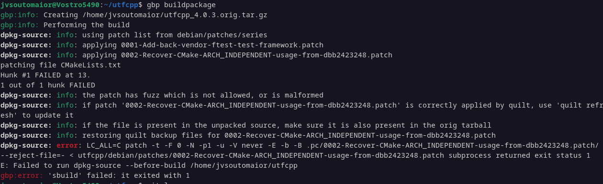
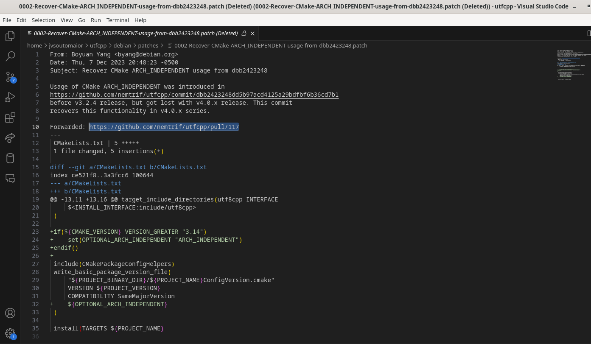

# João Vítor Motta Souto Maior

Breve resumo do que fez:
- Empacotamento e correção de erros no pacote 'utfcpp'

## utfcpp

easily handle UTF-8 encoded Unicode strings in c++

Issue: [#283](https://salsa.debian.org/debian-brasilia-team/docs/-/issues/283)

[Tracker](https://tracker.debian.org/pkg/utfcpp)

[Repositorio no Salsa](https://salsa.debian.org/debian/utfcpp) 

[lintian do pacote](https://udd.debian.org/lintian/?packages=utfcpp)

[clone do repositorio](https://salsa.debian.org/jvsoutomaior/utfcpp)

### Empacotamento

#### Erro de build

o erro era porque o manentedor do pacote alterou um arquivo e o patch do debian estava tentando aplicar o patch nesse arquivo.

vimos que esse patch era uma correção que fazia em um dos arquivos, porem esse patch ja foi submetido ao upstrem (forwarded) e foi aceito então ele não faz mais sentido de existir, então deletamos ele (patch 0002).

Assim que esse patch foi deletado, havia outros erros acontecendo pq o patch estava sendo aplicado á versão do upstream antiga, então a gente usou um time machine para voltar para quando esse patches foram aplicados e aplicamos eles á versão atual da upstream

### Updates

Merge request feito
https://salsa.debian.org/debian/utfcpp/-/merge_requests/1