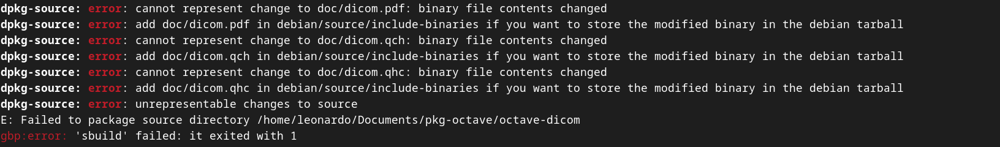
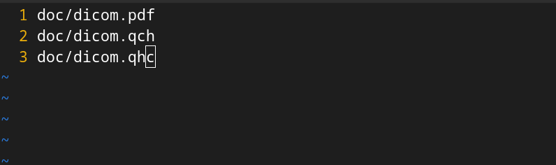
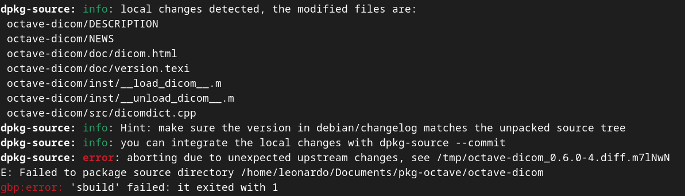

# Leonardo Gonçalves Machado

Nova upstream do pacote octave-dicom
## octave-dicom
### Package octave-dicom
Criação de uma nova versão upstream para o pacote octave-dicom.

Link issue no Salsa: <https://salsa.debian.org/debian-brasilia-team/docs/-/issues/299>

Link do respositório no salsa: <https://salsa.debian.org/pkg-octave-team/octave-dicom>

Link do Tracker: <https://tracker.debian.org/pkg/octave-dicom>

Link do Lintian: <https://udd.debian.org/lintian/?packages=octave-dicom>

### Empacotamento
Problema de geração da build após importar as mudanças da nova versão.

Para a solução do erro, foi criado o arquivo include-binaries na pasta debian/source

A inclusão do arquivo resolveu o problema com os arquivos na pasta doc, porém também há um problema em relação a patches na versão upstream

