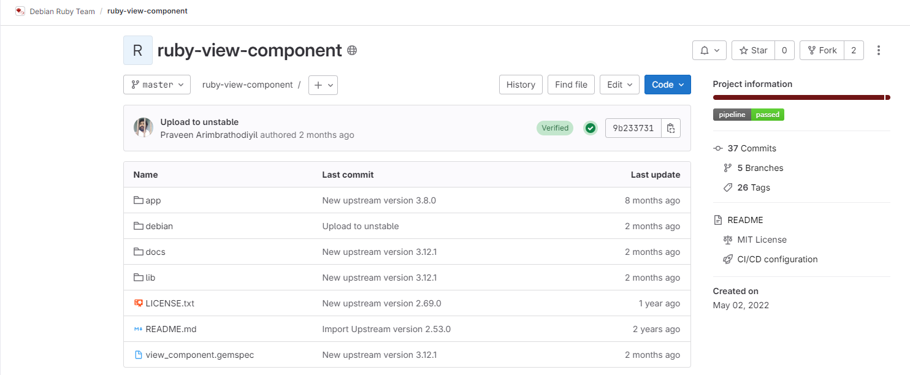
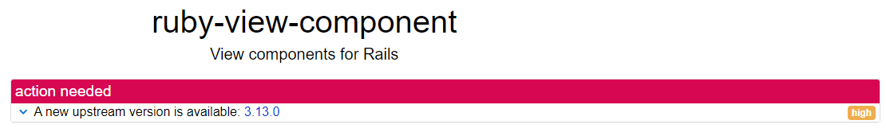
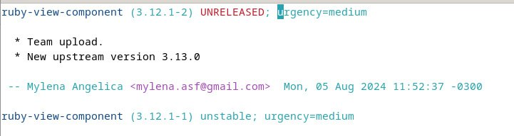
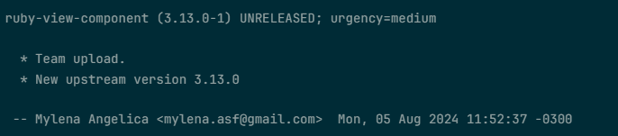
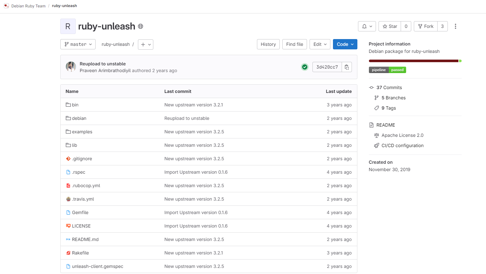
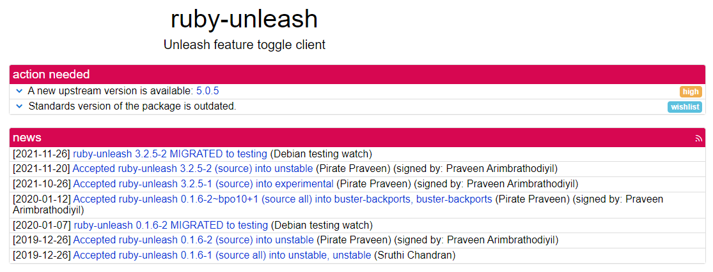
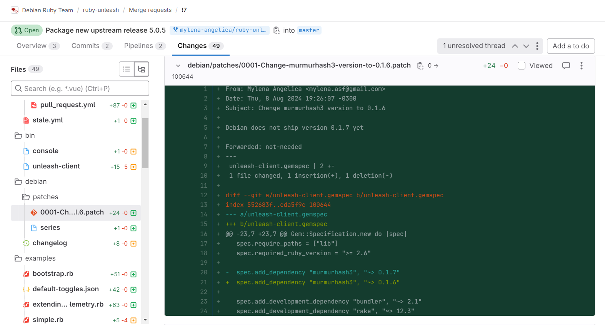

# Mylena Angélica Silva Farias

  

Na sprint 4, fiz alterações pendentes de revisão da sprint passada do pacote [python-smoke-zephyr](https://mylena-angelica.github.io/Debian-GCES-24.1/sprint3/mylena3/). Além disso, trabalhei no pacote ruby-view-component, realizando uma atualização upstream e no pacote ruby-unleash, no qual adicionei um patch e fez a nova versão upstream.  

## **ruby-view-component**

### [Package ruby-view-component](https://salsa.debian.org/debian-brasilia-team/docs/-/issues/280)  

O **ruby-view-component** é uma biblioteca para Ruby on Rails que permite construir componentes de interface de forma modular e reutilizável 

Nessa sprint, foi feito uma atualização de versão upstream.

[Link tracker](https://tracker.debian.org/pkg/ruby-view-component)

[Link Salsa](https://salsa.debian.org/ruby-team/ruby-view-component)
  

*Figura 1: ruby-view-component salsa*  

*Figura 2: ruby-view-component tracker* 

### **Empacotamento**
Foi realizada uma atualização de upstream. Durante o novo build foi acusado um erro. A tag da nova versão no commit não correspondia à versão upstream. Conforme imagem abaixo. Geralmente na hora de fazer a atualização a tag muda mas nesse caso teve de ser feita de forma manual

*Figura 3: ruby-view-component erro*

Durante o processo de revisão do meu merge, o Lintian identificou alguns alertas. No entanto, foi sugerido que as correções desses alertas fossem tratadas pelo sponsor, conforme recomendado durante a revisão. Então as alterações poderiam ir para o merge. O pacote foi revisado pelo Puida.

O merge está criado e já foi revisado, está aguardando o upload. [Link para o merge](https://salsa.debian.org/ruby-team/ruby-view-component/-/merge_requests/1)

  
*Figura 4: ruby-view-component changelog*

 Abaixo tem os alertas do Lintian.

    I: ruby-view-component: package-contains-documentation-outside-usr-share-doc [usr/share/rubygems-integration/all/gems/view_component-3.13.0/docs/CHANGELOG.md]
    P: ruby-view-component source: redundant-control-relation (in source paragraph) Build-Depends ruby-activesupport, ruby-activesupport (<< 2:8.0) [debian/control:8]
    P: ruby-view-component source: source-contains-prebuilt-javascript-object [app/assets/vendor/prism.min.js]
      

## ruby-unleash

### [Package ruby-unleash](https://salsa.debian.org/debian-brasilia-team/docs/-/issues/281)

O **ruby-unleash** é uma biblioteca em Ruby que permite o uso de _feature toggles_ (ou _feature flags_). 

Nessa sprint, foi feito uma atualização de versão upstream e a criação de um patch.

[Link tracker](https://tracker.debian.org/pkg/ruby-unleash)

[Link Salsa](https://salsa.debian.org/ruby-team/ruby-unleash)

*Figura 5: ruby-unleash salsa*

*Figura 6: ruby-unleash tracker*
  

### Empacotamento

> No Debian, **patches** são modificações aplicadas ao código-fonte
> original de um software. Essas alterações podem incluir correções de
> bugs, melhorias de segurança, ajustes de compatibilidade ou
> personalizações específicas para o sistema Debian. Os patches são
> aplicados durante o processo de empacotamento, permitindo que o
> software original seja adaptado para funcionar melhor no ambiente
> Debian sem alterar permanentemente o código-fonte upstream.

Foi realizada uma atualização para a nova versão upstream nesse pacote. No entanto, ao rodar o `sbuild` novamente, surgiram dois problemas:

1.  Ocorreu o mesmo problema relatado no pacote anterior, onde a tag da nova versão no commit não correspondia à versão upstream.
2.  Havia uma alteração de dependência que não estava compatível com o Debian. O Lintian não conseguia identificar a nova versão da dependência `murmurhash3`. Para resolver isso, criei um patch, adicionando a modificação necessária para que a versão presente no Debian fosse aceita. Mais detalhes podem ser vistos na imagem abaixo.

O pacote foi revisado pelo Puida.

*Figura 7: ruby-unleash patch*

O merge está criado e já foi revisado, está aguardando o upload. [Link para o merge](https://salsa.debian.org/ruby-team/ruby-unleash/-/merge_requests/7) 

### Histórico de versão

|Data|Autora|Versão|
|----|------|------|
| 18/08/2024 | Mylena | Adição de informações | 

