# Clean code

Clean code é um conjunto de práticas e princípios de desenvolvimento de software que visam criar código claro, legível e fácil de manter. Um código considerado "limpo" é aquele que, além de funcionar corretamente, é escrito de forma que outros desenvolvedores possam entendê-lo facilmente, fazendo com que a manutenção e a evolução do software sejam mais simples e menos propensas a erros. Entre os princípios de clean code estão a escolha de nomes descritivos para variáveis, funções e classes, a redução da complexidade, a modularização do código em funções pequenas e específicas, e a eliminação de duplicações.
No contexto da tarefa, sugerimos mudanças baseadas nesses princípios para melhorar a clareza e a qualidade do código, tornando-o mais intuitivo e de fácil compreensão para qualquer desenvolvedor que precise trabalhar com ele no futuro.

## OWASP

### Joao

Para essa atividade, foi utilizado o código do projeto [WebGoat](https://github.com/WebGoat/WebGoat). A sugestão de melhoria foi implementada no arquivo `webgoat-container/src/main/java/org/owasp/webgoat/lessons/AbstractLesson.java` do código. As sugestões foram embasadas na literatura vigente da disciplina, _Clean Code_ e _Clean Architecture_. Desse modo, a seguir será apresentado o código original, os problemas encontrados nessa solução, o código refatorado e a explicação do porquê foi realizada cada alteração com sua motivação.

#### Código antes da refatoração:
```java
/*
 * This file is part of WebGoat, an Open Web Application Security Project utility. For details, please see http://www.owasp.org/
 *
 * Copyright (c) 2002 - 2019 Bruce Mayhew
 *
 * This program is free software; you can redistribute it and/or modify it under the terms of the
 * GNU General Public License as published by the Free Software Foundation; either version 2 of the
 * License, or (at your option) any later version.
 *
 * This program is distributed in the hope that it will be useful, but WITHOUT ANY WARRANTY; without
 * even the implied warranty of MERCHANTABILITY or FITNESS FOR A PARTICULAR PURPOSE. See the GNU
 * General Public License for more details.
 *
 * You should have received a copy of the GNU General Public License along with this program; if
 * not, write to the Free Software Foundation, Inc., 59 Temple Place - Suite 330, Boston, MA
 * 02111-1307, USA.
 *
 * Getting Source ==============
 *
 * Source for this application is maintained at https://github.com/WebGoat/WebGoat, a repository for free software projects.
 */

package org.owasp.webgoat.lessons.sqlinjection.introduction;

import static java.sql.ResultSet.CONCUR_UPDATABLE;
import static java.sql.ResultSet.TYPE_SCROLL_SENSITIVE;

import java.sql.*;
import java.text.SimpleDateFormat;
import java.util.Calendar;
import org.owasp.webgoat.container.LessonDataSource;
import org.owasp.webgoat.container.assignments.AssignmentEndpoint;
import org.owasp.webgoat.container.assignments.AssignmentHints;
import org.owasp.webgoat.container.assignments.AttackResult;
import org.springframework.web.bind.annotation.PostMapping;
import org.springframework.web.bind.annotation.RequestParam;
import org.springframework.web.bind.annotation.ResponseBody;
import org.springframework.web.bind.annotation.RestController;

@RestController
@AssignmentHints(
    value = {
      "SqlStringInjectionHint.8.1",
      "SqlStringInjectionHint.8.2",
      "SqlStringInjectionHint.8.3",
      "SqlStringInjectionHint.8.4",
      "SqlStringInjectionHint.8.5"
    })
public class SqlInjectionLesson8 extends AssignmentEndpoint {

  private final LessonDataSource dataSource;

  public SqlInjectionLesson8(LessonDataSource dataSource) {
    this.dataSource = dataSource;
  }

  @PostMapping("/SqlInjection/attack8")
  @ResponseBody
  public AttackResult completed(@RequestParam String name, @RequestParam String auth_tan) {
    return injectableQueryConfidentiality(name, auth_tan);
  }

  protected AttackResult injectableQueryConfidentiality(String name, String auth_tan) {
    StringBuilder output = new StringBuilder();
    String query =
        "SELECT * FROM employees WHERE last_name = '"
            + name
            + "' AND auth_tan = '"
            + auth_tan
            + "'";

    try (Connection connection = dataSource.getConnection()) {
      try {
        Statement statement =
            connection.createStatement(
                ResultSet.TYPE_SCROLL_INSENSITIVE, ResultSet.CONCUR_UPDATABLE);
        log(connection, query);
        ResultSet results = statement.executeQuery(query);

        if (results.getStatement() != null) {
          if (results.first()) {
            output.append(generateTable(results));
            results.last();

            if (results.getRow() > 1) {
              // more than one record, the user succeeded
              return success(this)
                  .feedback("sql-injection.8.success")
                  .output(output.toString())
                  .build();
            } else {
              // only one record
              return failed(this).feedback("sql-injection.8.one").output(output.toString()).build();
            }

          } else {
            // no results
            return failed(this).feedback("sql-injection.8.no.results").build();
          }
        } else {
          return failed(this).build();
        }
      } catch (SQLException e) {
        return failed(this)
            .output("<br><span class='feedback-negative'>" + e.getMessage() + "</span>")
            .build();
      }

    } catch (Exception e) {
      return failed(this)
          .output("<br><span class='feedback-negative'>" + e.getMessage() + "</span>")
          .build();
    }
  }

  public static String generateTable(ResultSet results) throws SQLException {
    ResultSetMetaData resultsMetaData = results.getMetaData();
    int numColumns = resultsMetaData.getColumnCount();
    results.beforeFirst();
    StringBuilder table = new StringBuilder();
    table.append("<table>");

    if (results.next()) {
      table.append("<tr>");
      for (int i = 1; i < (numColumns + 1); i++) {
        table.append("<th>" + resultsMetaData.getColumnName(i) + "</th>");
      }
      table.append("</tr>");

      results.beforeFirst();
      while (results.next()) {
        table.append("<tr>");
        for (int i = 1; i < (numColumns + 1); i++) {
          table.append("<td>" + results.getString(i) + "</td>");
        }
        table.append("</tr>");
      }

    } else {
      table.append("Query Successful; however no data was returned from this query.");
    }

    table.append("</table>");
    return (table.toString());
  }

  public static void log(Connection connection, String action) {
    action = action.replace('\'', '"');
    Calendar cal = Calendar.getInstance();
    SimpleDateFormat sdf = new SimpleDateFormat("yyyy-MM-dd HH:mm:ss");
    String time = sdf.format(cal.getTime());

    String logQuery =
        "INSERT INTO access_log (time, action) VALUES ('" + time + "', '" + action + "')";

    try {
      Statement statement = connection.createStatement(TYPE_SCROLL_SENSITIVE, CONCUR_UPDATABLE);
      statement.executeUpdate(logQuery);
    } catch (SQLException e) {
      System.err.println(e.getMessage());
    }
  }
}
```

com base no código acima, foram identificados os seguintes problemas:

##### 1. Tamanho e Complexidade de Funções
A função `injectableQueryConfidentiality` é extensa e executa múltiplas tarefas, como a construção da query, a execução da consulta, a verificação dos resultados e a geração de feedback. Essa função não segue o princípio SRP (Single Responsibility Principle) do SOLID, que estabelece que uma função deve ter uma única responsabilidade. Funções longas e multifuncionais são difíceis de ler, testar e manter, e devem ser divididas em funções menores, cada uma dedicada a uma única responsabilidade.

codigo refatorado:

```java
/*
 * This file is part of WebGoat, an Open Web Application Security Project utility. For details, please see http://www.owasp.org/
 *
 * Copyright (c) 2002 - 2019 Bruce Mayhew
 *
 * This program is free software; you can redistribute it and/or modify it under the terms of the
 * GNU General Public License as published by the Free Software Foundation; either version 2 of the
 * License, or (at your option) any later version.
 *
 * This program is distributed in the hope that it will be useful, but WITHOUT ANY WARRANTY; without
 * even the implied warranty of MERCHANTABILITY or FITNESS FOR A PARTICULAR PURPOSE. See the GNU
 * General Public License for more details.
 *
 * You should have received a copy of the GNU General Public License along with this program; if
 * not, write to the Free Software Foundation, Inc., 59 Temple Place - Suite 330, Boston, MA
 * 02111-1307, USA.
 *
 * Getting Source ==============
 *
 * Source for this application is maintained at https://github.com/WebGoat/WebGoat, a repository for free software projects.
 */

package org.owasp.webgoat.lessons.sqlinjection.introduction;

import static java.sql.ResultSet.CONCUR_UPDATABLE;
import static java.sql.ResultSet.TYPE_SCROLL_SENSITIVE;

import java.sql.*;
import java.text.SimpleDateFormat;
import java.util.Calendar;
import org.owasp.webgoat.container.LessonDataSource;
import org.owasp.webgoat.container.assignments.AssignmentEndpoint;
import org.owasp.webgoat.container.assignments.AssignmentHints;
import org.owasp.webgoat.container.assignments.AttackResult;
import org.springframework.web.bind.annotation.PostMapping;
import org.springframework.web.bind.annotation.RequestParam;
import org.springframework.web.bind.annotation.ResponseBody;
import org.springframework.web.bind.annotation.RestController;

@RestController
@AssignmentHints(
    value = {
      "SqlStringInjectionHint.8.1",
      "SqlStringInjectionHint.8.2",
      "SqlStringInjectionHint.8.3",
      "SqlStringInjectionHint.8.4",
      "SqlStringInjectionHint.8.5"
    })
public class SqlInjectionLesson8 extends AssignmentEndpoint {

  private final LessonDataSource dataSource;

  public SqlInjectionLesson8(LessonDataSource dataSource) {
    this.dataSource = dataSource;
  }

  @PostMapping("/SqlInjection/attack8")
  @ResponseBody
  public AttackResult completed(@RequestParam String name, @RequestParam String auth_tan) {
    return injectableQueryConfidentiality(name, auth_tan);
  }

  protected AttackResult injectableQueryConfidentiality(String name, String auth_tan) {
    StringBuilder output = new StringBuilder();
    String query =
        "SELECT * FROM employees WHERE last_name = '"
            + name
            + "' AND auth_tan = '"
            + auth_tan
            + "'";

    try (Connection connection = dataSource.getConnection()) {
      try {
        Statement statement =
            connection.createStatement(
                ResultSet.TYPE_SCROLL_INSENSITIVE, ResultSet.CONCUR_UPDATABLE);
        log(connection, query);
        ResultSet results = statement.executeQuery(query);
        ResultSetMetaData resultsMetaData = getMetaData(results, output);
 
      } catch (SQLException e) {
        return failed(this)
            .output("<br><span class='feedback-negative'>" + e.getMessage() + "</span>")
            .build();
      }

    } catch (Exception e) {
      return failed(this)
          .output("<br><span class='feedback-negative'>" + e.getMessage() + "</span>")
          .build();
    }
  }

  public static String generateTable(ResultSet results) throws SQLException {
    ResultSetMetaData resultsMetaData = results.getMetaData();
    int numColumns = resultsMetaData.getColumnCount();
    results.beforeFirst();
    StringBuilder table = new StringBuilder();
    table.append("<table>");

    if (results.next()) {
      table.append("<tr>");
      for (int i = 1; i < (numColumns + 1); i++) {
        table.append("<th>" + resultsMetaData.getColumnName(i) + "</th>");
      }
      table.append("</tr>");

      results.beforeFirst();
      while (results.next()) {
        table.append("<tr>");
        for (int i = 1; i < (numColumns + 1); i++) {
          table.append("<td>" + results.getString(i) + "</td>");
        }
        table.append("</tr>");
      }

    } else {
      table.append("Query Successful; however no data was returned from this query.");
    }

    table.append("</table>");
    return (table.toString());
  }

  public static void log(Connection connection, String action) {
    action = action.replace('\'', '"');
    Calendar cal = Calendar.getInstance();
    SimpleDateFormat sdf = new SimpleDateFormat("yyyy-MM-dd HH:mm:ss");
    String time = sdf.format(cal.getTime());

    String logQuery =
        "INSERT INTO access_log (time, action) VALUES ('" + time + "', '" + action + "')";

    try {
      Statement statement = connection.createStatement(TYPE_SCROLL_SENSITIVE, CONCUR_UPDATABLE);
      statement.executeUpdate(logQuery);
    } catch (SQLException e) {
      System.err.println(e.getMessage());
    }
  }
}

  private ResultSetMetaData getMetaData(ResultSet results, StringBuilder output) {
  if (results.getStatement() != null) {
    if (results.first()) {
      output.append(generateTable(results));
      results.last();

      if (results.getRow() > 1) {
        // more than one record, the user succeeded
        return success(this)
            .feedback("sql-injection.8.success")
            .output(output.toString())
            .build();
      } else {
        // only one record
        return failed(this).feedback("sql-injection.8.one").output(output.toString()).build();
      }

    } else {
      // no results
      return failed(this).feedback("sql-injection.8.no.results").build();
    }
  } else {
    return failed(this).build();
  }
}
```

[Pull Request](https://github.com/WebGoat/WebGoat/pull/1887)

### Bruno

Para essa atividade, foi utilizado o código do projeto [NINJA-PingU](https://github.com/OWASP/NINJA-PingU). A sugestão de melhoria foi implementada no arquivo `src/connector.c` do código. As sugestões foram embasadas na literatura vigente da disciplina, _Clean Code_ e _Clean Architecture_. Desse modo, a seguir será apresentado o código original, os problemas encontrados nessa solução, o código refatorado e a explicação do porquê foi realizada cada alteração com sua motivação.

#### Código antes da refatoração:
```c
/*   OWASP NINJA PingU: Is Not Just a Ping Utility
 *
 *   Copyright (C) 2014 Guifre Ruiz <guifre.ruiz@owasp.org>
 *
 *  This program is free software: you can redistribute it and/or modify
 *  it under the terms of the GNU General Public License as published by
 *  the Free Software Foundation, either version 3 of the License, or
 *  (at your option) any later version.
 *
 *  This program is distributed in the hope that it will be useful,
 *  but WITHOUT ANY WARRANTY; without even the implied warranty of
 *  MERCHANTABILITY or FITNESS FOR A PARTICULAR PURPOSE.  See the
 *  GNU General Public License for more details.
 *
 *  You should have received a copy of the GNU General Public License
 *  along with this program.  If not, see <http://www.gnu.org/licenses/>.
 */

#include <unistd.h>
#include <stdio.h>
#include <stdlib.h>
#include <netinet/in.h>
#include <arpa/inet.h>
#include <netdb.h>
#include <errno.h>
#include <string.h>
#include <sys/epoll.h>
#include <fcntl.h>
#include <signal.h>
#include <sys/time.h>
#include <pthread.h>
#include <sys/timerfd.h>

#include "socks.c"
#include "pluginHandler.c"

// the epoll file descriptor
int epfd;

pthread_mutex_t mutex_epfd = PTHREAD_MUTEX_INITIALIZER;

int *start_connector(void *agentI) {
	struct agentInfo *aInfo = agentI;
	loadMethods();
	
	//wait for sync
	sem_wait(aInfo->startB);
	printf("\t+Connector Service started [%u]\n", aInfo->mPort);

	openAckFile();
	onInitPlugin();
	
	// internal variables definition
	int i, count, datacount;
	
	//buf to hold the response
	char buffer[512];
	int buffersize = sizeof(buffer);

	// epoll structure that will contain the current network socket and event when epoll wakes up
	static struct epoll_event *events;
	static struct epoll_event event_mask;
	
	// create the special epoll file descriptor
	pthread_mutex_lock(&mutex_epfd);
	epfd = epoll_create(MAX_SOCKS);
	pthread_mutex_unlock(&mutex_epfd);

	// allocate enough memory to store all the events in the "events" structure
	if (NULL == (events = calloc(MAX_SOCKS, sizeof(struct epoll_event)))) {
		perror("calloc events");
		exit(1);
	};

	while (endOfScan == FALSE) {

		count = epoll_wait((int )epfd, events, MAX_SOCKS, -1);
		for (i = 0; i < count; i++) {

			if ((events[i].events & EPOLLERR) || (events[i].events & EPOLLRDHUP) || (events[i].events & EPOLLHUP)) //socket is erroneous
			{
				deleteSock(epfd, events[i].data.fd);
			}

			if (events[i].events & EPOLLOUT) //we can write
			{
				if (socket_check(events[i].data.fd) != 0) {
					deleteSock(epfd, events[i].data.fd);
					continue;
				} else {
					// Request
					int porr = (int)getPortBySock(events[i].data.fd);
					char *message= malloc(sizeof(char)*80);

					getServiceInput(porr, message);
					int messagelength = strlen(message);
					if ((datacount = send(events[i].data.fd, message, messagelength, 0)) < 0) {
						//printf("send failed");
						continue;
					} else {
						event_mask.events = EPOLLIN | EPOLLRDHUP | EPOLLERR;
						event_mask.data.fd = events[i].data.fd;
						if (epoll_ctl((int) epfd, EPOLL_CTL_MOD, events[i].data.fd, &event_mask) != 0) {
							deleteSock(epfd, events[i].data.fd);
							continue;
						}
					}
					if (message != NULL) {
						free(message);
					}
				}
			}
			if ((events[i].events & EPOLLIN)) //we can read
			{
				if (socket_check(events[i].data.fd) != 0) {
					deleteSock(epfd, events[i].data.fd);
					continue;
				} else {
					struct host hostInfo;
					hostInfo.port =  (int)getPortBySock(events[i].data.fd);
					hostInfo.ip =  getHostBySock(events[i].data.fd);
					if (hostInfo.port == -1 || strlen(hostInfo.ip) == 0){
						deleteSock(epfd, events[i].data.fd);
						continue;
					}
					memset(buffer, 0x0, buffersize);
					char *msg;
					msg = (char *) malloc(5000);
					if (msg != NULL) {
						int data = 0, datacount = 0;
						while ((datacount = recv(events[i].data.fd, buffer, buffersize, 0)) > 0) {
							buffer[datacount] = '\0';
							if (data + datacount > 4999) {
								break;
							}
							if (data == 0) {
								strncpy(msg, buffer,4999);
							} else {
								strncat(msg, buffer,4999);
							}
							data = data + datacount;
						}
						if (data > 0) {
							persistAck(hostInfo.ip,hostInfo.port,msg);
							provideOutput(hostInfo.ip, hostInfo.port, msg);
						}
						if (msg!= NULL) {
							free(msg);
						}
					}
					deleteSock(epfd, events[i].data.fd);
				}
			}
			if (events[i].events & EPOLLERR) { //error
				continue;
			}
		}
	}
	onStopPlugin();
	return 0;
}
```

#### Problemas encontrados:
##### 1. Modularização e Separação de Responsabilidades (SRP - Single Responsibility Principle):
O princípio SRP (_Single Responsibility Principle_) do SOLID afirma que uma classe ou função deve ter uma única responsabilidade. No código original, a função `start_connector` concentra múltiplas responsabilidades, desde a inicialização dos recursos até o processamento de eventos de leitura e escrita. Essa abordagem viola o princípio da responsabilidade única, tornando o código mais complexo e difícil de manter.

A refatoração resolve esse problema ao separar as responsabilidades em funções distintas: `initialize_connector`, `handle_write_event`, e `handle_read_event`. Essa modularização promove um código mais coeso e com responsabilidades claramente definidas. Isso facilita a compreensão do fluxo lógico do programa e reduz a complexidade ciclomática, um importante indicador da probabilidade de introdução de erros.

##### 2.  Responsabilidade Única
###### 2.1 Coesão
Além disso, a coesão é baixa, já que a função manipula várias responsabilidades diferentes em um único lugar, resultando em um código que não é modular e é difícil de modificar. Ao quebrar a função em funções menores, podemos criar um código que seja mais fácil de entender e modificar, além de permitir a reutilização de partes do código em outros contextos.

###### 2.2 Aplicação do Princípio de Aberto/Fechado (OCP - Open/Closed Principle):
Embora o código refatorado não introduza novas extensões diretamente, a separação de responsabilidades e modularização do código facilita futuras extensões. Com funções específicas para cada tarefa, novos comportamentos podem ser adicionados ou alterados sem modificar a estrutura existente, permitindo que o código seja estendido sem ser modificado, conforme proposto pelo princípio de Aberto/Fechado.

##### 3. Gerenciamento de Recursos e Melhoria na Concorrência:
O gerenciamento adequado de recursos é uma prática essencial em _Clean Code_ e deve ser uma prioridade, especialmente em sistemas que funcionam por longos períodos, como servidores. A memória deve sempre ser liberada após o uso com `free()`, garantindo que não haja desperdício de recursos. A refatoração também preserva e melhora a segurança em cenários de concorrência. O uso de mutexes para proteger o descritor de arquivo `epfd` continua presente, mas a separação das operações em funções específicas reduz a chance de erros em ambientes _multithread_, minimizando possíveis _race conditions_. O código refatorado também assegura que recursos como memória alocada e _file descriptors_ são devidamente liberados, evitando vazamentos de memória e possíveis falhas no sistema.

##### 4. Variáveis
###### 4.1. Uso de Números "Mágicos"
O uso de números "mágicos" (constantes numéricas sem significado evidente, como 512, 5000, 10) no código original é um problema clássico de manutenção. Esses valores não são autoexplicativos e podem gerar confusão se usados em mais de um lugar no código. _Clean Code_ recomenda substituir números mágicos por constantes nomeadas, como `BUFFER_SIZE`, `MESSAGE_SIZE`, e `EPOLL_MAX_EVENTS` o que elimina os números mágicos, melhorando a legibilidade, facilitando futuras alterações e menos propenso a erros.

###### 4.2 Nomes de Variáveis e Funções
Uma das regras básicas de _Clean Code_ é que o código deve ser autoexplicativo. Nomes de variáveis e funções devem expressar claramente a intenção do código sem a necessidade de comentários adicionais. Esse problema é frequentemente identificado como "nomenclatura obscura", o que compromete a legibilidade e aumenta o tempo necessário para um novo desenvolvedor entender o código. O código refatorado utiliza nomes de funções e variáveis mais descritivos, como `handle_write_event` e `handle_read_event`, que tornam o código autoexplicativo. Essa prática está alinhada com as recomendações de _Clean Code_, que enfatizam a importância de nomes claros e que reflitam a intenção do código.

##### 5. Detalhes
###### 5.1. Comentários
Comentários são frequentemente necessários para explicar trechos de código complexos. No entanto, _Clean Code_ sugere que o código deve ser escrito de forma tão clara que os comentários se tornem desnecessários. No código analisado, há vários comentários que explicam o "como" em vez de "por que", o que é uma prática a ser evitada. Comentários que explicam como o código funciona podem ser substituídos por uma escolha melhor de nomes de variáveis e funções, enquanto comentários que explicam o "por que" oferecem mais valor ao leitor.

###### 5.2. Tratamento de Erros
O tratamento de erros no código original é rudimentar e não oferece informações suficientes para diagnóstico em caso de falha. A refatoração melhora significativamente o gerenciamento de recursos e a manipulação de erros. O uso de mensagens de erro detalhadas com perror, além de verificar imediatamente a falha na alocação de memória, evita potenciais problemas em tempo de execução. 

#### Código com solução 

#### Refatorações designadas para solução / explicação

Para a solução proposta foi definido o nome de constantes como `BUFFER_SIZE` e `MESSAGE_SIZE` e `EPOLL_MAX_EVENTS`. 
```c
#define BUFFER_SIZE 512
#define MESSAGE_SIZE 5000
#define EPOLL_MAX_EVENTS 10

pthread_mutex_t mutex_epfd = PTHREAD_MUTEX_INITIALIZER;
int epfd;

void initialize_connector(struct agentInfo *aInfo);
void handle_write_event(int fd);
void handle_read_event(int fd);
```

A função `sart_connector()` foi reduziada, sendo dividida em mais outras duas funções. Desse modo, ela continua sendo a função principal do código, porém, agora, com um escopo bem menor de tarefas e com menos responsabilidade.
```c
int* start_connector(void *agentI) {
    struct agentInfo *aInfo = agentI;
    initialize_connector(aInfo);
    static struct epoll_event *events;
    if (NULL == (events = calloc(MAX_SOCKS, sizeof(struct epoll_event)))) {
        perror("calloc events");
        exit(1);
    };

    while (!endOfScan) {
        int event_count = epoll_wait(epfd, events, EPOLL_MAX_EVENTS, -1);
        for (int i = 0; i < event_count; i++)
            if (events[i].events & (EPOLLERR | EPOLLRDHUP | EPOLLHUP))
                deleteSock(epfd, events[i].data.fd);
            else if (events[i].events & EPOLLOUT)
                handle_write_event(events[i].data.fd);
            else if (events[i].events & EPOLLIN)
                handle_read_event(events[i].data.fd);
    }

    onStopPlugin();
    pthread_mutex_destroy(&mutex_epfd);
    close(epfd);
    return 0;
}
```

Foi estraida as funções `handle_write_event()` e `handle_read_event()`, cada uma com tarefas e atributos bem definidos. Nessas funções, agora, fora utilizado uma ideia de redução ciclomática do código, invertendo a ordem e o fluxo de condicionais.
```c
void handle_write_event(int fd) {
    if (socket_check(fd) != 0) {
        deleteSock(epfd, fd);
        return;
    }

    int port = (int)getPortBySock(fd);
    char *message = malloc(sizeof(char) * 80);

    if (message == NULL) {
        perror("Failed to allocate memory for message");
        return;
    }

    getServiceInput(port, message);
    int message_length = strlen(message);

    if (send(fd, message, message_length, 0) < 0) {
        free(message);
        return;
    }

    struct epoll_event event_mask;
    event_mask.events = EPOLLIN | EPOLLRDHUP | EPOLLERR;
    event_mask.data.fd = fd;

    if (epoll_ctl(epfd, EPOLL_CTL_MOD, fd, &event_mask) != 0) {
        deleteSock(epfd, fd);
    }

    free(message);
```

```c
void handle_read_event(int fd) {
    if (socket_check(fd) != 0) {
        deleteSock(epfd, fd);
        return;
    }

    struct host hostInfo;
    hostInfo.port = (int)getPortBySock(fd);
    hostInfo.ip = getHostBySock(fd);

    if (hostInfo.port == -1 || strlen(hostInfo.ip) == 0) {
        deleteSock(epfd, fd);
        return;
    }

    char buffer[BUFFER_SIZE];
    memset(buffer, 0x0, BUFFER_SIZE);
    char *msg = malloc(MESSAGE_SIZE);

    if (msg == NULL) {
        perror("Failed to allocate memory for msg");
        deleteSock(epfd, fd);
        return;
    }

    int total_data = 0, data_count = 0;

    while ((data_count = recv(fd, buffer, BUFFER_SIZE, 0)) > 0) {
        if (total_data + data_count > MESSAGE_SIZE - 1) break;

        if (total_data == 0) strncpy(msg, buffer, MESSAGE_SIZE - 1);
        else strncat(msg, buffer, MESSAGE_SIZE - 1 - total_data);

        total_data += data_count;
    }

    if (total_data > 0) {
        persistAck(hostInfo.ip, hostInfo.port, msg);
        provideOutput(hostInfo.ip, hostInfo.port, msg);
    }

    free(msg);
    deleteSock(epfd, fd);
}
```

#### PR
[Pull Request](https://github.com/OWASP/NINJA-PingU/pull/7)

### Igor

Neste projeto, utilizamos o código do [NINJA-PingU](https://github.com/OWASP/NINJA-PingU) como base. As melhorias foram implementadas no arquivo `src/listener.c`, seguindo os princípios do _Clean Code_ e _Clean Architecture_, conforme abordado na literatura da disciplina. A seguir, apresentaremos o código original, os problemas identificados, o código refatorado, e a justificativa para cada alteração realizada, explicando a motivação por trás dessas mudanças.


#### Código antes da refatoração:
```c
/*   OWASP NINJA PingU: Is Not Just a Ping Utility
 *
 *   Copyright (C) 2014 Guifre Ruiz <guifre.ruiz@owasp.org>
 *
 *  This program is free software: you can redistribute it and/or modify
 *  it under the terms of the GNU General Public License as published by
 *  the Free Software Foundation, either version 3 of the License, or
 *  (at your option) any later version.
 *
 *  This program is distributed in the hope that it will be useful,
 *  but WITHOUT ANY WARRANTY; without even the implied warranty of
 *  MERCHANTABILITY or FITNESS FOR A PARTICULAR PURPOSE.  See the
 *  GNU General Public License for more details.
 *
 *  You should have received a copy of the GNU General Public License
 *  along with this program.  If not, see <http://www.gnu.org/licenses/>.
 */

#include <netinet/ip_icmp.h>
#include <netinet/udp.h>
#include <arpa/inet.h>

#include "spotter.c"

int mSocket;
FILE *logfile;
int i, j;
struct sockaddr_in source, dest;


void createSock() {
    mSocket = socket(AF_INET, SOCK_RAW, IPPROTO_TCP);
    if (mSocket < 0) {
        printf("Socket Error\n");
        exit(1);
    }
}
void *start_receiver(void *agentI) {
    struct agentInfo *aInfo = agentI;
    sem_wait(aInfo->startB);
    printf("\t+Listener  Started at port [%u]\n", aInfo->mPort);

    openSynFile();

    int saddr_size, data_size;
    struct sockaddr saddr;

    char *mBuffer = (char *) malloc(80000);

    //creates the socket
    createSock();

    //tmp cache to hold results
    int tmpFoundHosts = 0;

    //main loop
    while (endOfScan == FALSE) {
        saddr_size = sizeof saddr;

        //recieve packets
        data_size = recvfrom(mSocket, mBuffer, 65536, 0, &saddr, (socklen_t*) &saddr_size);
        if (data_size < 0) {
            printf("Recvfrom error , failed to get packets\n");
            exit(1);
        }

        struct iphdr *iph = (struct iphdr*) mBuffer;
        unsigned short iphdrlen;
        iphdrlen = iph->ihl * 4;
        struct tcphdr *tcph = (struct tcphdr*) (mBuffer + iphdrlen);

        //we uniquely identify packets by magic port and magic ack seq number	
        if ((unsigned int) tcph->ack == 1 &&
                     ntohs(tcph->dest) == aInfo->mPort &&
                     ntohl(tcph->ack_seq) == MAGIC_ACKSEQ) {
            //port open
            if ((unsigned int) tcph->rst  == 0 ) {
                struct iphdr *iph = (struct iphdr *) mBuffer;
                iphdrlen = (int) iph->ihl * 4;
                memset(&source, 0, sizeof(source));
                source.sin_addr.s_addr = (unsigned int) iph->saddr;
                memset(&dest, 0, sizeof(dest));
                dest.sin_addr.s_addr = iph->daddr;

                if (synOnly == FALSE) {
                    pthread_mutex_lock (&mutex_epfd);
                    while (create_and_connect(inet_ntoa(source.sin_addr), ntohs(tcph->source), epfd) != 0) {
                        //printf("problem");
                    } 
                    pthread_mutex_unlock (&mutex_epfd);
                }
				
                //increments counter result
                tmpFoundHosts++;
                if (tmpFoundHosts >= CACHE_SYNC) {
                    incFoundHosts(tmpFoundHosts);
                    tmpFoundHosts = 0;
                }
                //persists results
                persistSyn(inet_ntoa(source.sin_addr), ntohs(tcph->source));
            } else { //port closed
                //persists results
                //persistClosedSyn(inet_ntoa(source.sin_addr), ntohs(tcph->source));
            }
        } else { //uncomment for debugging purposes
            /*struct iphdr *iph = (struct iphdr *) mBuffer;
            iphdrlen = (int) iph->ihl * 4;
            memset(&source, 0, sizeof(source));
            source.sin_addr.s_addr = (unsigned int) iph->saddr;
            memset(&dest, 0, sizeof(dest));
            dest.sin_addr.s_addr = iph->daddr;
            printf("\nTo[%d] From[%s:%d] syn[%d] ack[%d] rst[%d] ack_seq[%d] fin[%d]\n",tcph->source,inet_ntoa(source.sin_addr),
            ntohs(tcph->source), (unsigned int) tcph->syn,(unsigned int) tcph->ack,(unsigned int) tcph->rst,ntohl(tcph->ack_seq),(unsigned int) tcph->fin );
            */
        }
    }
    close(mSocket);
    return NULL;
}
```

#### Problemas encontrados:

##### 1. Tamanho e Complexidade de Funções
O princípio SRP (Single Responsibility Principle) do SOLID estabelece que uma classe ou função deve ter uma única responsabilidade. No código original, a função `start_receiver()` ilustra claramente uma violação desse princípio. Ela é extensa, executa múltiplas tarefas e não se concentra em uma única responsabilidade. Essa função não apenas cria o socket, mas também recebe pacotes, processa-os e persiste os resultados, tudo em um único bloco de código.

Essa prática de concentrar múltiplas responsabilidades em uma única função resulta em código difícil de ler, testar e manter. De acordo com os princípios do Clean Code, funções longas e multifuncionais devem ser divididas em funções menores, cada uma dedicada a uma única responsabilidade. Isso não só facilita a compreensão do fluxo lógico do programa, como também reduz a complexidade ciclomática, um indicador crucial da probabilidade de introdução de erros.

##### 2.  Responsabilidade Única e Coesão
Além disso, a função apresenta baixa coesão, pois manipula várias responsabilidades distintas em um único lugar, o que resulta em um código não modular e difícil de modificar. Ao dividir essa função em funções menores, conseguimos criar um código mais fácil de entender e modificar, além de permitir a reutilização de partes do código em outros contextos.

##### 3. Gerenciamento de Recursos e Memória 
O código original utiliza alocação dinâmica de memória com malloc para a variável `mBuffer`, mas não libera a memória alocada, o que pode causar vazamentos de memória. O gerenciamento adequado de recursos é uma prática fundamental em _Clean Code_ e deve ser uma prioridade, especialmente em sistemas que operam por longos períodos, como servidores. A memória deve sempre ser liberada após o uso com `free()`, garantindo que não haja desperdício de recursos

##### 4. Variáveis
###### 4.1. Uso de Variáveis Globais
Variáveis globais como `mSocket`, `source`, e `dest` são usadas em todo o código, enquanto `logfile`, `i` e `j` são variáveis globais, as quais nem são utilizadas no decorrer do código. O uso de variáveis globais pode resultar em efeitos colaterais indesejados e dificulta o rastreamento do estado do programa, tornando o código mais difícil de depurar e testar.

###### 4.2. Uso de Números "Mágicos"
O uso de números "mágicos" (constantes numéricas sem significado evidente, como 65536, 80000) no código original é um problema clássico de manutenção. Esses valores não são autoexplicativos e podem gerar confusão se usados em mais de um lugar no código. Clean Code recomenda substituir números mágicos por constantes nomeadas, como MAX_BUFFER_SIZE ou RECEIVE_BUFFER_SIZE, o que torna o código mais legível e menos propenso a erros.

O uso de números "mágicos" (constantes numéricas sem significado evidente, como 65536 ou 80000) no código original é um problema clássico de manutenção. Esses valores não são autoexplicativos e podem gerar confusão, especialmente se utilizados em mais de um ponto do código. O _Clean Code_ recomenda substituir números mágicos por constantes nomeadas, como `MAX_BUFFER_SIZE` ou `RECEIVE_BUFFER_SIZE`, tornando o código mais legível e menos propenso a erros.

###### 4.3 Nomes de Variáveis e Funções 
Uma das regras fundamentais do _Clean Code_ é que o código deve ser autoexplicativo. Nomes de variáveis e funções devem expressar claramente a intenção do código, eliminando a necessidade de comentários adicionais. No código original, variáveis como `mSocket`, `aInfo`, e `iphdrlen` possuem nomes criptográficos, o que dificulta a compreensão imediata de seus propósitos. Esse problema, conhecido como "nomenclatura obscura", compromete a legibilidade e aumenta o tempo necessário para que um novo desenvolvedor entenda o código.


##### 5. Detalhes
###### 5.1. Comentários
Comentários são frequentemente necessários para explicar trechos de código complexos. No entanto, _Clean Code_ sugere que o código deve ser escrito de forma tão clara que os comentários se tornem desnecessários. No código analisado, há vários comentários que explicam o "como" em vez de "por que", o que é uma prática a ser evitada. Comentários que explicam como o código funciona podem ser substituídos por uma escolha melhor de nomes de variáveis e funções, enquanto comentários que explicam o "por que" oferecem mais valor ao leitor.

###### 5.2. Tratamento de Erros
O tratamento de erros no código original é rudimentar e não oferece informações suficientes para diagnóstico em caso de falha. Por exemplo, quando a criação do socket falha, o programa simplesmente imprime "Socket Error" e termina. Esta prática não está alinhada com a recomendação de _Clean Code_ de fornecer mensagens de erro claras e úteis. Além disso, o uso de exit(1) interrompe abruptamente a execução, o que pode ser aceitável em alguns contextos, mas não é uma solução ideal, especialmente em sistemas maiores onde a recuperação de erros é crítica.

###### 5.3 Estrutura do Código e Estilo
A estrutura do código, como a organização das funções e o estilo de formatação, não é consistente. Algumas funções e blocos de código não seguem um padrão claro de espaçamento ou indentação. A inconsistência na formatação pode dificultar a leitura do código, especialmente em projetos grandes com vários desenvolvedores.

#### Código com solução
```c
/*   OWASP NINJA PingU: Is Not Just a Ping Utility
 *
 *   Copyright (C) 2014 Guifre Ruiz <guifre.ruiz@owasp.org>
 *
 *  This program is free software: you can redistribute it and/or modify
 *  it under the terms of the GNU General Public License as published by
 *  the Free Software Foundation, either version 3 of the License, or
 *  (at your option) any later version.
 *
 *  This program is distributed in the hope that it will be useful,
 *  but WITHOUT ANY WARRANTY; without even the implied warranty of
 *  MERCHANTABILITY or FITNESS FOR A PARTICULAR PURPOSE.  See the
 *  GNU General Public License for more details.
 *
 *  You should have received a copy of the GNU General Public License
 *  along with this program.  If not, see <http://www.gnu.org/licenses/>.
 */

#include <netinet/ip_icmp.h>
#include <netinet/udp.h>
#include <arpa/inet.h>

#include "spotter.c"

#define BUFFER_SIZE 80000
#define PACKET_SIZE 65536

typedef struct {
    int socket_fd;
    char *buffer;
    struct sockaddr_in source, dest;
} PacketReceiver;

int create_socket() {
    int socket_fd = socket(AF_INET, SOCK_RAW, IPPROTO_TCP);
    if (socket_fd < 0) {
        perror("Socket creation failed");
        exit(EXIT_FAILURE);
    }
    return socket_fd;
}

PacketReceiver* init_packet_receiver() {
    PacketReceiver *receiver = malloc(sizeof(PacketReceiver));
    if (!receiver) {
        perror("Memory allocation failed");
        exit(EXIT_FAILURE);
    }
    receiver->socket_fd = create_socket();
    receiver->buffer = malloc(BUFFER_SIZE);
    if (!receiver->buffer) {
        perror("Memory allocation for buffer failed");
        free(receiver);
        exit(EXIT_FAILURE);
    }
    return receiver;
}

void process_packet(PacketReceiver *receiver, struct agentInfo *aInfo) {
    struct sockaddr saddr;
    socklen_t saddr_size = sizeof(saddr);

    int data_size = recvfrom(receiver->socket_fd, receiver->buffer, PACKET_SIZE, 0, &saddr, &saddr_size);
    if (data_size < 0) {
        perror("Failed to receive packets");
        exit(EXIT_FAILURE);
    }

    struct iphdr *iph = (struct iphdr*) receiver->buffer;
    unsigned short iphdrlen = iph->ihl * 4;
    struct tcphdr *tcph = (struct tcphdr*) (receiver->buffer + iphdrlen);

    if ((unsigned int) tcph->ack == 1 &&
        ntohs(tcph->dest) == aInfo->mPort &&
        ntohl(tcph->ack_seq) == MAGIC_ACKSEQ) {

        if ((unsigned int) tcph->rst == 0) {
            receiver->source.sin_addr.s_addr = iph->saddr;
            receiver->dest.sin_addr.s_addr = iph->daddr;

            if (!synOnly) {
                pthread_mutex_lock(&mutex_epfd);
                while (create_and_connect(inet_ntoa(receiver->source.sin_addr), ntohs(tcph->source), epfd) != 0) {
                    // printf("problem");
                }
                pthread_mutex_unlock(&mutex_epfd);
            }

            incFoundHosts(1);
            persistSyn(inet_ntoa(receiver->source.sin_addr), ntohs(tcph->source));
        }
    }
}

void* start_receiver(void *agentI) {
    struct agentInfo *aInfo = agentI;
    sem_wait(aInfo->startB);
    printf("\t+Listener Started at port [%u]\n", aInfo->mPort);

    openSynFile();
    PacketReceiver *receiver = init_packet_receiver();

    while (!endOfScan) {
        process_packet(receiver, aInfo);
    }

    close(receiver->socket_fd);
    free(receiver->buffer);
    free(receiver);
    return NULL;
}
```

#### Refatorações designadas para solução

Na solução proposta, a utilização de variáveis globais foi eliminada. Algumas dessas variáveis não estavam sendo utilizadas, enquanto outras foram devidamente acopladas em funções ou estruturas mais apropriadas. Além disso, foram definidas constantes com nomes significativos, como `BUFFER_SIZE` e `PACKET_SIZE`. Resultando na eliminação de variáveis globais, números mágicos e melhorando alguns nomes de variáveis.
```c
#include <netinet/ip_icmp.h>
#include <netinet/udp.h>
#include <arpa/inet.h>

#include "spotter.c"

#define BUFFER_SIZE 80000
#define PACKET_SIZE 65536

typedef struct {
    int socket_fd;
    char *buffer;
    struct sockaddr_in source, dest;
} PacketReceiver;
```

A função `start_receiver()`, que anteriormente concentrava praticamente toda a lógica do programa, foi simplificada ao ser dividida em funções menores, cada uma responsável por tarefas mais específicas. Essa refatoração ajudou a reduzir o tamanho e a complexidade da função principal, aumentando a coesão do código e facilitando sua manutenção.
```c
void* start_receiver(void *agentI) {
    struct agentInfo *aInfo = agentI;
    sem_wait(aInfo->startB);
    printf("\t+Listener Started at port [%u]\n", aInfo->mPort);

    openSynFile();
    PacketReceiver *receiver = init_packet_receiver();

    while (!endOfScan) {
        process_packet(receiver, aInfo);
    }

    close(receiver->socket_fd);
    free(receiver->buffer);
    free(receiver);
    return NULL;
}
```

A nova função `init_packet_receiver()` agora é responsável pela inicialização dos pacotes recebidos. Com disso, ela melhora as mensagens e o tratamento de erros, proporcionando uma abordagem mais clara e robusta para o gerenciamento de pacotes.
```c
PacketReceiver* init_packet_receiver() {
    PacketReceiver *receiver = malloc(sizeof(PacketReceiver));
    if (!receiver) {
        perror("Memory allocation failed");
        exit(EXIT_FAILURE);
    }
    receiver->socket_fd = create_socket();
    receiver->buffer = malloc(BUFFER_SIZE);
    if (!receiver->buffer) {
        perror("Memory allocation for buffer failed");
        free(receiver);
        exit(EXIT_FAILURE);
    }
    return receiver;
}
```

O processamento dos pacotes foi transferido para a função `process_packet()`. Nessa refatoração, eliminamos um `if` desnecessário e removemos código duplicado. Além disso, os valores de source e dest foram centralizados dentro da função, tornando o código mais limpo e eficiente.
```c
void process_packet(PacketReceiver *receiver, struct agentInfo *aInfo) {
    struct sockaddr saddr;
    socklen_t saddr_size = sizeof(saddr);

    int data_size = recvfrom(receiver->socket_fd, receiver->buffer, PACKET_SIZE, 0, &saddr, &saddr_size);
    if (data_size < 0) {
        perror("Failed to receive packets");
        exit(EXIT_FAILURE);
    }

    struct iphdr *iph = (struct iphdr*) receiver->buffer;
    unsigned short iphdrlen = iph->ihl * 4;
    struct tcphdr *tcph = (struct tcphdr*) (receiver->buffer + iphdrlen);

    if ((unsigned int) tcph->ack == 1 &&
        ntohs(tcph->dest) == aInfo->mPort &&
        ntohl(tcph->ack_seq) == MAGIC_ACKSEQ) {

        if ((unsigned int) tcph->rst == 0) {
            receiver->source.sin_addr.s_addr = iph->saddr;
            receiver->dest.sin_addr.s_addr = iph->daddr;

            if (!synOnly) {
                pthread_mutex_lock(&mutex_epfd);
                while (create_and_connect(inet_ntoa(receiver->source.sin_addr), ntohs(tcph->source), epfd) != 0) {
                    // printf("problem");
                }
                pthread_mutex_unlock(&mutex_epfd);
            }

            incFoundHosts(1);
            persistSyn(inet_ntoa(receiver->source.sin_addr), ntohs(tcph->source));
        }
    }
}
```
Para toda a realização do trabalho foi pensado em nomes de variáveis e funções mais coerentes, foi realizado um gerenciamento de recursos e memória adequado para evitar qualquer problema e foi seguido um padrão quantos a estrutura do código.

#### PR
[Pull Request](https://github.com/OWASP/NINJA-PingU/pull/8)

### Hellen Faria

Para a entrega do Clean Code, escolhi o projeto OWASP [Juice Shop](https://github.com/juice-shop/juice-shop). Utilizando a ferramenta Code Climate, foi possível analisar o projeto como um todo e identificar possíveis melhorias. A sugestão de melhoria se concentra no arquivo lib/startup/customizeApplication.ts, especificamente na função customizeApplication.

Note que a função tem uma complexidade ciclomática de 8 devido ao número de ramos condicionais (if statements) e chamadas de funções diferentes. Essa alta complexidade torna o código mais difícil de entender, testar, e manter.

### Refatoração proposta

Refatorar a função customizeApplication para usar uma abordagem baseada em configuração, traz várias melhorias significativas em termos de Clean Code e manutenibilidade.


Essa refatoração melhora a organização, modularidade, e clareza do código, seguindo princípios de Clean Code como a responsabilidade única e a redução da repetição. O código torna-se mais fácil de manter, menos propenso a erros e mais adaptável a mudanças futuras.

### Henrique

Para essa entrega, foi utilizado o código do Projeto OWASP [Juice Shop](https://github.com/juice-shop/juice-shop), no qual foi realizada uma análise utilizando a ferramenta _Code Climate_. A partir dos resultados obtidos, foram identificados pontos de melhoria para refatoração no arquivo _lib/codingChallenges.ts_. Dessa forma, as melhorias foram nas funções _findFilesWithCodeChallenges_ e _getCodingChallengeFromFileContent_, com foco na redução da complexidade cognitiva, fazendo a separação dessas duas funções muito grandes, em pequenas funções mais específicas, seguindo os princípios de _Clean Code_.

#### findFilesWithCodeChallenges

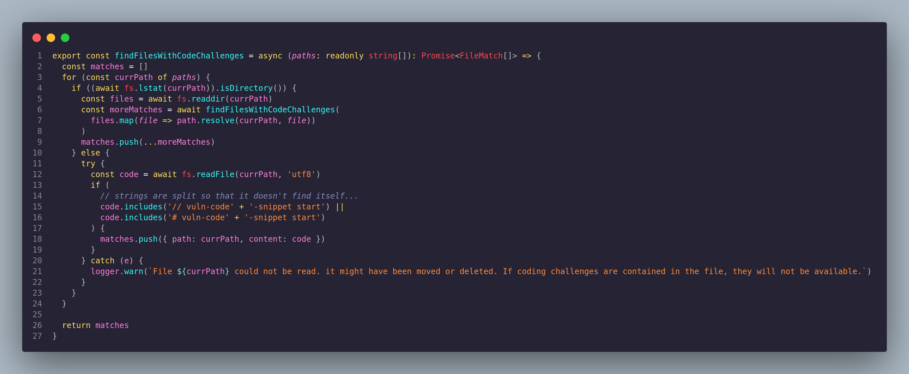

#### findFilesWithCodeChallenges (Refatorado)

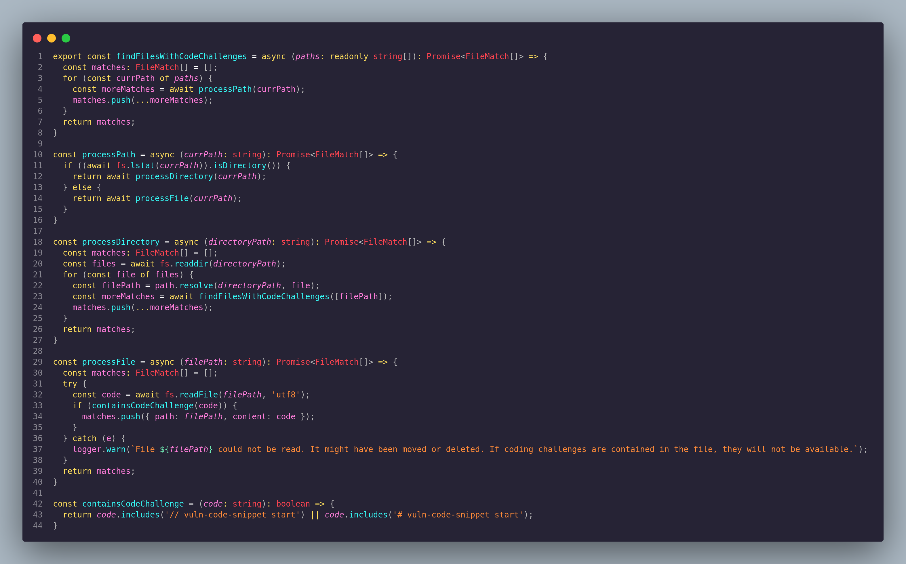

_processPath_: Decide se o caminho é um diretório ou um arquivo e delega o processamento para as respectivas funções.

_processDirectory_: Lida com a lógica de iterar sobre arquivos em um diretório.

_processFile_: Lida com a lógica de leitura de arquivos e verificação de conteúdo.

_containsCodeChallenge_: Verifica se o código contém desafios de código vulnerável.

#### getCodingChallengeFromFileContent

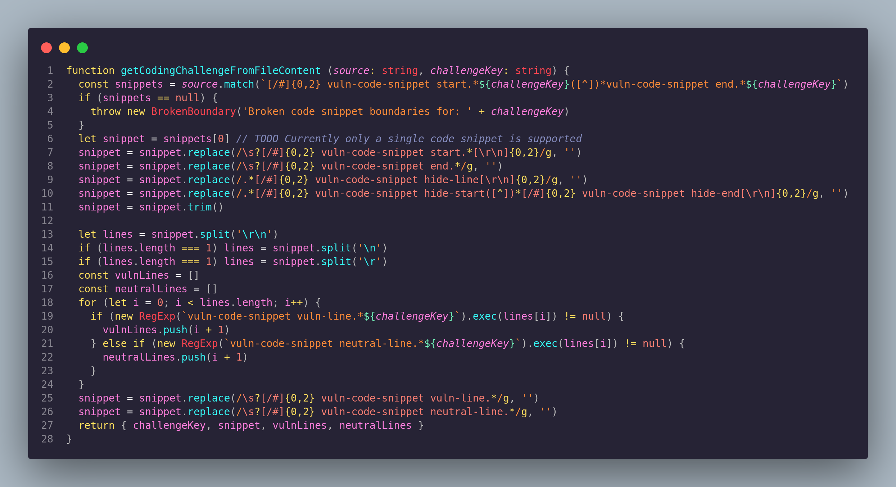

#### getCodingChallengeFromFileContent (Refatorado)

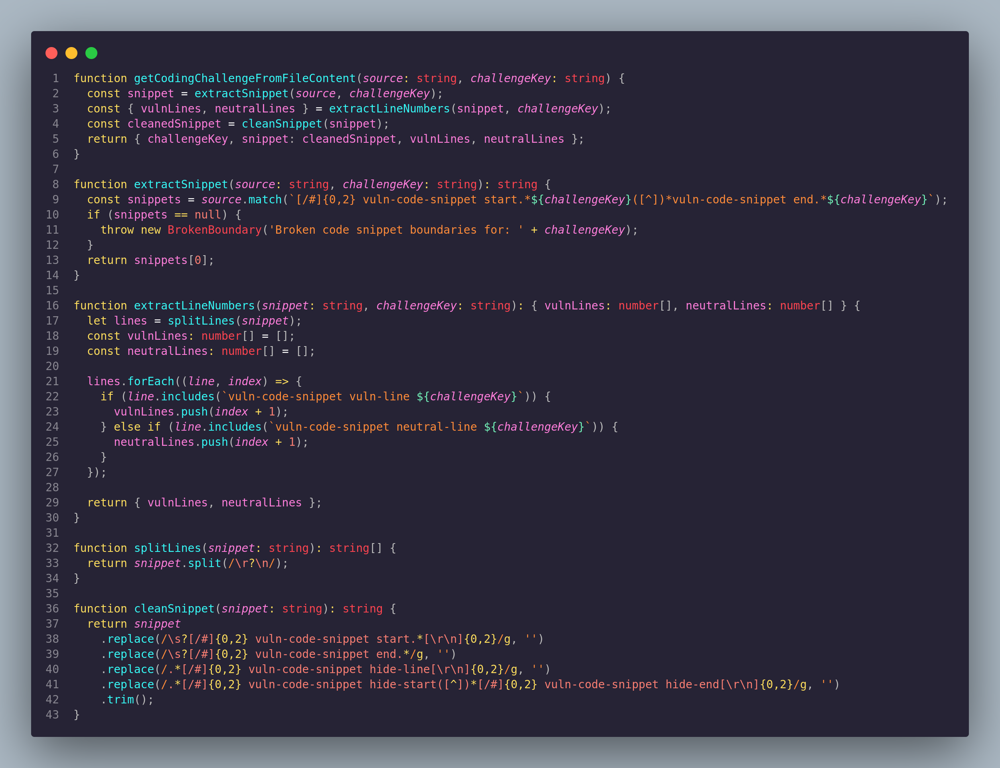

_extractSnippet_: Esta função isola a lógica de extração do snippet de código. Se o snippet não puder ser encontrado, uma exceção é lançada.

_extractLineNumbers_: Esta função isola a lógica que encontra as linhas vulneráveis e neutras dentro do snippet. Isso separa a lógica de extração de linhas da lógica de manipulação de strings.

_splitLines_: Lida com a divisão do snippet em linhas, independentemente de quebras de linha (\r\n, \n, \r).

_cleanSnippet_: Remove as marcações específicas do snippet (como start, end, e hide) para deixar o código limpo.


Após a refatoração, o código foi submetido a um pull request. A refatoração focou na melhoria da legibilidade e manutenção do código, resultando em um código mais modular e fácil de testar.

<div align="center">
        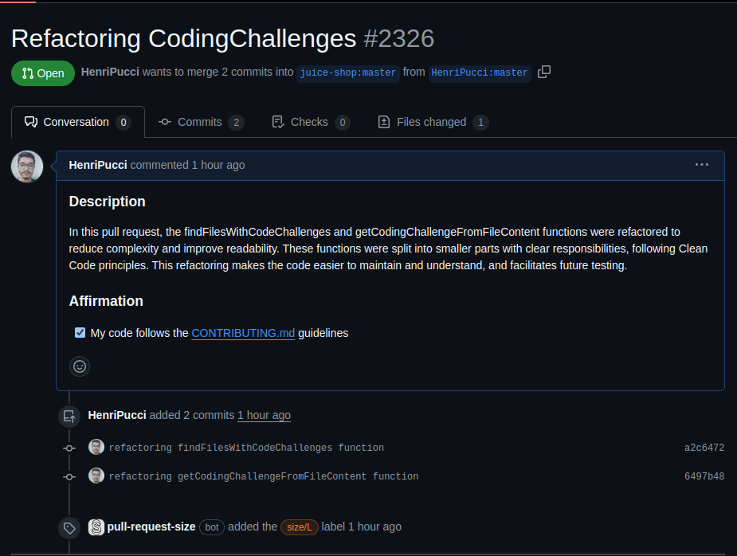
</div>


### Ingrid

Para esta atividade, escolhi trabalhar no projeto [OWASP Juice Shop](https://github.com/juice-shop/juice-shop). As melhorias aplicadas foram identificadas por meio da plataforma **Code Climate**, que oferece uma análise detalhada do código-fonte, apontando questões relacionadas à complexidade, duplicação de código e tamanho excessivo de funções.


### Melhorias Aplicadas

#### 1. Modularização da Função `setupNodeEvents`

A função `setupNodeEvents` era originalmente muito extensa, com mais de 77 linhas, o que ultrapassava o limite recomendado. Para melhorar sua legibilidade e manutenção, a função foi modularizada em várias funções menores e com responsabilidades específicas. 

#### 2. Redução da Complexidade Cognitiva
Ao separar a função setupNodeEvents em pequenas funções, a complexidade cognitiva foi reduzida, tornando o código mais claro e fácil de entender. Cada função agora tem uma responsabilidade bem definida. 

#### 3. Organização das Funções Utilitárias
Funções utilitárias, como a geração de cupons e o tratamento de produtos, foram extraídas para melhorar a organização do código. Agora, essas funções podem ser reutilizadas, facilitando a manutenção.


link do fork : [owasp - fork](https://github.com/ingridSCarvalho/juice-shop)

### Luana Ribeiro

#### Juice-Shop

O Juice-Shop é uma aplicação Web Pode ser utilizada em formações de segurança, demonstrações de consciencialização, CTFs e como cobaia para ferramentas de segurança. A Juice Shop engloba vulnerabilidades de todo o Top 10 da OWASP, juntamente com muitas outras falhas de segurança encontradas em aplicações do mundo real!


### Análise de problemáticas

Utilizando a ferramenta code climate foi encontrada uma função que precisava ser refatorada:


A função além de muito grande, possuem problemas de complexidade. 

### Correções 

Dessa forma, funções e variáveis foram renomeadas para descreverem melhor seus objetivos. Com relação a  modularidade, função foi dividida em várias funções menores para melhorar a legibilidade e reutilização. Por fim, o tratamento de erros foi direcionado para uma seção específica.


### Pull Requests


## MEC-ENERGIA API

### Leonardo

Utilizando a ferramenta `Clean Code` no repositório [mec-energia-api](https://gitlab.com/lappis-unb/projetos-energia/mec-energia/mec-energia-api) foram encontrados possíveis problemas envolvendo má elaboração de código. Nesse caso, foi selecionado o método `validate_csv_row` do arquivo `contracts/services.py`. Segundo a análise do `Code Climate`, o método apresentava complexidade cognitiva de 37, sendo que o recomendado é 5, ou seja, muito acima do recomendado. 

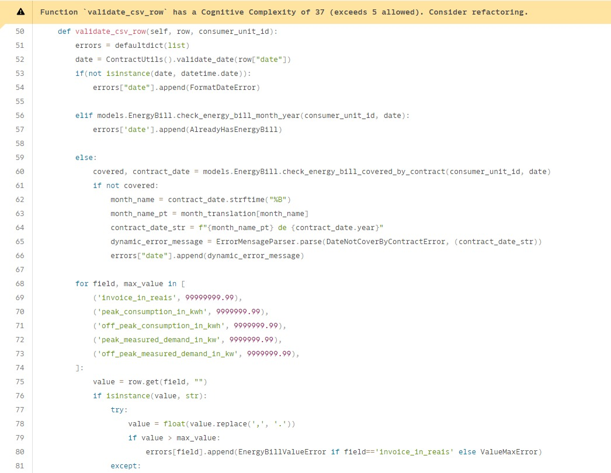

## Refatoração proposta

Para a refatoração do código foram criados outros 4 métodos, sendo eles: `error_append`, `check_value`, `get_max_values` e `error_detection`.

    def error_append(self, field, errors):
        errors[field].append(EnergyBillValueError if field=='invoice_in_reais' else ValueMaxError)

    def check_value(self, value, max_value, row, field, errors):
        try: 
            value = float(value.replace(',', '.'))
            if value > max_value:
                self.error_append(field, errors)
        except: 
            row[field] = value
            if(value != ""):
                self.error_append(field, errors)

    def get_max_values(self):
        return [
            ('invoice_in_reais', 99999999.99),
            ('peak_consumption_in_kwh', 9999999.99),
            ('off_peak_consumption_in_kwh', 9999999.99),
            ('peak_measured_demand_in_kw', 9999999.99),
            ('off_peak_measured_demand_in_kw', 9999999.99),
        ]

    def error_detection(self, row, errors):
        for field, max_value in self.get_max_values():
            value = row.get(field, "")
            if isinstance(value, str):
                self.check_value(value, max_value, row, field, errors)
            
            elif math.isnan(value):
                row[field] = ""

            elif value > max_value:
                row[field] = value
                self.error_append(field, errors)

        if row.get('invoice_in_reais') == '':
            errors['invoice_in_reais'].append(EnergyBillValueError)
            

    def validate_csv_row(self, row, consumer_unit_id):
        errors = defaultdict(list)
        date = ContractUtils().validate_date(row["date"])
        if(not isinstance(date, datetime.date)):
            errors["date"].append(FormatDateError)

        elif models.EnergyBill.check_energy_bill_month_year(consumer_unit_id, date):
            errors['date'].append(AlreadyHasEnergyBill)

        else:
            covered, contract_date = models.EnergyBill.check_energy_bill_covered_by_contract(consumer_unit_id, date)
            if not covered:
                month_name = contract_date.strftime("%B")
                month_name_pt = month_translation[month_name]
                contract_date_str = f"{month_name_pt} de {contract_date.year}"
                dynamic_error_message = ErrorMensageParser.parse(DateNotCoverByContractError, (contract_date_str))
                errors["date"].append(dynamic_error_message)

        self.error_detection(row, errors)
        return errors, date
## Resultados

Os resultados mostram que a função com maior complexidade do arquivo apresenta valor 6, e infelizamente, uma das funções possui um parâmetro a mais do que o recomendado.

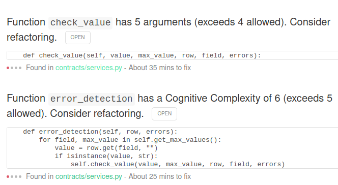

## Merge Request

Foi criado um Merge Request para as alterações, além de uma issue detalhando as motivações da alteração.

[Link Issue](https://gitlab.com/lappis-unb/projetos-energia/mec-energia/mec-energia-api/-/issues/200)

[Link MR](https://gitlab.com/lappis-unb/projetos-energia/mec-energia/mec-energia-api/-/merge_requests/140)

Entretanto, ao realizar o fork do projeto, a suíte de testes falhou em 2 testes.

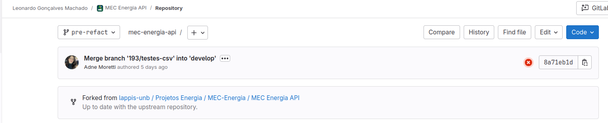

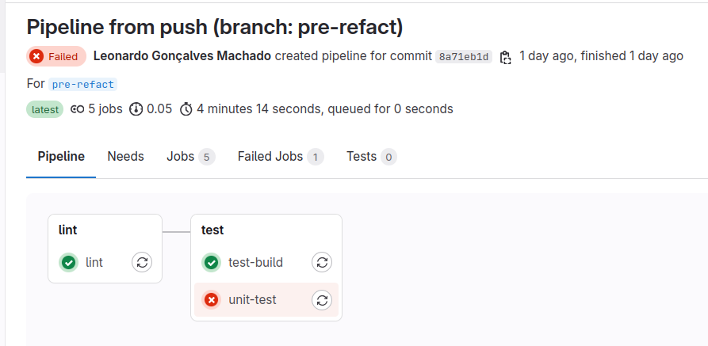


Após a refatoração do código, apenas esses mesmos erros persistiram.

### Mylena

Para essa atividade, foi utilizado o código do projeto [mec-energia-api](https://gitlab.com/lappis-unb/projetos-energia/mec-energia/mec-energia-api). Realizei uma análise utilizando a ferramenta `Code Climate` e, a partir dos resultados obtidos, decidi quais aspectos seriam abordados para refatoração. A sugestão de melhoria foi implementada no código do arquivo `utils/energy_bill_util.py`, no qual a  complexidade cognitiva  seguindo os princípios de _Clean Code_

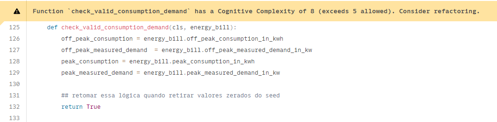

## Refatoração proposta

    class EnergyBillValidator:

    @staticmethod
     def is_valid_consumption(consumption, measured_demand):
     return consumption > 0 and measured_demand > 0
     @classmethod
     def check_valid_consumption_demand(cls, energy_bill):
     off_peak_consumption = energy_bill.off_peak_consumption_in_kwh
     off_peak_measured_demand  = energy_bill.off_peak_measured_demand_in_kw
     peak_consumption = energy_bill.peak_consumption_in_kwh
     peak_measured_demand = energy_bill.peak_measured_demand_in_kw

    ## retomar essa lógica quando retirar valores zerados do seed
     off_peak_valid = cls.is_valid_consumption(
     energy_bill.off_peak_consumption_in_kwh,
     energy_bill.off_peak_measured_demand_in_kw
     )
     peak_valid = cls.is_valid_consumption(
     energy_bill.peak_consumption_in_kwh,
     energy_bill.peak_measured_demand_in_kw
     )
     ## retomar essa lógica quando retirar valores zerados do seed
     return True

    if (off_peak_consumption and off_peak_consumption == 0) or (off_peak_measured_demand and off_peak_consumption == 0) or (peak_consumption and  peak_consumption == 0) or (peak_measured_demand and peak_measured_demand == 0):
     return False
     return True
     return True

### Justificativas

#### 1. ****Modularização e Clareza**:**

- **Modularidade**: A lógica de validação foi extraída para um método estático separado (`is_valid_consumption`), que encapsula a verificação se o consumo e a demanda medida são válidos. Isso melhora a clareza e a reutilização do código.
- **Clareza**: A nova implementação é mais direta ao verificar a validade dos consumos e demandas. Usar o método `is_valid_consumption` melhora a legibilidade e reduz a complexidade cognitiva, alinhando-se ao princípio de clareza do Clean Code.

#### 2. **Redução da Complexidade Cognitiva**

**Simplicidade**: A versão original da função possui múltiplas condições e verificações que aumentam a complexidade cognitiva. A nova versão simplifica a lógica ao utilizar o resultado das verificações feitas pelo método `is_valid_consumption`, reduzindo a complexidade cognitiva e tornando o código mais fácil de entender e manter.

## MR

No meu repositório, o pipeline falhou após eu adicionar um novo código, pois a parte de testes não funcionou devido às mudanças que fiz. Foram mais de cinco arquivos que precisavam ser alterados para corrigir os problemas. No entanto, uma [issue](https://gitlab.com/lappis-unb/projetos-energia/mec-energia/mec-energia-api/-/issues/199) foi criada com uma sugestão de refatoração, incluindo trechos de código para melhorar a implementação.


## SIGE

### Ana Luíza Rodrigues

Para essa atividade, foi utilizado o código do projeto [SIGE](https://gitlab.com/lappis-unb/projetos-energia/SIGE/sige-front). Realizei uma análise utilizando a ferramenta `SonarQube` e, a partir dos resultados obtidos, decidi quais aspectos seriam abordados para refatoração. A sugestão de melhoria foi implementada no código do arquivo `src/pages/TotalCost.vue`, no qual foi identificado hostspots.

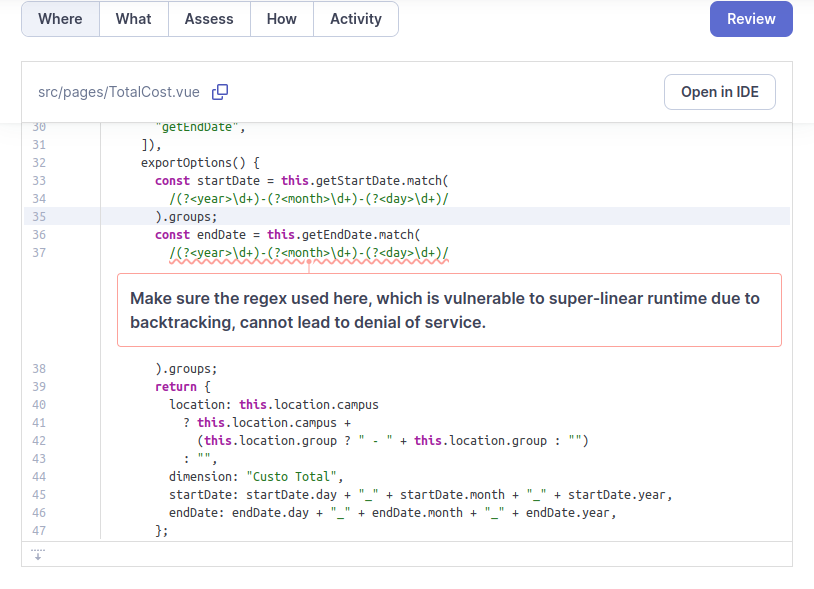

```
exportOptions() {
      const startDate = this.getStartDate.match(
        /(?<year>\d+)-(?<month>\d+)-(?<day>\d+)/
      ).groups;
      const endDate = this.getEndDate.match(
        /(?<year>\d+)-(?<month>\d+)-(?<day>\d+)/
      ).groups;
      return {
        location: this.location.campus
          ? this.location.campus +
            (this.location.group ? " - " + this.location.group : "")
          : "",
        dimension: "Custo Total",
        startDate: startDate.day + "_" + startDate.month + "_" + startDate.year,
        endDate: endDate.day + "_" + endDate.month + "_" + endDate.year,
      };
},
```

## Refatoração proposta

```
exportOptions() {
      if (/^\d{4}-\d{2}-\d{2}$/.test(this.getStartDate) && /^\d{4}-\d{2}-\d{2}$/.test(this.getEndDate)) {
        const startDate = this.getStartDate.match(/(?<year>\d{4})-(?<month>\d{2})-(?<day>\d{2})/).groups;
        const endDate = this.getEndDate.match(/(?<year>\d{4})-(?<month>\d{2})-(?<day>\d{2})/).groups;
        return {
          location: this.location.campus
            ? this.location.campus +
              (this.location.group ? " - " + this.location.group : "")
            : "",
          dimension: "Custo Total",
          startDate: startDate.day + "_" + startDate.month + "_" + startDate.year,
          endDate: endDate.day + "_" + endDate.month + "_" + endDate.year,
        };
      } else {
        console.error("Data inválida: " + this.getStartDate + " ou " + this.getEndDate);
        return {}; 
      }
}
```
### Justificativa

**Make sure the regex used here, which is vunerable to super-linear runtime due to backtracking, cannot lead to denial of service**

O aviso do SonarQube sobre ```/(?<year>\d+)-(?<month>\d+)-(?<day>\d+)/``` está relacionado a uma vulnerabilidade potencial chamada "backtracking", que pode levar a um consumo excessivo de recursos e, em casos extremos, a um Denial of Service (DoS). Esse problema ocorre quando uma expressão regular é mal projetada e pode levar a uma quantidade exponencial de operações de correspondência, especialmente com entradas específicas.

A expressão regular ```/(?<year>\d+)-(?<month>\d+)-(?<day>\d+)/``` é usada para extrair ano, mês e dia de uma string no formato YYYY-MM-DD. Embora essa expressão não seja a mais complexa, o uso de \d+ (um ou mais dígitos) pode levar a problemas de desempenho com entradas inesperadas.

- **Backtracking:** A expressão \d+ pode causar backtracking excessivo se a entrada tiver muitos dígitos ou se o padrão for mal interpretado pelo mecanismo de expressão regular.

- **Entradas Maliciosas:** Um atacante pode criar entradas que causam uma quantidade desproporcional de tempo de CPU para processar, levando a um potencial DoS.

Como sugestão de refatoração restringi a quantidade de dígitos

```/(?<year>\d{4})-(?<month>\d{2})-(?<day>\d{2})/```

Também adicionei uma validação da entrada verificando se a string tem o formato esperado antes de aplicar a expressão regular.
