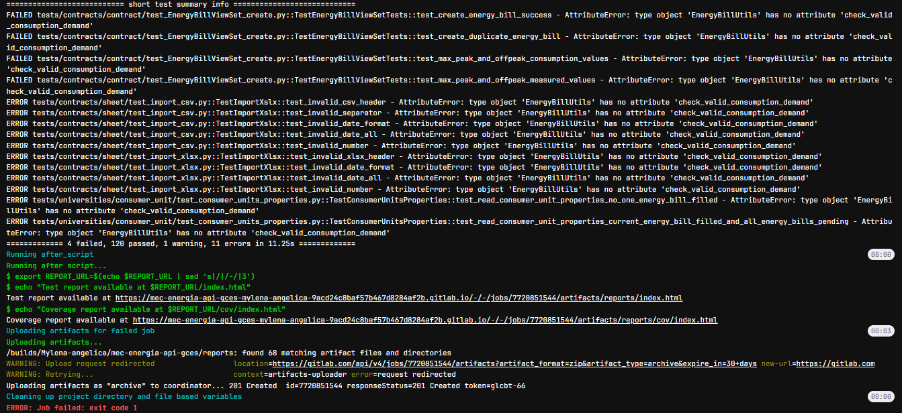

# Clean code

Clean code é um conjunto de práticas e princípios de desenvolvimento de software que visam criar código claro, legível e fácil de manter. Um código considerado "limpo" é aquele que, além de funcionar corretamente, é escrito de forma que outros desenvolvedores possam entendê-lo facilmente, fazendo com que a manutenção e a evolução do software sejam mais simples e menos propensas a erros. Entre os princípios de clean code estão a escolha de nomes descritivos para variáveis, funções e classes, a redução da complexidade, a modularização do código em funções pequenas e específicas, e a eliminação de duplicações.
No contexto da tarefa, sugerimos mudanças baseadas nesses princípios para melhorar a clareza e a qualidade do código, tornando-o mais intuitivo e de fácil compreensão para qualquer desenvolvedor que precise trabalhar com ele no futuro.

## OWASP

### Bruno

Para essa atividade, foi utilizado o código do projeto [NINJA-PingU](https://github.com/OWASP/NINJA-PingU). A sugestão de melhoria foi implementada no arquivo `src/connector.c` do código. As sugestões foram embasadas na literatura vigente da disciplina, _Clean Code_ e _Clean Architecture_. Desse modo, a seguir será apresentado o código original, os problemas encontrados nessa solução, o código refatorado e a explicação do porquê foi realizada cada alteração com sua motivação.

#### Código antes da refatoração:
```c
/*   OWASP NINJA PingU: Is Not Just a Ping Utility
 *
 *   Copyright (C) 2014 Guifre Ruiz <guifre.ruiz@owasp.org>
 *
 *  This program is free software: you can redistribute it and/or modify
 *  it under the terms of the GNU General Public License as published by
 *  the Free Software Foundation, either version 3 of the License, or
 *  (at your option) any later version.
 *
 *  This program is distributed in the hope that it will be useful,
 *  but WITHOUT ANY WARRANTY; without even the implied warranty of
 *  MERCHANTABILITY or FITNESS FOR A PARTICULAR PURPOSE.  See the
 *  GNU General Public License for more details.
 *
 *  You should have received a copy of the GNU General Public License
 *  along with this program.  If not, see <http://www.gnu.org/licenses/>.
 */

#include <unistd.h>
#include <stdio.h>
#include <stdlib.h>
#include <netinet/in.h>
#include <arpa/inet.h>
#include <netdb.h>
#include <errno.h>
#include <string.h>
#include <sys/epoll.h>
#include <fcntl.h>
#include <signal.h>
#include <sys/time.h>
#include <pthread.h>
#include <sys/timerfd.h>

#include "socks.c"
#include "pluginHandler.c"

// the epoll file descriptor
int epfd;

pthread_mutex_t mutex_epfd = PTHREAD_MUTEX_INITIALIZER;

int *start_connector(void *agentI) {
	struct agentInfo *aInfo = agentI;
	loadMethods();
	
	//wait for sync
	sem_wait(aInfo->startB);
	printf("\t+Connector Service started [%u]\n", aInfo->mPort);

	openAckFile();
	onInitPlugin();
	
	// internal variables definition
	int i, count, datacount;
	
	//buf to hold the response
	char buffer[512];
	int buffersize = sizeof(buffer);

	// epoll structure that will contain the current network socket and event when epoll wakes up
	static struct epoll_event *events;
	static struct epoll_event event_mask;
	
	// create the special epoll file descriptor
	pthread_mutex_lock(&mutex_epfd);
	epfd = epoll_create(MAX_SOCKS);
	pthread_mutex_unlock(&mutex_epfd);

	// allocate enough memory to store all the events in the "events" structure
	if (NULL == (events = calloc(MAX_SOCKS, sizeof(struct epoll_event)))) {
		perror("calloc events");
		exit(1);
	};

	while (endOfScan == FALSE) {

		count = epoll_wait((int )epfd, events, MAX_SOCKS, -1);
		for (i = 0; i < count; i++) {

			if ((events[i].events & EPOLLERR) || (events[i].events & EPOLLRDHUP) || (events[i].events & EPOLLHUP)) //socket is erroneous
			{
				deleteSock(epfd, events[i].data.fd);
			}

			if (events[i].events & EPOLLOUT) //we can write
			{
				if (socket_check(events[i].data.fd) != 0) {
					deleteSock(epfd, events[i].data.fd);
					continue;
				} else {
					// Request
					int porr = (int)getPortBySock(events[i].data.fd);
					char *message= malloc(sizeof(char)*80);

					getServiceInput(porr, message);
					int messagelength = strlen(message);
					if ((datacount = send(events[i].data.fd, message, messagelength, 0)) < 0) {
						//printf("send failed");
						continue;
					} else {
						event_mask.events = EPOLLIN | EPOLLRDHUP | EPOLLERR;
						event_mask.data.fd = events[i].data.fd;
						if (epoll_ctl((int) epfd, EPOLL_CTL_MOD, events[i].data.fd, &event_mask) != 0) {
							deleteSock(epfd, events[i].data.fd);
							continue;
						}
					}
					if (message != NULL) {
						free(message);
					}
				}
			}
			if ((events[i].events & EPOLLIN)) //we can read
			{
				if (socket_check(events[i].data.fd) != 0) {
					deleteSock(epfd, events[i].data.fd);
					continue;
				} else {
					struct host hostInfo;
					hostInfo.port =  (int)getPortBySock(events[i].data.fd);
					hostInfo.ip =  getHostBySock(events[i].data.fd);
					if (hostInfo.port == -1 || strlen(hostInfo.ip) == 0){
						deleteSock(epfd, events[i].data.fd);
						continue;
					}
					memset(buffer, 0x0, buffersize);
					char *msg;
					msg = (char *) malloc(5000);
					if (msg != NULL) {
						int data = 0, datacount = 0;
						while ((datacount = recv(events[i].data.fd, buffer, buffersize, 0)) > 0) {
							buffer[datacount] = '\0';
							if (data + datacount > 4999) {
								break;
							}
							if (data == 0) {
								strncpy(msg, buffer,4999);
							} else {
								strncat(msg, buffer,4999);
							}
							data = data + datacount;
						}
						if (data > 0) {
							persistAck(hostInfo.ip,hostInfo.port,msg);
							provideOutput(hostInfo.ip, hostInfo.port, msg);
						}
						if (msg!= NULL) {
							free(msg);
						}
					}
					deleteSock(epfd, events[i].data.fd);
				}
			}
			if (events[i].events & EPOLLERR) { //error
				continue;
			}
		}
	}
	onStopPlugin();
	return 0;
}
```

#### Problemas encontrados:
##### 1. Modularização e Separação de Responsabilidades (SRP - Single Responsibility Principle):
O princípio SRP (_Single Responsibility Principle_) do SOLID afirma que uma classe ou função deve ter uma única responsabilidade. No código original, a função `start_connector` concentra múltiplas responsabilidades, desde a inicialização dos recursos até o processamento de eventos de leitura e escrita. Essa abordagem viola o princípio da responsabilidade única, tornando o código mais complexo e difícil de manter.

A refatoração resolve esse problema ao separar as responsabilidades em funções distintas: `initialize_connector`, `handle_write_event`, e `handle_read_event`. Essa modularização promove um código mais coeso e com responsabilidades claramente definidas. Isso facilita a compreensão do fluxo lógico do programa e reduz a complexidade ciclomática, um importante indicador da probabilidade de introdução de erros.

##### 2.  Responsabilidade Única
###### 2.1 Coesão
Além disso, a coesão é baixa, já que a função manipula várias responsabilidades diferentes em um único lugar, resultando em um código que não é modular e é difícil de modificar. Ao quebrar a função em funções menores, podemos criar um código que seja mais fácil de entender e modificar, além de permitir a reutilização de partes do código em outros contextos.

###### 2.2 Aplicação do Princípio de Aberto/Fechado (OCP - Open/Closed Principle):
Embora o código refatorado não introduza novas extensões diretamente, a separação de responsabilidades e modularização do código facilita futuras extensões. Com funções específicas para cada tarefa, novos comportamentos podem ser adicionados ou alterados sem modificar a estrutura existente, permitindo que o código seja estendido sem ser modificado, conforme proposto pelo princípio de Aberto/Fechado.

##### 3. Gerenciamento de Recursos e Melhoria na Concorrência:
O gerenciamento adequado de recursos é uma prática essencial em _Clean Code_ e deve ser uma prioridade, especialmente em sistemas que funcionam por longos períodos, como servidores. A memória deve sempre ser liberada após o uso com `free()`, garantindo que não haja desperdício de recursos. A refatoração também preserva e melhora a segurança em cenários de concorrência. O uso de mutexes para proteger o descritor de arquivo `epfd` continua presente, mas a separação das operações em funções específicas reduz a chance de erros em ambientes _multithread_, minimizando possíveis _race conditions_. O código refatorado também assegura que recursos como memória alocada e _file descriptors_ são devidamente liberados, evitando vazamentos de memória e possíveis falhas no sistema.

##### 4. Variáveis
###### 4.1. Uso de Números "Mágicos"
O uso de números "mágicos" (constantes numéricas sem significado evidente, como 512, 5000, 10) no código original é um problema clássico de manutenção. Esses valores não são autoexplicativos e podem gerar confusão se usados em mais de um lugar no código. _Clean Code_ recomenda substituir números mágicos por constantes nomeadas, como `BUFFER_SIZE`, `MESSAGE_SIZE`, e `EPOLL_MAX_EVENTS` o que elimina os números mágicos, melhorando a legibilidade, facilitando futuras alterações e menos propenso a erros.

###### 4.2 Nomes de Variáveis e Funções
Uma das regras básicas de _Clean Code_ é que o código deve ser autoexplicativo. Nomes de variáveis e funções devem expressar claramente a intenção do código sem a necessidade de comentários adicionais. Esse problema é frequentemente identificado como "nomenclatura obscura", o que compromete a legibilidade e aumenta o tempo necessário para um novo desenvolvedor entender o código. O código refatorado utiliza nomes de funções e variáveis mais descritivos, como `handle_write_event` e `handle_read_event`, que tornam o código autoexplicativo. Essa prática está alinhada com as recomendações de _Clean Code_, que enfatizam a importância de nomes claros e que reflitam a intenção do código.

##### 5. Detalhes
###### 5.1. Comentários
Comentários são frequentemente necessários para explicar trechos de código complexos. No entanto, _Clean Code_ sugere que o código deve ser escrito de forma tão clara que os comentários se tornem desnecessários. No código analisado, há vários comentários que explicam o "como" em vez de "por que", o que é uma prática a ser evitada. Comentários que explicam como o código funciona podem ser substituídos por uma escolha melhor de nomes de variáveis e funções, enquanto comentários que explicam o "por que" oferecem mais valor ao leitor.

###### 5.2. Tratamento de Erros
O tratamento de erros no código original é rudimentar e não oferece informações suficientes para diagnóstico em caso de falha. A refatoração melhora significativamente o gerenciamento de recursos e a manipulação de erros. O uso de mensagens de erro detalhadas com perror, além de verificar imediatamente a falha na alocação de memória, evita potenciais problemas em tempo de execução. 

#### Código com solução 

#### Refatorações designadas para solução / explicação

Para a solução proposta foi definido o nome de constantes como `BUFFER_SIZE` e `MESSAGE_SIZE` e `EPOLL_MAX_EVENTS`. 
```c
#define BUFFER_SIZE 512
#define MESSAGE_SIZE 5000
#define EPOLL_MAX_EVENTS 10

pthread_mutex_t mutex_epfd = PTHREAD_MUTEX_INITIALIZER;
int epfd;

void initialize_connector(struct agentInfo *aInfo);
void handle_write_event(int fd);
void handle_read_event(int fd);
```

A função `sart_connector()` foi reduziada, sendo dividida em mais outras duas funções. Desse modo, ela continua sendo a função principal do código, porém, agora, com um escopo bem menor de tarefas e com menos responsabilidade.
```c
int* start_connector(void *agentI) {
    struct agentInfo *aInfo = agentI;
    initialize_connector(aInfo);
    static struct epoll_event *events;
    if (NULL == (events = calloc(MAX_SOCKS, sizeof(struct epoll_event)))) {
        perror("calloc events");
        exit(1);
    };

    while (!endOfScan) {
        int event_count = epoll_wait(epfd, events, EPOLL_MAX_EVENTS, -1);
        for (int i = 0; i < event_count; i++)
            if (events[i].events & (EPOLLERR | EPOLLRDHUP | EPOLLHUP))
                deleteSock(epfd, events[i].data.fd);
            else if (events[i].events & EPOLLOUT)
                handle_write_event(events[i].data.fd);
            else if (events[i].events & EPOLLIN)
                handle_read_event(events[i].data.fd);
    }

    onStopPlugin();
    pthread_mutex_destroy(&mutex_epfd);
    close(epfd);
    return 0;
}
```

Foi estraida as funções `handle_write_event()` e `handle_read_event()`, cada uma com tarefas e atributos bem definidos. Nessas funções, agora, fora utilizado uma ideia de redução ciclomática do código, invertendo a ordem e o fluxo de condicionais.
```c
void handle_write_event(int fd) {
    if (socket_check(fd) != 0) {
        deleteSock(epfd, fd);
        return;
    }

    int port = (int)getPortBySock(fd);
    char *message = malloc(sizeof(char) * 80);

    if (message == NULL) {
        perror("Failed to allocate memory for message");
        return;
    }

    getServiceInput(port, message);
    int message_length = strlen(message);

    if (send(fd, message, message_length, 0) < 0) {
        free(message);
        return;
    }

    struct epoll_event event_mask;
    event_mask.events = EPOLLIN | EPOLLRDHUP | EPOLLERR;
    event_mask.data.fd = fd;

    if (epoll_ctl(epfd, EPOLL_CTL_MOD, fd, &event_mask) != 0) {
        deleteSock(epfd, fd);
    }

    free(message);
```

```c
void handle_read_event(int fd) {
    if (socket_check(fd) != 0) {
        deleteSock(epfd, fd);
        return;
    }

    struct host hostInfo;
    hostInfo.port = (int)getPortBySock(fd);
    hostInfo.ip = getHostBySock(fd);

    if (hostInfo.port == -1 || strlen(hostInfo.ip) == 0) {
        deleteSock(epfd, fd);
        return;
    }

    char buffer[BUFFER_SIZE];
    memset(buffer, 0x0, BUFFER_SIZE);
    char *msg = malloc(MESSAGE_SIZE);

    if (msg == NULL) {
        perror("Failed to allocate memory for msg");
        deleteSock(epfd, fd);
        return;
    }

    int total_data = 0, data_count = 0;

    while ((data_count = recv(fd, buffer, BUFFER_SIZE, 0)) > 0) {
        if (total_data + data_count > MESSAGE_SIZE - 1) break;

        if (total_data == 0) strncpy(msg, buffer, MESSAGE_SIZE - 1);
        else strncat(msg, buffer, MESSAGE_SIZE - 1 - total_data);

        total_data += data_count;
    }

    if (total_data > 0) {
        persistAck(hostInfo.ip, hostInfo.port, msg);
        provideOutput(hostInfo.ip, hostInfo.port, msg);
    }

    free(msg);
    deleteSock(epfd, fd);
}
```

#### PR
[Pull Request](https://github.com/OWASP/NINJA-PingU/pull/7)

### Igor

Para essa atividade, foi utilizado o código do projeto [NINJA-PingU](https://github.com/OWASP/NINJA-PingU). A sugestão de melhoria foi implementada no arquivo `src/listener.c` do código. As sugestões foram embasadas na literatura vigente da disciplina, Clean Code e Clean Architecture. Desse modo, a seguir será apresentado o código original, os problemas encontrados nessa solução, o código refatorado e a explicação do porque foi realizada cada alteração com sua motivação.

#### Código antes da refatoração:
```c
/*   OWASP NINJA PingU: Is Not Just a Ping Utility
 *
 *   Copyright (C) 2014 Guifre Ruiz <guifre.ruiz@owasp.org>
 *
 *  This program is free software: you can redistribute it and/or modify
 *  it under the terms of the GNU General Public License as published by
 *  the Free Software Foundation, either version 3 of the License, or
 *  (at your option) any later version.
 *
 *  This program is distributed in the hope that it will be useful,
 *  but WITHOUT ANY WARRANTY; without even the implied warranty of
 *  MERCHANTABILITY or FITNESS FOR A PARTICULAR PURPOSE.  See the
 *  GNU General Public License for more details.
 *
 *  You should have received a copy of the GNU General Public License
 *  along with this program.  If not, see <http://www.gnu.org/licenses/>.
 */

#include <netinet/ip_icmp.h>
#include <netinet/udp.h>
#include <arpa/inet.h>

#include "spotter.c"

int mSocket;
FILE *logfile;
int i, j;
struct sockaddr_in source, dest;


void createSock() {
	mSocket = socket(AF_INET, SOCK_RAW, IPPROTO_TCP);
	if (mSocket < 0) {
		printf("Socket Error\n");
		exit(1);
	}
}
void *start_receiver(void *agentI) {
	struct agentInfo *aInfo = agentI;
	sem_wait(aInfo->startB);
	printf("\t+Listener  Started at port [%u]\n", aInfo->mPort);

	openSynFile();

	int saddr_size, data_size;
	struct sockaddr saddr;

	char *mBuffer = (char *) malloc(80000);

	//creates the socket
	createSock();

	//tmp cache to hold results
	int tmpFoundHosts = 0;

	//main loop
	while (endOfScan == FALSE) {
		saddr_size = sizeof saddr;

		//recieve packets
		data_size = recvfrom(mSocket, mBuffer, 65536, 0, &saddr, (socklen_t*) &saddr_size);
		if (data_size < 0) {
			printf("Recvfrom error , failed to get packets\n");
			exit(1);
		}

		struct iphdr *iph = (struct iphdr*) mBuffer;
		unsigned short iphdrlen;
		iphdrlen = iph->ihl * 4;
		struct tcphdr *tcph = (struct tcphdr*) (mBuffer + iphdrlen);

		//we uniquely identify packets by magic port and magic ack seq number	
		if ((unsigned int) tcph->ack == 1 &&
					 ntohs(tcph->dest) == aInfo->mPort &&
					 ntohl(tcph->ack_seq) == MAGIC_ACKSEQ) {
			//port open
			if ((unsigned int) tcph->rst  == 0 ) {
				struct iphdr *iph = (struct iphdr *) mBuffer;
				iphdrlen = (int) iph->ihl * 4;
				memset(&source, 0, sizeof(source));
				source.sin_addr.s_addr = (unsigned int) iph->saddr;
				memset(&dest, 0, sizeof(dest));
				dest.sin_addr.s_addr = iph->daddr;

				if (synOnly == FALSE) {
					pthread_mutex_lock (&mutex_epfd);
					while (create_and_connect(inet_ntoa(source.sin_addr), ntohs(tcph->source), epfd) != 0) {
						//printf("problem");
					} 
					pthread_mutex_unlock (&mutex_epfd);
				}
				
				//increments counter result
				tmpFoundHosts++;
				if (tmpFoundHosts >= CACHE_SYNC) {
					incFoundHosts(tmpFoundHosts);
					tmpFoundHosts = 0;
				}
				//persists results
				persistSyn(inet_ntoa(source.sin_addr), ntohs(tcph->source));
			} else { //port closed
				//persists results
				//persistClosedSyn(inet_ntoa(source.sin_addr), ntohs(tcph->source));
			}
		} else { //uncomment for debugging purposes
			/*struct iphdr *iph = (struct iphdr *) mBuffer;
			iphdrlen = (int) iph->ihl * 4;
			memset(&source, 0, sizeof(source));
			source.sin_addr.s_addr = (unsigned int) iph->saddr;
			memset(&dest, 0, sizeof(dest));
			dest.sin_addr.s_addr = iph->daddr;
			printf("\nTo[%d] From[%s:%d] syn[%d] ack[%d] rst[%d] ack_seq[%d] fin[%d]\n",tcph->source,inet_ntoa(source.sin_addr),
			ntohs(tcph->source), (unsigned int) tcph->syn,(unsigned int) tcph->ack,(unsigned int) tcph->rst,ntohl(tcph->ack_seq),(unsigned int) tcph->fin );
			*/
		}
	}
	close(mSocket);
	return NULL;
}
```

#### Problemas encontrados:

##### 1. Tamanho e Complexidade de Funções
O princípio SRP (Single Responsibility Principle) do SOLID afirma que uma classe ou função deve ter uma única responsabilidade. No código original, a função start_receiver() é um exemplo clássico de violação deste princípio. Ela é longa, realiza múltiplas tarefas e não está focada em uma única responsabilidade. Ela cria o socket, recebe pacotes, processa os pacotes e persiste resultados, tudo em um único bloco de código.

Essa prática de agregar múltiplas responsabilidades em uma única função resulta em código difícil de ler, testar e manter. Em termos de Clean Code, funções longas e multifuncionais devem ser divididas em funções menores, cada uma com uma única responsabilidade. Isso facilita a compreensão do fluxo lógico do programa e reduz a complexidade ciclomática, um importante indicador da probabilidade de introdução de erros.

##### 2.  Responsabilidade Única e Coesão
Além disso, a coesão é baixa, já que a função manipula várias responsabilidades diferentes em um único lugar, resultando em um código que não é modular e é difícil de modificar. Ao quebrar a função em funções menores, podemos criar um código que seja mais fácil de entender e modificar, além de permitir a reutilização de partes do código em outros contextos.

##### 3. Gerenciamento de Recursos e Memória
O código original faz uso de alocação dinâmica de memória com malloc para a variável mBuffer, mas não libera a memória alocada, o que pode levar a vazamentos de memória. O gerenciamento adequado de recursos é uma prática essencial em Clean Code e deve ser uma prioridade, especialmente em sistemas que funcionam por longos períodos, como servidores. A memória deve sempre ser liberada após o uso com free, garantindo que não haja desperdício de recursos.

##### 4. Variáveis
###### 4.1. Uso de Variáveis Globais
Variáveis globais como mSocket, logfile, i, j, source, e dest são usadas em todo o código. O uso de variáveis globais pode levar a efeitos colaterais não intencionais e dificulta o rastreamento do estado do programa, tornando o código mais difícil de depurar e testar.

###### 4.2. Uso de Números "Mágicos"
O uso de números "mágicos" (constantes numéricas sem significado evidente, como 65536, 80000) no código original é um problema clássico de manutenção. Esses valores não são autoexplicativos e podem gerar confusão se usados em mais de um lugar no código. Clean Code recomenda substituir números mágicos por constantes nomeadas, como MAX_BUFFER_SIZE ou RECEIVE_BUFFER_SIZE, o que torna o código mais legível e menos propenso a erros.

###### 4.3 Nomes de Variáveis e Funções
Uma das regras básicas de Clean Code é que o código deve ser autoexplicativo. Nomes de variáveis e funções devem expressar claramente a intenção do código sem a necessidade de comentários adicionais. No código original, variáveis como mSocket, i, j, aInfo, e iphdrlen têm nomes criptográficos, que dificultam a compreensão imediata do que elas representam. Esse problema é frequentemente identificado como "nomenclatura obscura", o que compromete a legibilidade e aumenta o tempo necessário para um novo desenvolvedor entender o código.

##### 5. Detalhes
###### 5.1. Comentários
Comentários são frequentemente necessários para explicar trechos de código complexos. No entanto, Clean Code sugere que o código deve ser escrito de forma tão clara que os comentários se tornem desnecessários. No código analisado, há vários comentários que explicam o "como" em vez de "por que", o que é uma prática a ser evitada. Comentários que explicam como o código funciona podem ser substituídos por uma escolha melhor de nomes de variáveis e funções, enquanto comentários que explicam o "por que" oferecem mais valor ao leitor.

###### 5.2. Tratamento de Erros
O tratamento de erros no código original é rudimentar e não oferece informações suficientes para diagnóstico em caso de falha. Por exemplo, quando a criação do socket falha, o programa simplesmente imprime "Socket Error" e termina. Esta prática não está alinhada com a recomendação de Clean Code de fornecer mensagens de erro claras e úteis. Além disso, o uso de exit(1) interrompe abruptamente a execução, o que pode ser aceitável em alguns contextos, mas não é uma solução ideal, especialmente em sistemas maiores onde a recuperação de erros é crítica.

###### 5.3 Estrutura do Código e Estilo
A estrutura do código, como a organização das funções e o estilo de formatação, não é consistente. Algumas funções e blocos de código não seguem um padrão claro de espaçamento ou indentação. A inconsistência na formatação pode dificultar a leitura do código, especialmente em projetos grandes com vários desenvolvedores.

#### Código com solução 

#### Refatorações designadas para solução / explicação 

Para a solução proposta foi retirada a utilização das variáveis globais, as quais algumas não eram utilizadas e outras que foram acopladas. Além de definir o nome de constantes como BUFFER_SIZE e PACKET_SIZE. 

```c
#include <netinet/ip_icmp.h>
#include <netinet/udp.h>
#include <arpa/inet.h>

#include "spotter.c"

#define BUFFER_SIZE 80000
#define PACKET_SIZE 65536

typedef struct {
    int socket_fd;
    char *buffer;
    struct sockaddr_in source, dest;
} PacketReceiver;
```

A função start_receiver foi reduzida, dividindo a resposabilidade com outras funções, as quais realizam trabalhos mais pontuais. Assim, auxiliando a diminuir o tamanho e complexidade da função e, dessa maneira, aumentando a Coesão.

```c
void* start_receiver(void *agentI) {
    struct agentInfo *aInfo = agentI;
    sem_wait(aInfo->startB);
    printf("\t+Listener Started at port [%u]\n", aInfo->mPort);

    openSynFile();
    PacketReceiver *receiver = init_packet_receiver();

    while (!endOfScan) {
        process_packet(receiver, aInfo);
    }

    close(receiver->socket_fd);
    free(receiver->buffer);
    free(receiver);
    return NULL;
}
```

A nova função init_packet_receiver ficou responsabilizada pela inicialização do pacote recebido, além de melhorar as mensagens e tratamento de erro.
```c
PacketReceiver* init_packet_receiver() {
    PacketReceiver *receiver = malloc(sizeof(PacketReceiver));
    if (!receiver) {
        perror("Memory allocation failed");
        exit(EXIT_FAILURE);
    }
    receiver->socket_fd = create_socket();
    receiver->buffer = malloc(BUFFER_SIZE);
    if (!receiver->buffer) {
        perror("Memory allocation for buffer failed");
        free(receiver);
        exit(EXIT_FAILURE);
    }
    return receiver;
}
```

A parte de processamento do pacote foi redirecionada para uma função, a qual eliminamos a utilização de if desnecessário, a remoção de código duplicado, atribuindo os valores de source e dest centralizados dentro da função.
```c
void process_packet(PacketReceiver *receiver, struct agentInfo *aInfo) {
    struct sockaddr saddr;
    socklen_t saddr_size = sizeof(saddr);

    int data_size = recvfrom(receiver->socket_fd, receiver->buffer, PACKET_SIZE, 0, &saddr, &saddr_size);
    if (data_size < 0) {
        perror("Failed to receive packets");
        exit(EXIT_FAILURE);
    }

    struct iphdr *iph = (struct iphdr*) receiver->buffer;
    unsigned short iphdrlen = iph->ihl * 4;
    struct tcphdr *tcph = (struct tcphdr*) (receiver->buffer + iphdrlen);

    if ((unsigned int) tcph->ack == 1 &&
        ntohs(tcph->dest) == aInfo->mPort &&
        ntohl(tcph->ack_seq) == MAGIC_ACKSEQ) {

        if ((unsigned int) tcph->rst == 0) {
            receiver->source.sin_addr.s_addr = iph->saddr;
            receiver->dest.sin_addr.s_addr = iph->daddr;

            if (!synOnly) {
                pthread_mutex_lock(&mutex_epfd);
                while (create_and_connect(inet_ntoa(receiver->source.sin_addr), ntohs(tcph->source), epfd) != 0) {
                    // printf("problem");
                }
                pthread_mutex_unlock(&mutex_epfd);
            }

            incFoundHosts(1);
            persistSyn(inet_ntoa(receiver->source.sin_addr), ntohs(tcph->source));
        }
    }
}
```


#### PR
[Pull Request](https://github.com/OWASP/NINJA-PingU/pull/8)

### Hellen Faria

Para a entrega do Clean Code, escolhi o projeto OWASP [Juice Shop](https://github.com/juice-shop/juice-shop). Utilizando a ferramenta Code Climate, foi possível analisar o projeto como um todo e identificar possíveis melhorias. A sugestão de melhoria se concentra no arquivo lib/startup/customizeApplication.ts, especificamente na função customizeApplication.

Note que a função tem uma complexidade ciclomática de 8 devido ao número de ramos condicionais (if statements) e chamadas de funções diferentes. Essa alta complexidade torna o código mais difícil de entender, testar, e manter.

### Refatoração proposta

Refatorar a função customizeApplication para usar uma abordagem baseada em configuração, traz várias melhorias significativas em termos de Clean Code e manutenibilidade.


Essa refatoração melhora a organização, modularidade, e clareza do código, seguindo princípios de Clean Code como a responsabilidade única e a redução da repetição. O código torna-se mais fácil de manter, menos propenso a erros e mais adaptável a mudanças futuras.

### Henrique

Para essa entrega, foi utilizado o código do Projeto OWASP [Juice Shop](https://github.com/juice-shop/juice-shop), no qual foi realizada uma análise utilizando a ferramenta _Code Climate_. A partir dos resultados obtidos, foram identificados pontos de melhoria para refatoração no arquivo _lib/codingChallenges.ts_. Dessa forma, as melhorias foram nas funções _findFilesWithCodeChallenges_ e _getCodingChallengeFromFileContent_, com foco na redução da complexidade cognitiva, fazendo a separação dessas duas funções muito grandes, em pequenas funções mais específicas, seguindo os princípios de _Clean Code_.

#### findFilesWithCodeChallenges

<div align="center">
        
</div>

#### findFilesWithCodeChallenges (Refatorado)

<div align="center">
        
</div>

_processPath_: Decide se o caminho é um diretório ou um arquivo e delega o processamento para as respectivas funções.
_processDirectory_: Lida com a lógica de iterar sobre arquivos em um diretório.
_processFile_: Lida com a lógica de leitura de arquivos e verificação de conteúdo.
_containsCodeChallenge_: Verifica se o código contém desafios de código vulnerável.

#### getCodingChallengeFromFileContent

<div align="center">
        
</div>

#### getCodingChallengeFromFileContent (Refatorado)

<div align="center">
        
</div>

_extractSnippet_: Esta função isola a lógica de extração do snippet de código. Se o snippet não puder ser encontrado, uma exceção é lançada.
_extractLineNumbers_: Esta função isola a lógica que encontra as linhas vulneráveis e neutras dentro do snippet. Isso separa a lógica de extração de linhas da lógica de manipulação de strings.
_splitLines_: Lida com a divisão do snippet em linhas, independentemente de quebras de linha (\r\n, \n, \r).
_cleanSnippet_: Remove as marcações específicas do snippet (como start, end, e hide) para deixar o código limpo.

Após a refatoração, o código foi submetido a um pull request. A refatoração focou na melhoria da legibilidade e manutenção do código, resultando em um código mais modular e fácil de testar.

<div align="center">
        
</div>

## MEC-ENERGIA API

### Leonardo

### Mylena

Para essa atividade, foi utilizado o código do projeto [mec-energia-api](https://gitlab.com/lappis-unb/projetos-energia/mec-energia/mec-energia-api). Realizei uma análise utilizando a ferramenta `Code Climate` e, a partir dos resultados obtidos, decidi quais aspectos seriam abordados para refatoração. A sugestão de melhoria foi implementada no código do arquivo `utils/energy_bill_util.py`, no qual a  complexidade cognitiva  seguindo os princípios de _Clean Code_


## Refatoração proposta

    class EnergyBillValidator:

    @staticmethod
     def is_valid_consumption(consumption, measured_demand):
     return consumption > 0 and measured_demand > 0
     @classmethod
     def check_valid_consumption_demand(cls, energy_bill):
     off_peak_consumption = energy_bill.off_peak_consumption_in_kwh
     off_peak_measured_demand  = energy_bill.off_peak_measured_demand_in_kw
     peak_consumption = energy_bill.peak_consumption_in_kwh
     peak_measured_demand = energy_bill.peak_measured_demand_in_kw

    ## retomar essa lógica quando retirar valores zerados do seed
     off_peak_valid = cls.is_valid_consumption(
     energy_bill.off_peak_consumption_in_kwh,
     energy_bill.off_peak_measured_demand_in_kw
     )
     peak_valid = cls.is_valid_consumption(
     energy_bill.peak_consumption_in_kwh,
     energy_bill.peak_measured_demand_in_kw
     )
     ## retomar essa lógica quando retirar valores zerados do seed
     return True

    if (off_peak_consumption and off_peak_consumption == 0) or (off_peak_measured_demand and off_peak_consumption == 0) or (peak_consumption and  peak_consumption == 0) or (peak_measured_demand and peak_measured_demand == 0):
     return False
     return True
     return True

### Justificativas

#### 1. ****Modularização e Clareza**:**

- **Modularidade**: A lógica de validação foi extraída para um método estático separado (`is_valid_consumption`), que encapsula a verificação se o consumo e a demanda medida são válidos. Isso melhora a clareza e a reutilização do código.
- **Clareza**: A nova implementação é mais direta ao verificar a validade dos consumos e demandas. Usar o método `is_valid_consumption` melhora a legibilidade e reduz a complexidade cognitiva, alinhando-se ao princípio de clareza do Clean Code.

#### 2. **Redução da Complexidade Cognitiva**

**Simplicidade**: A versão original da função possui múltiplas condições e verificações que aumentam a complexidade cognitiva. A nova versão simplifica a lógica ao utilizar o resultado das verificações feitas pelo método `is_valid_consumption`, reduzindo a complexidade cognitiva e tornando o código mais fácil de entender e manter.

## MR

No meu repositório, o pipeline falhou após eu adicionar um novo código, pois a parte de testes não funcionou devido às mudanças que fiz. Foram mais de cinco arquivos que precisavam ser alterados para corrigir os problemas. No entanto, uma [issue](https://gitlab.com/lappis-unb/projetos-energia/mec-energia/mec-energia-api/-/issues/199) foi criada com uma sugestão de refatoração, incluindo trechos de código para melhorar a implementação.


