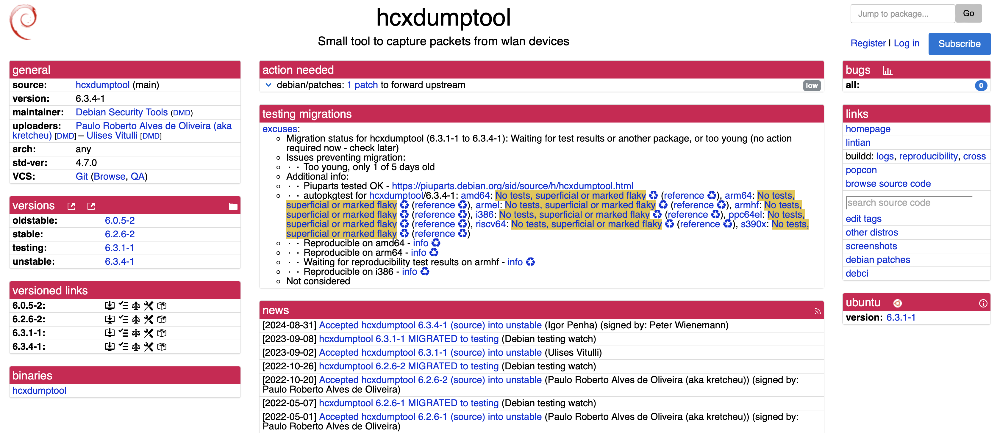
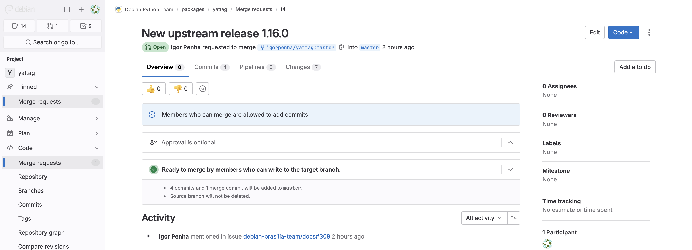
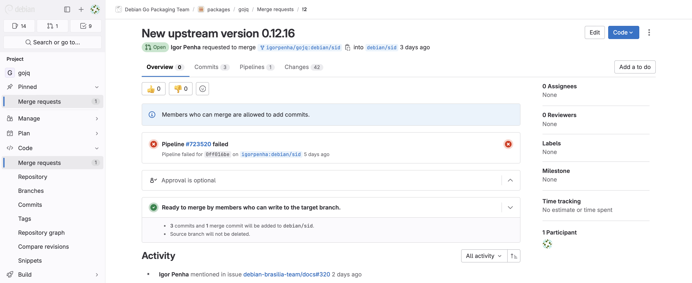

# Igor e Silva Penha

Na Sprint 5, terminei as correções que foram nessárias em hcxdumptool, pacote, o qual teve êxito em seu upload. Nessa sprint além do time de python, também, realizei pacotes do time de go, assim realizei os merge request dos seguintes pacotes: yattag, python-cytoolz, paste, continuity, golang-github-adrg-xdg, gojq, golang-barcode, golang-github-a8m-tree e golang-github-akavel-rsrc. Além de estar acompanhando os merges dos pacotes anteriores e realizando as devidas correções.

## Package hcxdumptool

[Link do Merge Request](https://salsa.debian.org/pkg-security-team/hcxdumptool/-/merge_requests/6)
  [Link do tracker](https://tracker.debian.org/pkg/hcxdumptool)

 Figura 1: Tracker uploaded hcxdumptool

 

## Package yattag

yattag é um gerador de documentos HTML ou XML com Python.

[Link issue no Salsa](https://salsa.debian.org/debian-brasilia-team/docs/-/issues/308)
  [Link do respositório no salsa](https://salsa.debian.org/python-team/packages/yattag)
  [Link do Lintian](https://udd.debian.org/lintian/?packages=yattag)
  [Link do tracker](https://tracker.debian.org/pkg/yattag)
  [Link do Merge Request](https://salsa.debian.org/python-team/packages/yattag/-/merge_requests/4)

 Figura 2: Merge request yattag

 

## Package python-cytoolz

python-cytoolz é uma implementação do pacote toolz, o qual provê uma alta performace funções úteis para interáveis, funções e dicionários.

[Link issue no Salsa](https://salsa.debian.org/debian-brasilia-team/docs/-/issues/309)
  [Link do respositório no salsa](https://salsa.debian.org/python-team/packages/python-cytoolz)
  [Link do Lintian](https://udd.debian.org/lintian/?packages=python-cytoolz)
  [Link do tracker](https://tracker.debian.org/pkg/python-cytoolz)

  [Link do Merge Request](https://salsa.debian.org/python-team/packages/python-pika/-/merge_requests/3)

## Package paste

Paste fornece várias peças de "middleware" (ou filtros) que podem ser aninhadas para criar aplicativos da web. Cada peça de middleware usa a interface WSGI (PEP 333) e deve ser compatível com outro middleware baseado nessas interfaces.

[Link issue no Salsa](https://salsa.debian.org/debian-brasilia-team/docs/-/issues/314)
  [Link do respositório no salsa](https://salsa.debian.org/python-team/packages/paste)
  [Link do Lintian](https://udd.debian.org/lintian/?packages=paste)
  [Link do tracker](https://tracker.debian.org/pkg/paste)
  [Link do Merge Request](https://salsa.debian.org/python-team/packages/paste/-/merge_requests/3)

## Package gojq

gojq é uma implementação do comando jq escrita em Go e é possível incorporar o gojq como uma biblioteca aos seus produtos Go.

[Link issue no Salsa](https://salsa.debian.org/debian-brasilia-team/docs/-/issues/320)
  [Link do respositório no salsa](https://salsa.debian.org/go-team/packages/gojq)
  [Link do Lintian](https://udd.debian.org/lintian/?packages=gojq)
  [Link do tracker](https://tracker.debian.org/pkg/gojq)
  [Link do Merge Request](https://salsa.debian.org/go-team/packages/gojq/-/merge_requests/2)

 Figura 3: Merge request gojq

 

## Package continuity

Contunnuity é um sistema de manifesto de metadados do sistema de arquivos agnóstico em transporte.

[Link issue no Salsa](https://salsa.debian.org/debian-brasilia-team/docs/-/issues/316)
  [Link do respositório no salsa](https://salsa.debian.org/go-team/packages/continuity)
  [Link do Lintian](https://udd.debian.org/lintian/?packages=continuity)
  [Link do tracker](https://tracker.debian.org/pkg/continuity)
  [Link do Merge Request](https://salsa.debian.org/go-team/packages/continuity/-/merge_requests/5)

## Package golang-github-adrg-xdg

golang-github-adrg-xdg fornece uma implementação da Especificação do Diretório Base XDG. A especificação define um conjunto de caminhos padrão para armazenar arquivos de aplicativos, incluindo dados e arquivos de configuração

[Link issue no Salsa](https://salsa.debian.org/debian-brasilia-team/docs/-/issues/318)
  [Link do respositório no salsa](https://salsa.debian.org/go-team/packages/golang-github-adrg-xdg)
  [Link do Lintian](https://udd.debian.org/lintian/?packages=golang-github-adrg-xdg)
  [Link do tracker](https://tracker.debian.org/pkg/golang-github-adrg-xdg)
  [Link do Merge Request](https://salsa.debian.org/go-team/packages/golang-github-adrg-xdg/-/merge_requests/3)

## Package golang-barcode

golang-barcode é uma ferramenta utilizada para a criação de diferentes tipos de barcodes.

[Link issue no Salsa](https://salsa.debian.org/debian-brasilia-team/docs/-/issues/323)
  [Link do respositório no salsa](https://salsa.debian.org/go-team/packages/golang-barcode)
  [Link do Lintian](https://udd.debian.org/lintian/?packages=golang-barcode)
  [Link do tracker](https://tracker.debian.org/pkg/golang-barcode)
  [Link do Merge Request](https://salsa.debian.org/go-team/packages/golang-barcode/-/merge_requests/6)

## Package golang-github-a8m-tree

golang-github-a8m-tree é uma implementação do comando tree em go.

[Link issue no Salsa](https://salsa.debian.org/debian-brasilia-team/docs/-/issues/326)
  [Link do respositório no salsa](https://salsa.debian.org/go-team/packages/golang-github-a8m-tree)
  [Link do Lintian](https://udd.debian.org/lintian/?packages=golang-github-a8m-tree)
  [Link do tracker](https://tracker.debian.org/pkg/golang-github-a8m-tree)
  [Link do Merge Request](https://salsa.debian.org/go-team/packages/golang-github-a8m-tree/-/merge_requests/3)

## Package golang-github-akavel-rsrc

golang-github-akavel-rsrc é uma ferramenta para incorporar recursos binários em programas Go.

[Link issue no Salsa](https://salsa.debian.org/debian-brasilia-team/docs/-/issues/327)
  [Link do respositório no salsa](https://salsa.debian.org/go-team/packages/golang-github-akavel-rsrc)
  [Link do Lintian](https://udd.debian.org/lintian/?packages=golang-github-akavel-rsrc)
  [Link do tracker](https://tracker.debian.org/pkg/golang-github-akavel-rsrc)
  [Link do Merge Request](https://salsa.debian.org/go-team/packages/golang-github-akavel-rsrc/-/merge_requests/3)

### Histórico de versão

|Data|Autor|Descrição|Versão|
|----|------|------|----|
| 02/09/2024 | Igor Penha | Criação do documento | `1.0` |
