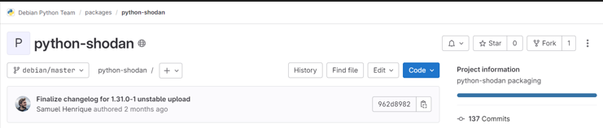
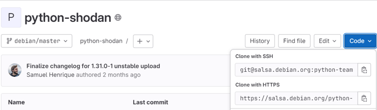
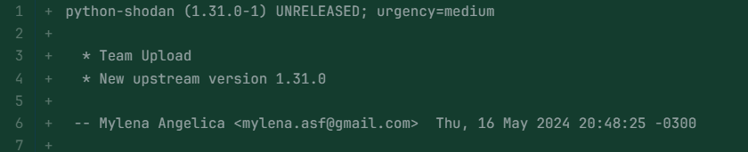

# Tutorial de Atualização Upstream para Projeto Debian

Antes de continuar nesse tutorial, saiba que para fazer a sua primeira atualização upstream você deve ter criado e ter sua senha no [salsa](https://salsa.debian.org/public) aceita.

Para mais informações de como configurar o ambiente para o empacotamento, dê uma lida [nessa documentação](https://wiki.debianbrasil.org.br/pt-br/empacotamento/empacotamento-101).

## Introdução

### O Que é Empacotamento?

Empacotamento é o processo de preparar software para distribuição no formato de pacotes.
O empacotamento serve para facilitar a instalação, atualização e remoção de software em um sistema operacional. Além disso, o empacotamento garante que o software seja instalado em conformidade com as diretrizes e políticas do sistema operacional, proporcionando uma experiência mais segura e consistente para o usuário final.

### Atualização Upstream, o que é?

Uma atualização upstream refere-se à incorporação das mudanças feitas no código fonte original de um software, que foram desenvolvidas e lançadas pelo autor ou equipe responsável por esse software. 
No processo de contribuição para o empacotamento Debian é um dos processos mais comuns e recomendado para iniciantes. 
Os passos listados aqui são genéricos e tentam abranger uma grande diversidade de cenários, no entanto, atualizar a versão pode ser simples e gastar poucos minutos ou muito complexo e demandar a ajuda de um conjunto de pessoas.

##  Informações iniciais

Esse tutorial tem como intuito auxiliar em atualizações Upstream. Ele tentará ser o mais explicativo possível mas devido a grande diversidade de cenários, pode ser que você precise de auxilio extra.  

Com o intuito de facilitar a compreensão, as informações dentro dos [ ] indica o que deve ser adicionado com suas informações ou as do seu pacote. Lembrando que quando for realizar, no comando não incluir os [ ]. 

Além disso, teremos exemplos de saídas no terminal depois dos comandos, e para isso será utilizado o exemplo feito no pacote [python-shodan](https://tracker.debian.org/pkg/python-shodan) pela usuária **mylena-angelica**. Lembre-se disso ao visualizar os exemplos para não se confundir.

## 1. Atualizar o chroot

Antes de iniciar o empacotamento,  realize o comando de atualização do chroot. Recomendamos fazer pelo menos 1 vez na semana ou antes de todo empacotamento.
```bash 
sudo sh /usr/share/doc/sbuild/examples/sbuild-debian-developer-setup-update-all 
```
## 2. Fazer o Fork 
Vá para o repositório oficial do pacote que você está trabalhando no Salsa e crie o fork do projeto para o seu repositório.



## 3. Clonar o repositório

Após criar o fork, vá para o terminal e inicie o clone do repositório seguindo o passo a passo abaixo:

1.  Utilize o gbp para clonar o seu fork com o ssh.
```shell 
gbp clone git@salsa.debian.org:[seu_usuário]/[nome_do_pacote].git 
```
Exemplo: `gbp clone git@salsa.debian.org:[mylena-angelica]/[python-shodan].git `
Lembrando que o caminho para clonar com o SSH está disponível no repositório, tanto no seu fork quanto no oficial. Recomendamos sempre fazer o clone utilizando o ssh.



2.  Entre na pasta do pacote
```shell 
cd [nome_do_pacote] 
```
Exemplo: `cd python-shodan `

3. Visualize os repositórios remotos configurados no seu repositório Git local.
```shell 
git remote -v 
```
A saída esperada é assim:
```shell 
origin  git@salsa.debian.org:[seu_usuário]/[nome_do_pacote].git (fetch)
origin  git@salsa.debian.org:[seu_usuário]/[nome_do_pacote].git (push)
```
Exemplo: `origin  git@salsa.debian.org: mylena-angelica/python-shodan.git (fetch)
origin  git@salsa.debian.org: mylena-angelica/python-shodan.git (push) `

4. Adicione o repositório oficial.
```shell 
git remote add debian [clone with ssh link] 
```
Exemplo: `git remote add debian git@salsa.debian.org:python-team/packages/flask-dance.git`

Faça o passo 3 novamente para checar que está tudo certo. Sendo que a saída exemplo é a seguinte: `debian  git@salsa.debian.org:python-team/packages/python-shodan.git (fetch)`
`debian  git@salsa.debian.org:python-team/packages/python-shodan.git (push)
origin  git@salsa.debian.org:[mylena-angelica]/python-shodan.git (fetch)
origin  git@salsa.debian.org:[mylena-angelica]/python-shodan.git (push)`

## 4. Buildar

Estando tudo correto no seu repositório remoto, devemos baixar a versão atual do pacote e realizar o build.
1. Buildar
* Opção 1: Caso a branch original se chame master
```shell 
gbp buildpackage
```
* Opção 1: Caso a branch original tenha outro nome como debian/master, debian/latest ...
```shell 
gbp buildpackage --git-debian-branch=[nome_da_branch]
```

Essa parte é a mais demorada do processo. Depois de alguns minutos, caso esteja tudo correto, o build será feito corretamente e terá como saída algo assim:
```shell 
+------------------------------------------------------------------------------+  
| Cleanup |  
+------------------------------------------------------------------------------+  
  
Purging /<<BUILDDIR>>  
Not cleaning session: cloned chroot in use  
  
+------------------------------------------------------------------------------+  
| Summary |  
+------------------------------------------------------------------------------+  
  
Build Architecture: amd64  
Build Type: full  
Build-Space: 2872  
Build-Time: 32  
Distribution: unstable  
Host Architecture: amd64  
Install-Time: 104  
Job: /home/mylena/python-shodan_1.30.1-1.dsc  
Lintian: warn  
Machine Architecture: amd64  
Package: python-shodan  
Package-Time: 246  
Source-Version: 1.30.1-1  
Space: 2872  
Status: successful  
Version: 1.30.1-1  
--------------------------------------------------------------------------------  
Finished at 2024-05-16T22:55:53Z  
Build needed 00:04:06, 2872k disk space

```
Uma saída parecida com a da cima indica que está tudo certo. 

2. Atualizar pacote

```shell 
gbp import-orig --uscan --pristine-tar
```
A saída esperada é a seguinte:
```shell 
gbp:info: Launching uscan...  
Newest version of python-shodan on remote site is 1.31.0, local version is 1.30.1  
=> Newer package available from:  
=> [https://pypi.debian.net/shodan/shodan-1.31.0.tar.gz](https://pypi.debian.net/shodan/shodan-1.31.0.tar.gz)  
Successfully symlinked ../shodan-1.31.0.tar.gz to ../python-shodan_1.31.0.orig.tar.gzgbp:info: Using uscan downloaded tarball ../python-shodan_1.31.0.orig.tar.gz  
What is the upstream version? [1.31.0] y  
gbp:warning:  
Not a valid upstream version: 'y'.  
Upstream version numbers must start with a digit and can only contain lower case  
letters (a-z), digits (0-9), full stops (.), plus signs (+), minus signs  
(-), colons (:) and tildes (~)  
What is the upstream version? [1.31.0]
```
Assim que aparecer a pergunta: What is the upstream version? [número da versão]. 
Você irá conferir se a que apareceu é a mesma que está indicado no tracker. Se for, só colocar ***o número da versão que aparece em [ ]*** e aguardar que a nova versão seja importada.

A saída será algo do tipo: `gbp:info: Successfully imported version 1.31.0 of ../python-shodan_1.31.0.orig.tar.gz`

## 5. Operações git
Após a versão upstream ter sido importada no seu repositório local, você irá fazer alguns passos relacionados ao git.
1. Commit mudanças 
```shell 
gbp dch --commit --team
``` 
Esse comando irá fazer o commit e inserir no documento debian/changelog que o empacotamento está sendo feito de forma **Team Upload**. Isso é necessário para o seu empacotamento, caso não esteja nesse documento, o seu build final poderá falhar.

2. Visualizar histórico de commits
```shell 
git log
``` 
Você irá visualizar toda a história dos commits feitos.  É importante realizar esse passo pois na próxima etapa você irá precisar do hash do commit da branch upstream para fazer a revisão.

## 6. Revisão

Essa parte é essencial na atualização upstream. Você irá revisar as mudanças feitas e ficar atendo as modificações como: 
-  **Dependências novas e alteradas;**
-  **Mudanças de licenças;**
-  **Checagem geral para verificar as mudanças feitas.**
-  **Erro de Lintian**
```shell 
git show [hash do commit upstream]
git diff
``` 
Caso tenha alguma modificação significativa, ela deve ser reportada. As mudanças podem resultar em diferentes cenários, por isso, na dúvida sempre entrar em contato com a sua equipe Debian. 
Feita a revisão podemos seguir em frente.

## 7. Partes finais

1. Adicionar mudanças no debian/changelog
Nessa parte você pode utilizar o seu editor de texto preferido. Nesse tutorial utilizaremos o vim.
```shell 
nvim debian/changelog
``` 
Você irá adicionar o que foi feita, geralmente informando que foi atualizado para a nova versão upstream.
Depois da alteração deverás er algo assim:



2. Fazer os commits finais

Uma dica importante é que você deve commitar os arquivos que editou separadamente. Por exemplo, se você precisou editar além do changelog, o arquivo watch, você fará um commit para o changelog e outro para o watch.

```shell 
git add debian/changelog
git commit --amend
``` 

```shell 
git add debian/watch
git commit --amend
``` 

3. Fazer o build final com as novas alterações
```shell 
gbp buildpackage
```
 Após esse passo muitos cenários diferentes podem acontecer, cabe ao empacotador analisar o que precisa ser feito a partir daqui. Sempre que tiver dúvida, entre em contato com alguém da equipe.
**Note que o Lintian vai reclamar com um error de "unreleased-changes", isso é esperado. Você não precisa fazer nada, está correto.**

4. Push dos commits
```shell 
git push --all && git push --tags
```
Feito isso, o salsa já irá reconhecer que houve mudanças e irá sugerir que seja feito um merge request. Então você irá no repositório oficial e seguir os passos que o próprio salsa pede para realizar o Merge. 

Lembrete: geralmente o merge request ocorre direto para a master, porém, no debian também pode ocorrer da branch master ser nomeada como debian/sid, que é equivalente à master, então não se assuste você está no caminho certo!


## 8. Revisão
 Agora o seu pacote será revisado por algum DM do Debian. É só aguardar e ficar de olho nos comentários, pois o seu revisor poderá sugerir alterações.

### Histórico de versão

|Data|Autora|Versão|
|----|------|------|
| 31/07/2024 | Mylena | Criação do tutorial | 
| 19/08/2024 | Luana | Adição de informações |